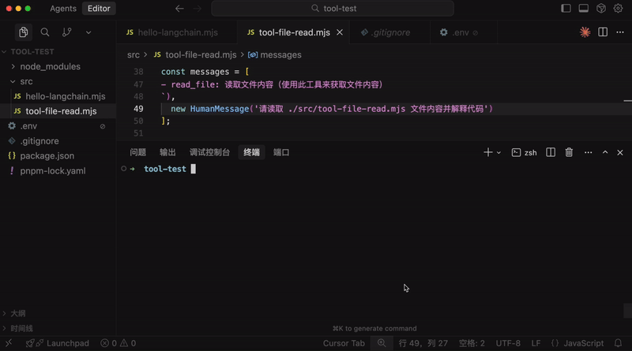
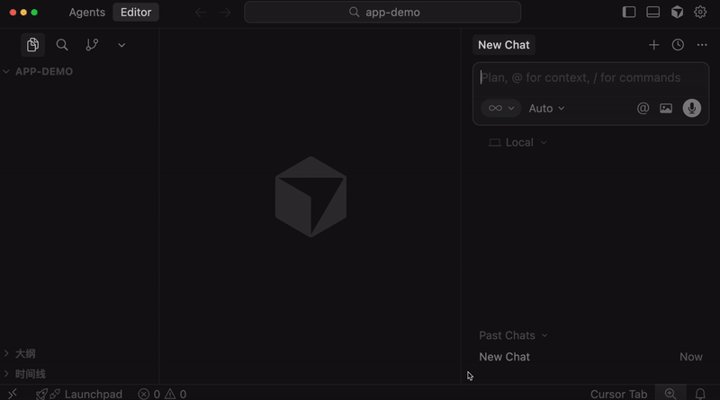
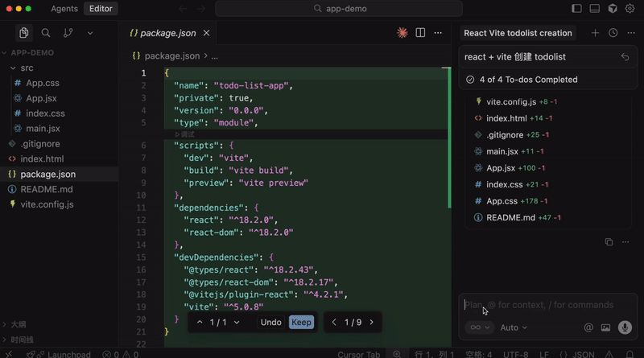
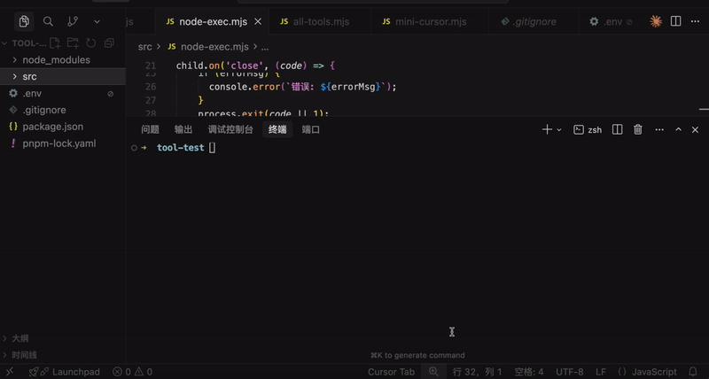
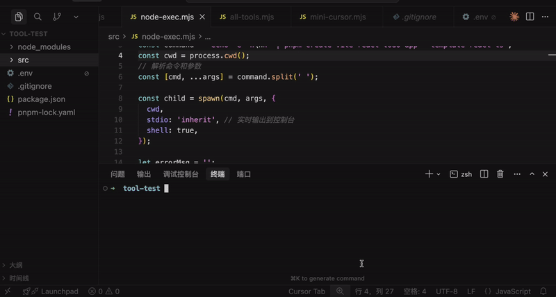
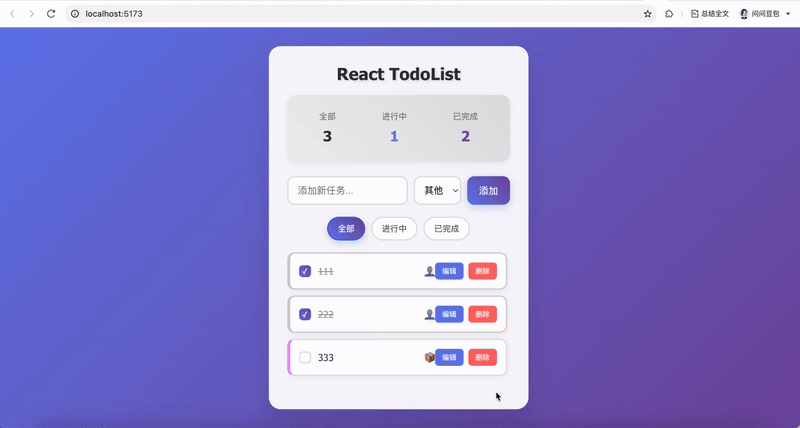

# 实现 mini cursor：大模型自动调用 tool 执行命令

上节我们给大模型扩展了读文件的 tool，你说一个文件路径让它解释，它就可以自动调工具读文件内容给出解释了。

**🎬 [视频 1](http://mpvideo.qpic.cn/0b2emeajaaaanyah4oki4fuvayodsbqqbeaa.f10002.mp4?dis_k=d457920d1d0b6b0f8e504ad557f4cd98&dis_t=1781679528&play_scene=10110&auth_info=cajrq782ZeDCuuUCZ/Hv3YsCL24QbW0UZTQ5SmEyUjxNHHNpRhxEKHt4ZEkQWGEBIW4iTgRn&auth_key=640276dbe53bf315c7241ec3648bf6b0)**



那继续思考：

如果我们给它扩展了执行命令、写文件、创建目录、读取目录、读文件等 tool，是不是就能实现 cursor 的功能呢？

比如创建项目对文件做增删改：

**🎬 [视频 2](http://mpvideo.qpic.cn/0b2edqaaaaaajeao4y2ivbuvahgdaaoaaaaa.f10002.mp4?dis_k=5f2ba4c8b3b5ed6c0d7bd8fc3aa00090&dis_t=1781679528&play_scene=10110&auth_info=Io6GodQzY+XKu+dQN6jti41UKGpDOW0cNGY+Hzk0AWAeSyE+FRpCLXN5ZhtAAWNXJzglSlcz&auth_key=6cded615b72a30107b001f51a168a8e3)**



项目创建后自动执行命令安装依赖和跑服务：

**🎬 [视频 3](http://mpvideo.qpic.cn/0bc3iaabeaaaamapzzcifvuvaqgdcjaaaeqa.f10002.mp4?dis_k=2b1d96e0410c930b8340e80c501a8f12&dis_t=1781679528&play_scene=10110&auth_info=dMyc9NBkZeTC7OQCNqi7i4sFeDtLb2UeM2I9GWE2B2hISXNoSU1ELHsuZUlBATVXIWl1G19l&auth_key=0f982a023a20a7a02a17247141d558cc)**



是不是现在就可以实现了！


虽然我们不会做那么完善，但是简易版确实可以写了。

这节我们就来实现下大模型根据 prompt 生成项目代码，自动读写文件、通过命令安装依赖、自动把项目跑起来，全程自己调用 tool 的功能：

不创建新项目了，直接在上节的 tool-test 项目继续写。

首先， node 里如何执行命令呢？

用 child_process 这个内置模块。

创建 src/node-exec.mjs

```
import { spawn } from'node:child_process';

const command = 'ls -la';
const cwd = process.cwd();

// 解析命令和参数
const [cmd, ...args] = command.split(' ');

const child = spawn(cmd, args, {
  cwd,
stdio: 'inherit', // 实时输出到控制台
shell: true,
});

let errorMsg = '';

child.on('error', (error) => {
  errorMsg = error.message;
});

child.on('close', (code) => {
if (code === 0) {
    process.exit(0);
  } else {
    if (errorMsg) {
      console.error(`错误: ${errorMsg}`);
    }
    process.exit(code || 1);
  }
});
```

spawn 可以指定在 cwd 这个目录下执行命令，会创建一个子进程来跑，这也是为啥这个模块叫 child_process。

用空格分割出命令和参数部分，分别作为 cmd、args

inherit 就是这个子进程的 stdout 也输出到父进程的 stdout，也就是控制台。

跑一下：

```
node ./src/node-exec.mjs
```

**🎬 [视频 4](http://mpvideo.qpic.cn/0bc3xaacaaaa2qam5asi3buvbogdec4aaiaa.f10002.mp4?dis_k=11d59c4c0861bf03c65bd1bfaa972a9e&dis_t=1781679528&play_scene=10110&auth_info=bo7PtyEztsm85gcx9LqK2FQoY0Q7NRVkMT0ZbTkBbB9Iez1BHBJ+cH5nTEZdNFZyOCVDUDE=&auth_key=a97f441701bea37499a23ff32f5a2c09)**



最终我们是要跑 npx create-vite 这个命令的，试一下：

```
const command = 'echo -e "n\nn" | pnpm create vite react-todo-app --template react-ts';
```

echo 两个 n 是有时候 vite 会让你选择两个选项：用不用 rolldown、安不安装依赖

echo n 然后通过管道操作符输出给那个进程就和我们键盘输入 n 一样的效果。

**🎬 [视频 5](http://mpvideo.qpic.cn/0bc3e4aeaaaawyak5tkiebuvaj6diatqaqaa.f10002.mp4?dis_k=3752b628d5692af61cafe8672eb01501&dis_t=1781679528&play_scene=10110&auth_info=JMm56+42M7DLvLFUNqi934xQK2pCPGQdMjc5Tzo2UGAYTXUyQh8SeHJ+MB9BATMDJjwmSlY2&auth_key=a07cc9fdba8187fc9a6c19fac1bcdbf1)**



测试完之后，接下来就是封装 tools 了。

我们单独一个文件来放所有的 tools：

src/all-tools.mjs

```
import { tool } from'@langchain/core/tools';
import fs from'node:fs/promises';
import path from'node:path';
import { spawn } from'node:child_process';
import { z } from'zod';

// 1. 读取文件工具
const readFileTool = tool(
async ({ filePath }) => {
    try {
      const content = await fs.readFile(filePath, 'utf-8');
      console.log(`  [工具调用] read_file("${filePath}") - 成功读取 ${content.length} 字节`);
      return`文件内容:\n${content}`;
    } catch (error) {
      console.log(`  [工具调用] read_file("${filePath}") - 错误: ${error.message}`);
      return`读取文件失败: ${error.message}`;
    }
  },
  {
    name: 'read_file',
    description: '读取指定路径的文件内容',
    schema: z.object({
      filePath: z.string().describe('文件路径'),
    }),
  }
);

// 2. 写入文件工具
const writeFileTool = tool(
async ({ filePath, content }) => {
    try {
      const dir = path.dirname(filePath);
      await fs.mkdir(dir, { recursive: true });
      await fs.writeFile(filePath, content, 'utf-8');
      console.log(`  [工具调用] write_file("${filePath}") - 成功写入 ${content.length} 字节`);
      return`文件写入成功: ${filePath}`;
    } catch (error) {
      console.log(`  [工具调用] write_file("${filePath}") - 错误: ${error.message}`);
      return`写入文件失败: ${error.message}`;
    }
  },
  {
    name: 'write_file',
    description: '向指定路径写入文件内容，自动创建目录',
    schema: z.object({
      filePath: z.string().describe('文件路径'),
      content: z.string().describe('要写入的文件内容'),
    }),
  }
);

// 3. 执行命令工具（带实时输出）
const executeCommandTool = tool(
async ({ command, workingDirectory }) => {
    const cwd = workingDirectory || process.cwd();
    console.log(`  [工具调用] execute_command("${command}")${workingDirectory ? ` - 工作目录: ${workingDirectory}` : ''}`);

    returnnewPromise((resolve, reject) => {
      // 解析命令和参数
      const [cmd, ...args] = command.split(' ');

      const child = spawn(cmd, args, {
        cwd,
        stdio: 'inherit', // 实时输出到控制台
        shell: true,
      });

      let errorMsg = '';

      child.on('error', (error) => {
        errorMsg = error.message;
      });

      child.on('close', (code) => {
        if (code === 0) {
          console.log(`  [工具调用] execute_command("${command}") - 执行成功`);
          const cwdInfo = workingDirectory
            ? `\n\n重要提示：命令在目录 "${workingDirectory}" 中执行成功。如果需要在这个项目目录中继续执行命令，请使用 workingDirectory: "${workingDirectory}" 参数，不要使用 cd 命令。`
            : '';
          resolve(`命令执行成功: ${command}${cwdInfo}`);
        } else {
          console.log(`  [工具调用] execute_command("${command}") - 执行失败，退出码: ${code}`);
          resolve(`命令执行失败，退出码: ${code}${errorMsg ? '\n错误: ' + errorMsg : ''}`);
        }
      });
    });
  },
  {
    name: 'execute_command',
    description: '执行系统命令，支持指定工作目录，实时显示输出',
    schema: z.object({
      command: z.string().describe('要执行的命令'),
      workingDirectory: z.string().optional().describe('工作目录（推荐指定）'),
    }),
  }
);

// 4. 列出目录内容工具
const listDirectoryTool = tool(
async ({ directoryPath }) => {
    try {
      const files = await fs.readdir(directoryPath);
      console.log(`  [工具调用] list_directory("${directoryPath}") - 找到 ${files.length} 个项目`);
      return`目录内容:\n${files.map(f => `- ${f}`).join('\n')}`;
    } catch (error) {
      console.log(`  [工具调用] list_directory("${directoryPath}") - 错误: ${error.message}`);
      return`列出目录失败: ${error.message}`;
    }
  },
  {
    name: 'list_directory',
    description: '列出指定目录下的所有文件和文件夹',
    schema: z.object({
      directoryPath: z.string().describe('目录路径'),
    }),
  }
);

export { readFileTool, writeFileTool, executeCommandTool, listDirectoryTool };
```

创建了这几个 tool：

- 读文件
- 写文件（包含创建目录了）
- 读目录
- 执行命令


这里的工具调用返回结果，我额外加了 cwd 的信息，避免之后命令胡乱 cd


```
重要提示：命令在目录 "${workingDirectory}" 中执行成功。
如果需要在这个项目目录中继续执行命令，
请使用 workingDirectory: "${workingDirectory}" 参数，
不要使用 cd 命令。
```


每个 tool 都是 name、description 以及基于 zod 声明的参数格式。

接下来就可以调用了：

创建 src/mini-cursor.mjs

```
import 'dotenv/config';
import { ChatOpenAI } from'@langchain/openai';
import { HumanMessage, SystemMessage, ToolMessage } from'@langchain/core/messages';
import { executeCommandTool, listDirectoryTool, readFileTool, writeFileTool } from'./all-tools.mjs';

const model = new ChatOpenAI({ 
    modelName: "qwen-plus",
    apiKey: process.env.OPENAI_API_KEY,
    temperature: 0,
    configuration: {
        baseURL: process.env.OPENAI_BASE_URL,
    },
});

const tools = [
    readFileTool,
    writeFileTool,
    executeCommandTool,
    listDirectoryTool,
];

// 绑定工具到模型
const modelWithTools = model.bindTools(tools);

// Agent 执行函数
asyncfunction runAgentWithTools(query, maxIterations = 30) {
    const messages = [
        new SystemMessage(`你是一个项目管理助手，使用工具完成任务。

当前工作目录: ${process.cwd()}

工具：
1. read_file: 读取文件
2. write_file: 写入文件
3. execute_command: 执行命令（支持 workingDirectory 参数）
4. list_directory: 列出目录

重要规则 - execute_command：
- workingDirectory 参数会自动切换到指定目录
- 当使用 workingDirectory 时，绝对不要在 command 中使用 cd
- 错误示例: { command: "cd react-todo-app && pnpm install", workingDirectory: "react-todo-app" }
这是错误的！因为 workingDirectory 已经在 react-todo-app 目录了，再 cd react-todo-app 会找不到目录
- 正确示例: { command: "pnpm install", workingDirectory: "react-todo-app" }
这样就对了！workingDirectory 已经切换到 react-todo-app，直接执行命令即可

回复要简洁，只说做了什么`),
        new HumanMessage(query)
    ];

    for (let i = 0; i < maxIterations; i++) {
        console.log(`⏳ 正在等待 AI 思考...`);
        const response = await modelWithTools.invoke(messages);
        messages.push(response);

        // 检查是否有工具调用
        if (!response.tool_calls || response.tool_calls.length === 0) {
            console.log(`\n✨ AI 最终回复:\n${response.content}\n`);
            return response.content;
        }

        // 执行工具调用
        for (const toolCall of response.tool_calls) {
            const foundTool = tools.find(t => t.name === toolCall.name);
            if (foundTool) {
                const toolResult = await foundTool.invoke(toolCall.args);
                messages.push(new ToolMessage({
                    content: toolResult,
                    tool_call_id: toolCall.id,
                }));
            }
        }
    }

    return messages[messages.length - 1].content;
}
```

代码大部分我们都写过。

首先创建大模型对象：


temperature 温度指定为 0，不让 AI 随意发挥。

模型用 qwen-plus，这个更好一点。

然后把 tools 绑定到模型：


后面就是返回的对话了，因为可能会反复对话、返回调用 tools 很多次，这里加了个最大限制。

具体的调用过程和之前一样：

用 System message 指定 AI 可以做什么，回答的规范：


告诉它有哪些工具：


我还特意说明了下 cd 的问题，有了 cwd 之后，就不用 cd 了。

之后把调用 tool 返回的内容封装成 ToolMessage：


这样，模型、工具、调用流程就搭建完了。

接下来我们开始调用：

首先我们用 chalk 加点颜色，不然都是白色不好看：

```
pnpm install chalk
```

这行背景变绿：


```
import chalk from 'chalk';

console.log(chalk.bgGreen(`⏳ 正在等待 AI 思考...`));
```

接下来写个 case：


```
const case1 = `创建一个功能丰富的 React TodoList 应用：

1. 创建项目：echo -e "n\nn" | pnpm create vite react-todo-app --template react-ts
2. 修改 src/App.tsx，实现完整功能的 TodoList：
 - 添加、删除、编辑、标记完成
 - 分类筛选（全部/进行中/已完成）
 - 统计信息显示
 - localStorage 数据持久化
3. 添加复杂样式：
 - 渐变背景（蓝到紫）
 - 卡片阴影、圆角
 - 悬停效果
4. 添加动画：
 - 添加/删除时的过渡动画
 - 使用 CSS transitions
5. 列出目录确认

注意：使用 pnpm，功能要完整，样式要美观，要有动画效果

之后在 react-todo-app 项目中：
1. 使用 pnpm install 安装依赖
2. 使用 pnpm run dev 启动服务器
`;

try {
  await runAgentWithTools(case1);
} catch (error) {
  console.error(`\n❌ 错误: ${error.message}\n`);
}
```

告诉它创建一个 todo app，然后安装依赖，跑起来。

你是不是在 cursor 里经常做这种事情？

今天用自己写的工具来做：

```
node ./src/mini-cursor.mjs
```

**🎬 [视频 6](http://mpvideo.qpic.cn/0bc3buackaaa4eamqsciy5uvadodeugqajia.f10002.mp4?dis_k=849db6b30987fa48eec3aa69619fe2e8&dis_t=1781679528&play_scene=10110&auth_info=cLHQ7u40Yb6furMBMvG90YgEcDwWOzEUOTQ1GTo2AGtMQXs8Fh9AdiZ4MkpFWDMNImh9HAIx&auth_key=539c6bb39e635dbaa2f4db002478620b)**


可以看到，过程中调用了各种工具：


我们写的 tool 都用上了。

读取目录、写入文件、读取文件、执行命令

当然，这个过程慢很正常，生成过程本来就慢，我们没用流式展示过程，其实你等待的时间一直在输出内容。流式相关的后面再做。

但是，这个项目的代码是用我们写的 mini cursor 自动创建、自动跑起来的：

**🎬 [视频 7](http://mpvideo.qpic.cn/0bc3ayaayaaagyaofakinzuvabwdbqdaadaa.f10002.mp4?dis_k=e617921cbfd0f83d606456a6ad70315f&dis_t=1781679528&play_scene=10110&auth_info=It+ZpbFtZuLM7+YGZqbq3t9RfmpAOGFKZDY9SmEyUzseHic7FkZHKnUtZ00RD2QCdT1zSlQy&auth_key=27ec7e55642e52494cbd4dbf06215cc9)**



它和 cursor 肯定有差距，但是已经实现部分功能了。

我们不是想真的实现 cursor，只是要知道它的实现原理。

> 代码上传了课程仓库： https://github.com/QuarkGluonPlasma/ai-agent-course-code/tool-test

## 总结

这节我们创建了更多的 tool，比如目录、文件的读写，还有用 spawn 执行命令。

我们基于这些 tool 实现了部分 cursor 功能，最终效果是，它可以帮你创建项目，写入文件，执行安装依赖、跑项目的命令。

相信学到这，你就知道 cursor 的大概实现原理了。

你也可以基于 tool + llm 来做一些自己想做的功能，边学边练，AI 学起来还是很有趣的！
