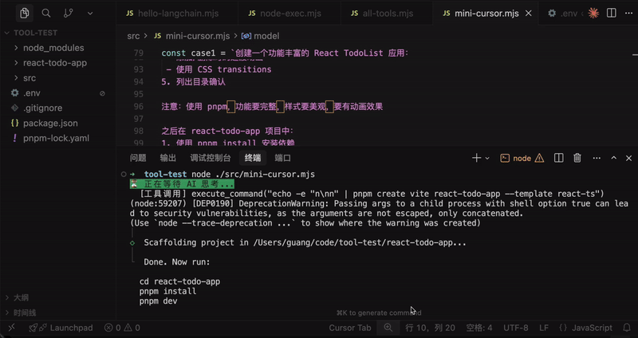
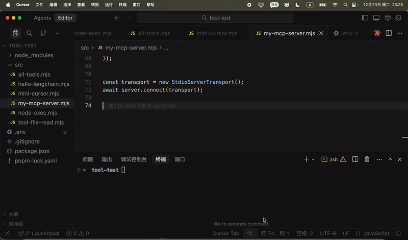
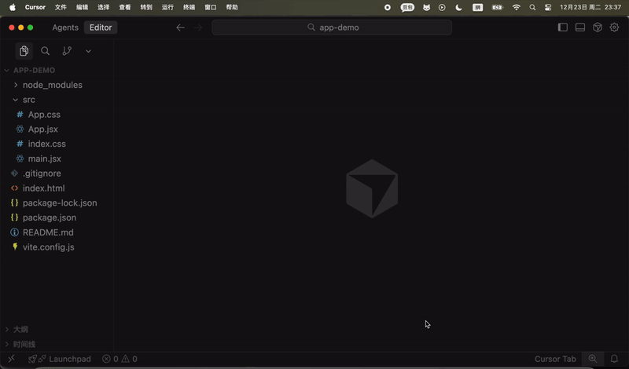
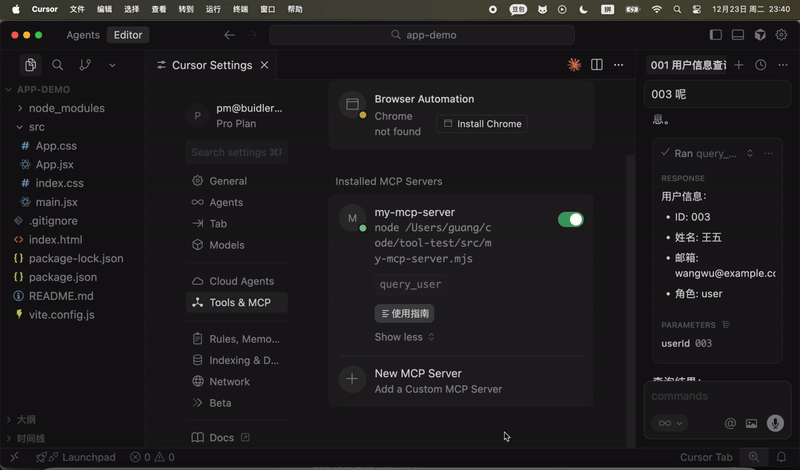
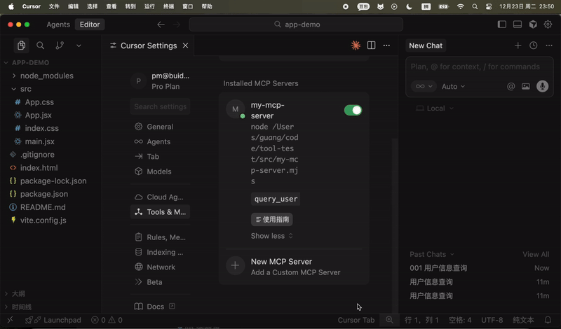
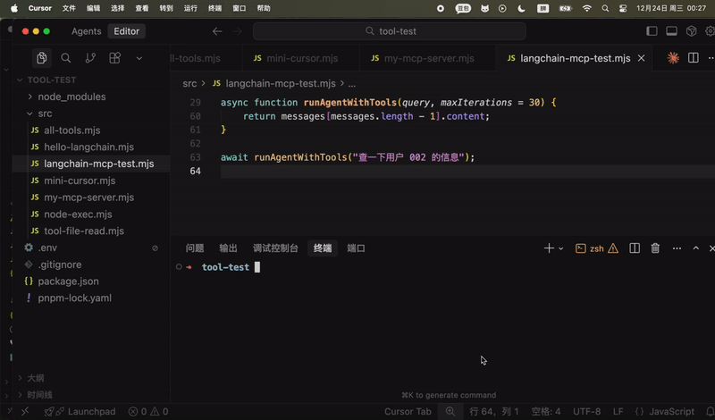
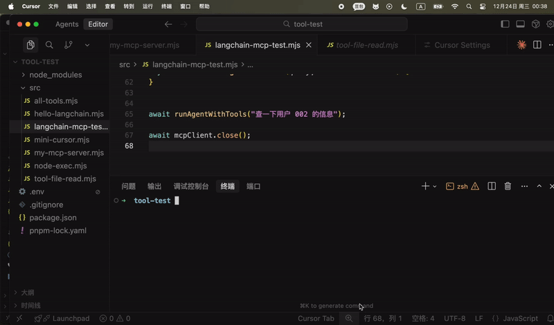
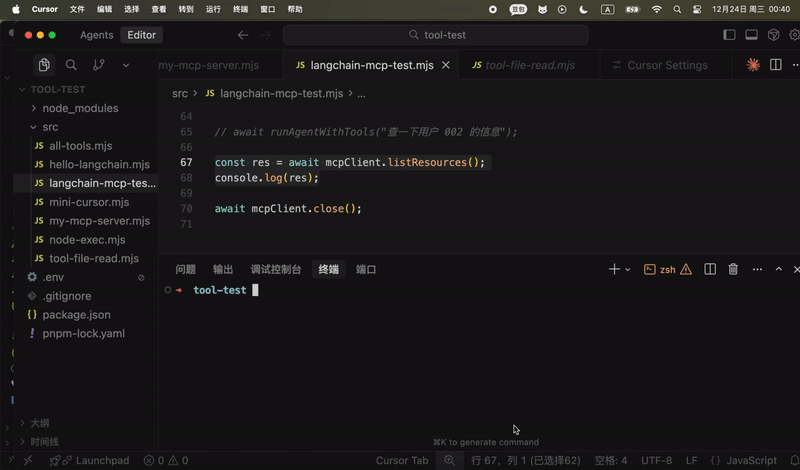
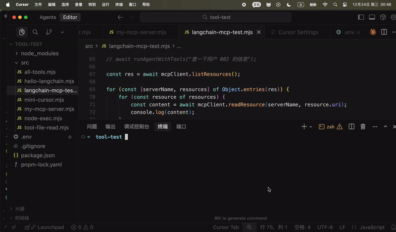
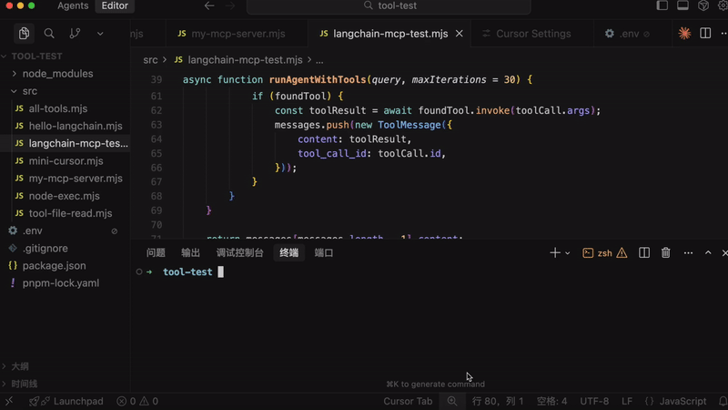

# MCP：可跨进程调用的 Tool

我们已经写了一些 tool 了：读写文件和目录、执行命令

@@IMG:|https://mmbiz.qpic.cn/sz_mmbiz_png/JnZIbTicL4jVyG2W4yUxn0yaZkWNVjcfFkCbpPMVCycL6Q9D3lzQ5694jWVC8jZrKATRgkXic3RFjlA23OLTxibXA/640?wx_fmt=png&from=appmsg@@

只要声明 tool 的名字、描述、参数格式，模型会在发现需要用 tool 的时候自动解析出参数传入来调用，然后把执行结果封装成 ToolMessage 传入 chat。


比如上节我们实现了简易的 cursor，就是声明了读写文件和目录、执行命令的 tool，这样你让大模型创建 react + vite 项目，它就会自动判断什么时候调用哪个 tool，自动实现目录、文件的创建，以及 pnpm install 和 pnpn run dev 的执行。

**🎬 [视频 1](http://mpvideo.qpic.cn/0bc3mmafiaaar4ajqickbruvay6dkrrqavaa.f10002.mp4?dis_k=0b72f5c67244a9cd88b0e802d9b587d4&dis_t=1781680028&play_scene=10110&auth_info=e9yU2aleTIyi7tt6SIflyM4ADRBKVHZuRA5PdyM9FjBGQiZeempySB8sWjE/LmsUZGwAMF5e&auth_key=ae051cdadaba64acfa9db5562f53fd6e)**



我们只是告诉他要创建的项目，然后安装依赖跑起来。

这些 tool 怎么调用、参数是什么都是大模型自己决定的。

tool 给大模型扩展了做事情的能力，本来它只能思考，不能做事情，但是现在可以自己调用 tool 来帮你做事情了。

但你有没有发现 tool 有个问题：

node 写的 ai agent 的代码，你的 tool 也得是 node 写。

如果你之前有一些工具是 java、python、rust 写的呢？

你想封装成 tool 怎么办呢？

有的同学说：现在不是可以执行命令么，通过单独进程把这些其他语言写的代码跑一下就行啊。

确实，也就是这样：


这里的 stdio 就是标准输入输出流，也就是键盘输入、控制台输出。当你进程跑一个子进程，就可以用这种方式通信。

还有的同学说：简单，用 http 啊！本地跑个服务就好了。

也就是这样：


现在是解决了跨语言调用工具的问题。

那如果每个人都这样搞，它们提供的服务都不一样，我想接入别的 tool，是不是要了解每个服务都是怎么定义的呢？

能不能定义一个统一的通信协议，我们都按照这个格式来沟通，这样所有的跨进程工具调用就都可以接入了。

也就是这样：


想跨进程调用某个工具，通过这个协议通信就行。

不管是本地工具，直接跑那个进程，然后 stdio 通信。

还是远程工具，通过 http 连接远程服务进程。

这个协议叫什么呢？

是给 Model 扩展 Context 上下文，让它能做的更多，知道的更多的 Protocal 协议。

就叫 MCP 吧。

恭喜你，你发明了 MCP！


MCP 最大的特点就是可以**跨进程调用工具**。

跨本地的进程调用，就是用 stdio。

跨远程的进程调用，就是用 http。

提到 MCP 都会提到这张图：


你的 ai agent 就是 MCP 客户端，可以通过 MCP 协议调用各种 MCP Server，实现跨进程的工具调用。

当然，在 langchain 里，它也是 tool ，只不过是 tool 的一种而已：


你在 tool 的函数里，调用下 MCP Client，访问下远程 Mcp Server，它本质上还是 tool，但是却集成了 MCP 工具。

MCP 是由 AI 巨头 Anthropic 公司发起并开发，但是 2025 年 12 月交给了 Linux 基金会维护。

也就是说它现在是完全中立于任何一个模型的行业通用协议。

大概知道 MCP 是啥就行，我们自己来写个 MCP 服务就明白了。

继续在 tool-test 这个项目里写：

安装 mcp 的包：

```
pnpm install @modelcontextprotocol/sdk
```

从包名就可以看出来是中立于任何一家公司的。

创建 src/my-mcp-server.mjs

```
import { McpServer } from'@modelcontextprotocol/sdk/server/mcp.js';
import { StdioServerTransport } from'@modelcontextprotocol/sdk/server/stdio.js';
import { z } from'zod';

// 数据库
const database = {
users: {
    '001': { id: '001', name: '张三', email: 'zhangsan@example.com', role: 'admin' },
    '002': { id: '002', name: '李四', email: 'lisi@example.com', role: 'user' },
    '003': { id: '003', name: '王五', email: 'wangwu@example.com', role: 'user' },
  }
};

const server = new McpServer({
name: 'my-mcp-server',
version: '1.0.0',
});

// 注册工具：查询用户信息
server.registerTool('query_user', {
description: '查询数据库中的用户信息。输入用户 ID，返回该用户的详细信息（姓名、邮箱、角色）。',
inputSchema: {
    userId: z.string().describe('用户 ID，例如: 001, 002, 003'),
  },
}, async ({ userId }) => {
const user = database.users[userId];

if (!user) {
    return {
      content: [
        {
          type: 'text',
          text: `用户 ID ${userId} 不存在。可用的 ID: 001, 002, 003`,
        },
      ],
    };
  }

return {
    content: [
      {
        type: 'text',
        text: `用户信息：\n- ID: ${user.id}\n- 姓名: ${user.name}\n- 邮箱: ${user.email}\n- 角色: ${user.role}`,
      },
    ],
  };
});

server.registerResource('使用指南', 'docs://guide', {
description: 'MCP Server 使用文档',
mimeType: 'text/plain',
}, async () => {
return {
    contents: [
      {
        uri: 'docs://guide',
        mimeType: 'text/plain',
        text: `MCP Server 使用指南

功能：提供用户查询等工具。

使用：在 Cursor 等 MCP Client 中通过自然语言对话，Cursor 会自动调用相应工具。`,
      },
    ],
  };
});

const transport = new StdioServerTransport();
await server.connect(transport);    
```

代码很容易看懂：

- new McpServer 创建了 mcp server 实例
- server.registerTool 注册了一个工具，声明 name、description、schema
- server.registerResource 注册了一个资源，就是静态数据

和我们写 tool 的时候差不多，只不过这里分了 resource 和 tool，resouce 一般返回静态数据，tool 来做一些事情。

最后，可以提供 stdio 的本地进程的调用方式，也可以提供 http 的远程调用方式。

这里是 stdio 的传输方式（Transport）


这样，我们的 MCP 服务就创建好了！

是不是很简单。

其实就是 tool，加上了协议而已。

我们在 cursor 里配置下这个 mcp server：

**🎬 [视频 2](http://mpvideo.qpic.cn/0bc3iyaagaaaiyam5vkkeruvarwdandaaaya.f10002.mp4?dis_k=24b1bde8750635367951d23c6bb31671&dis_t=1781680028&play_scene=10110&auth_info=cq66xZ8LGY+mv910SIDhypwMXUJFVSFvRQRMJnFmFjZPQ3VbeDwnSxt9XD8/KW8WNmBQYlFf&auth_key=e0d10879c980cb767a7556e00ec7d439)**



配置好之后测试下：

**🎬 [视频 3](http://mpvideo.qpic.cn/0bc3naafiaaaziajrqcka5uva2gdkruaavaa.f10002.mp4?dis_k=8fc5e0aaffe4b92399409403bd10714b&dis_t=1781680028&play_scene=10110&auth_info=dJ7kwJVbGIuh69ktGdO0yM0AXEdLVSBuGAJPdiVgRTVJRHYIcm4mTxwpWGZuejoUZ2xRZ19f&auth_key=30372ab379d2ed196a9b75795ffe6dd3)**



我特意换了个项目来测。

可以看到，确实检测到了这个 mcp 然后调用了！

这里 cursor 有个坑注意下：

**🎬 [视频 4](http://mpvideo.qpic.cn/0bc3fuacsaaagyaoj6ckdfuvalodfewqakia.f10002.mp4?dis_k=632716cd37e5c0e6774cafd41c58c8e7&dis_t=1781680028&play_scene=10110&auth_info=IJW/l/sKSYn17dsoTIK0ycwJC0JFWyA9QFAbcXZnQT0dTSddfDt3TUgvWmM7KzoVZmUGYlFR&auth_key=6c0655dc4ffcabeb1d113884b786a525)**



点一下 tool 是禁用，再点一下是启用。

但是 cursor 这个状态颜色区分不明显，没有调用 mcp 工具，可能你关掉了。

**这就是 mcp 的好处，写好之后可以插拔到任何地方当 tool 用。**

那 resource 呢？

它其实不是用来作为 tool 触发的，主要是你可以引用用来写 prompt 之类的。

比如这样：

**🎬 [视频 5](http://mpvideo.qpic.cn/0bc3vyaaiaaaciamqykkebuvblwdasxaabaa.f10002.mp4?dis_k=157fc752e958cc72a1df7f5a564bdfe2&dis_t=1781680028&play_scene=10110&auth_info=J9iwntUJTNin7I1+GozkxMxaWUYTXXA4FlBKJHIyQGcaEydYez1yHBouDDVtJWoYZjZUZgdX&auth_key=6538cb5af444b9399dc61c2e30f61a49)**



resource 主要是查询信息用的（read）， 而 tool 是执行功能用的（call）

当然，因为有了 mcp，除了 cursor，别的软件同样可以调用这个服务：


我们在 langchain 代码里调用下 mcp server：

用这个包：

```
pnpm install @langchain/mcp-adapters
```

创建 src/langchain-mcp-test.mjs

```
import 'dotenv/config';
import { MultiServerMCPClient } from'@langchain/mcp-adapters';
import { ChatOpenAI } from'@langchain/openai';
import chalk from'chalk';
import { HumanMessage, ToolMessage } from'@langchain/core/messages';

const model = new ChatOpenAI({ 
    modelName: "qwen-plus",
    apiKey: process.env.OPENAI_API_KEY,
    configuration: {
        baseURL: process.env.OPENAI_BASE_URL,
    },
});

const mcpClient = new MultiServerMCPClient({
    mcpServers: {
        'my-mcp-server': {
            command: "node",
            args: [
                "/Users/guang/code/tool-test/src/my-mcp-server.mjs"
            ]
        }
    }
});

const tools = await mcpClient.getTools();
const modelWithTools = model.bindTools(tools);

asyncfunction runAgentWithTools(query, maxIterations = 30) {
    const messages = [
        new HumanMessage(query)
    ];

    for (let i = 0; i < maxIterations; i++) {
        console.log(chalk.bgGreen(`⏳ 正在等待 AI 思考...`));
        const response = await modelWithTools.invoke(messages);
        messages.push(response);

        // 检查是否有工具调用
        if (!response.tool_calls || response.tool_calls.length === 0) {
            console.log(`\n✨ AI 最终回复:\n${response.content}\n`);
            return response.content;
        }

        console.log(chalk.bgBlue(`🔍 检测到 ${response.tool_calls.length} 个工具调用`));
        console.log(chalk.bgBlue(`🔍 工具调用: ${response.tool_calls.map(t => t.name).join(', ')}`));
        // 执行工具调用
        for (const toolCall of response.tool_calls) {
            const foundTool = tools.find(t => t.name === toolCall.name);
            if (foundTool) {
                const toolResult = await foundTool.invoke(toolCall.args);
                messages.push(new ToolMessage({
                    content: toolResult,
                    tool_call_id: toolCall.id,
                }));
            }
        }
    }

    return messages[messages.length - 1].content;
}

await runAgentWithTools("查一下用户 002 的信息");
```

我们用 @langchain/mcp-adapters 创建了 mcp client

写法和 cursor 里配置一样：


就是用命令行启动这个进程，之后用 stdio 的方式做通信。

拿到 tools 之后绑定到模型。

模型调用返回 tool_calls 消息需要自己调用 tool，调用完通过 ToolMessage 封装返回的消息，继续调用。

这个循环我们写过很多次了。

调用下试试：

**🎬 [视频 6](http://mpvideo.qpic.cn/0b2eoaakcaaafiagzwck6juva4gdufyabiia.f10002.mp4?dis_k=2208c1b33412bb008fcb5f6b27fc8e4e&dis_t=1781680028&play_scene=10110&auth_info=e+TKpYIIS4an6tp/TIHgzs1bXkRKCnc8FFBJJ3UzEmZGEHYPeDp1QhooWzQ7KG4SZzdTZF4A&auth_key=af39a2e0d52255e78f6096c08d5248ba)**



可以看到，你让大模型查询用户，它识别到了工具调用，然后调用了 mcp 的工具。

这里进程没退出，因为你跑了一个子进程作为 mcp server，需要把那个关掉才可以：


```
await mcpClient.close();
```

**🎬 [视频 7](http://mpvideo.qpic.cn/0bc33yafeaaawaaj7i2kgbuvbxwdklpaauqa.f10002.mp4?dis_k=52a224cb1ede7ae58755e232bfdca79c&dis_t=1781680028&play_scene=10110&auth_info=KqiOy0BJ3/bpjC8dhLSYyg4PEUdUI2sUU012dWYSYR0UdVMpPXcbSysNZGotOkRgYgIxU14=&auth_key=02d06d1654762358b4f030d354ec34ca)**



那 resource 怎么用呢？

那种静态信息可以放到 system message 里。

我们先查一下 resource：


```
const res = await mcpClient.listResources();
console.log(res);
```

**🎬 [视频 8](http://mpvideo.qpic.cn/0bc3saadgaaa2yap4bskhnuvbegdgoiaamya.f10002.mp4?dis_k=491c3409deb330892d7427c373ac27ac&dis_t=1781680028&play_scene=10110&auth_info=caXQzJkHSt3374h1G9Czz5wJVk1ACCNqEwEcdnA3FWZMQiMJfjF0GUotCT5seT0TNmVbbVQC&auth_key=847a9d7dd157c4449eda0f2dffd69330)**



遍历依次读取 uri 内容


```
const res = await mcpClient.listResources();

for (const [serverName, resources] of Object.entries(res)) {
    for (const resource of resources) {
        const content = await mcpClient.readResource(serverName, resource.uri);
        console.log(content);
    }
}
```

**🎬 [视频 9](http://mpvideo.qpic.cn/0b2eyiafwaaaxqajmeskx5uvbqwdlpbaawya.f10002.mp4?dis_k=69791e7c99582b3c1e232c156ad642ef&dis_t=1781680028&play_scene=10110&auth_info=d9nFh68ETIf1vo8vRozkxJ1bXRdDCSZtE1VOcHFlEDNKRycMfDFyQ0h8DmQxJWoYNzdQN1cD&auth_key=4eb038a5d7e63efd8c1be2ff43157da8)**



然后只要把它放到 system message 里作为上下文就好了：


```
const res = await mcpClient.listResources();

let resourceContent = '';
for (const [serverName, resources] of Object.entries(res)) {
    for (const resource of resources) {
        const content = await mcpClient.readResource(serverName, resource.uri);
        resourceContent += content[0].text;
    }
}
```

```
const messages = [
    new SystemMessage(resourceContent),
    new HumanMessage(query)
];
```

调用下：


```
await runAgentWithTools("MCP Server 的使用指南是什么");
```

跑一下：

**🎬 [视频 10](http://mpvideo.qpic.cn/0bc3ryafgaaaxeaj4sckbvuvbdwdkohaauya.f10002.mp4?dis_k=d7127f103b3cb71b6f630b745f45cdea&dis_t=1781680028&play_scene=10110&auth_info=IPWLhpoLSozzvYl8TNfin80OXxZECiJtEVRIcXJiQDAdEScLLj90SE5/CDc7fmxDZ2JSNlAA&auth_key=380fa2353fbba0875ace9dffc43c0d99)**



现在，大模型就知道这个 resource 的信息，可以用来回答问题了。

resource 可以用在 system message 里，也可以用在 human message 里，总之，是作为信息引用的。

我们主要还是用 mcp 的 tools。


这样，我们就写了一个 mcp server，并分别在 cursor、langchain 里用了这个 mcp server。

mcp 本质上还是 tool，和之前的 tool 的区别只不过是可以跨进程调用：


当你不需要跨进程用的时候，还是之前那样写更好，还少了进程通信的成本。

> 代码上传了课程仓库： https://github.com/QuarkGluonPlasma/ai-agent-course-code/tool-test

## 总结

这节我们学了 MCP，它是可跨进程调用的 Tool。

可以是本地进程，用 stdio 进程通信。

可以是远程进程，用 http 通信。

在 langchain 里用 @langchain/mcp-adapters 封装成 tools 来用，其实和其他 tool 没区别。

跨进程就意味着不限语言，开发好之后，可以被任意 mcp client 调用，比如 cursor、langchain 等。

除了自己写 mcp server，现在也有很多现成的 mcp server 可以直接用，下节我们来用一下。
