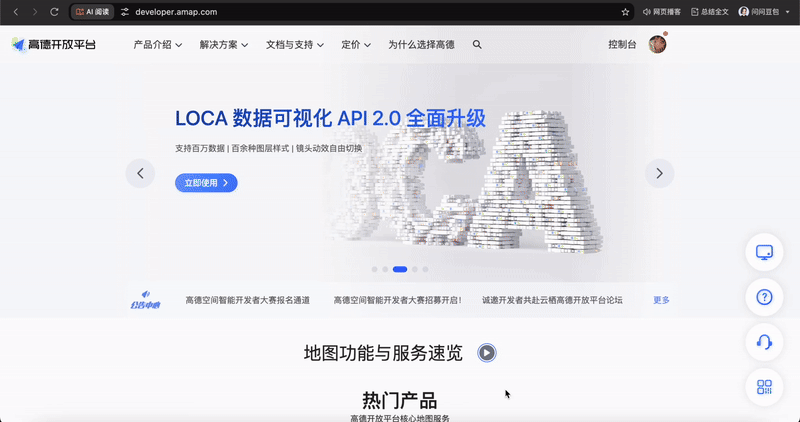
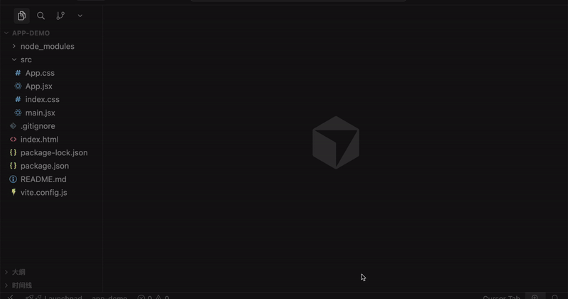
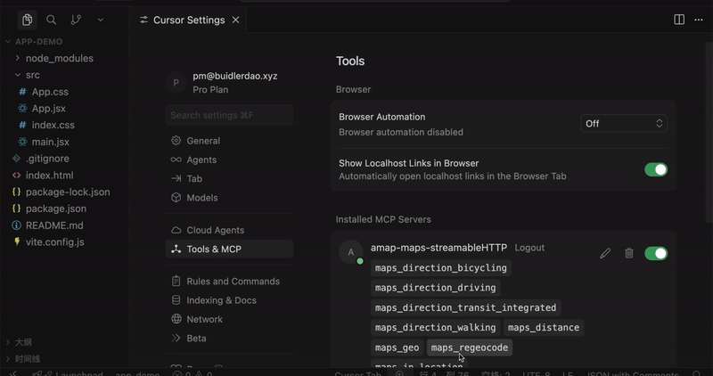
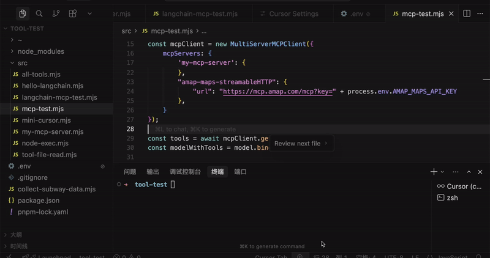
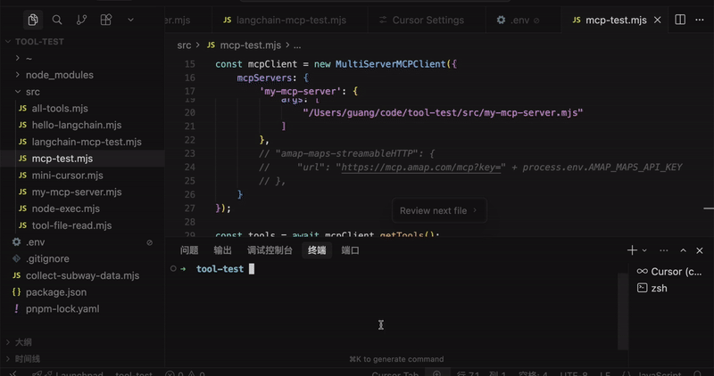
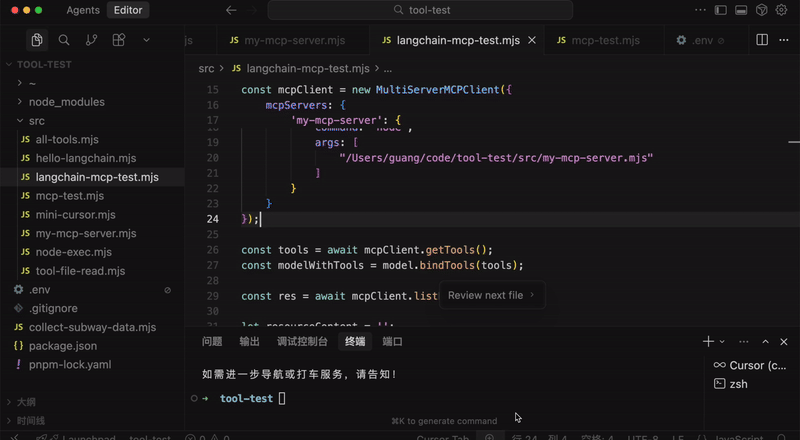
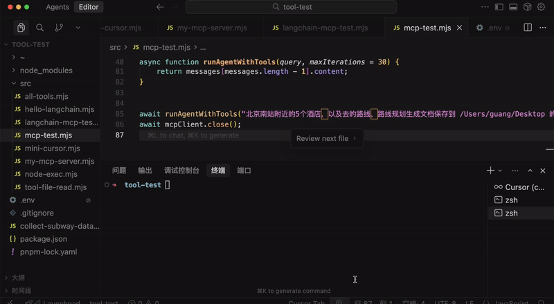
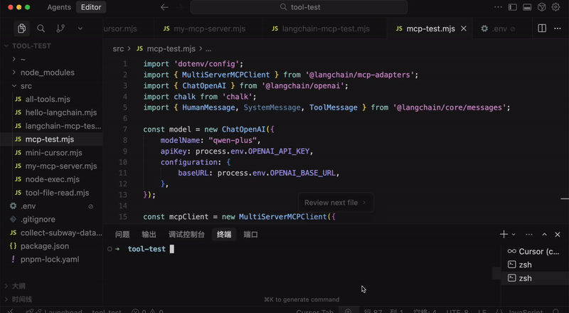
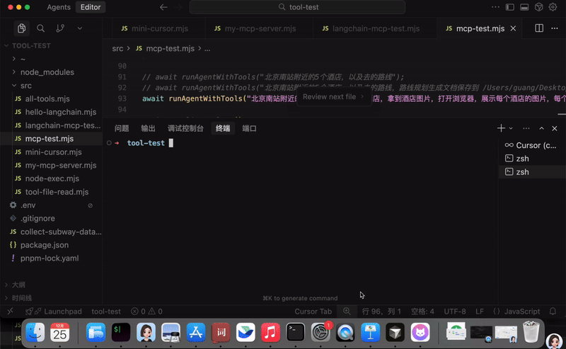

# 高德 MCP + 浏览器 MCP：LangChain 复用别人的 MCP Server 有多爽！

上节我们学了 MCP。

自己实现了一个 MCP Server，然后在 Cursor 或者 LangChain 里连上这个 server，就可以用里面的 tools 了。

**🎬 [视频 1](http://mpvideo.qpic.cn/0bc3riagqaaaeuakyb2mbjuvbcwdncfaa2aa.f10002.mp4?dis_k=30d80611a5606e7521c5e5cc61185383&dis_t=1781680077&play_scene=10110&auth_info=IZ/R3Mksc+aAzLl1XpXo38F+UkpSJmY9Hx44YU9ieDEcaC9MYhtNIj0OOD4pPGYDaxJfakYs&auth_key=e0866a99eaf163a800c03e4adf6e9fe6)**


它本质上还是 tool，只不过包了一层进程，可以通过 stdio 和 http 来访问。


有这一层协议之后，有个巨大的好处：

任何人都可以开发基于这个协议的 MCP Server，然后我们可以直接复用！

比如上节我们写的那个 MCP Server 就可以被别人用。

这节我们用一下别人写好的 MCP Server，感受下 MCP 有多爽！

我们用这三个 MCP Server：

- 高德 MCP：可以做位置查询、路线规划等
- Chrome DevTools MCP：控制浏览器，打开关闭页面、点击元素、截图等
- FileSystem MCP：读写文件、创建目录等

首先是高德 MCP，我们需要先获取一个 apikey：

https://developer.amap.com/

**🎬 [视频 2](http://mpvideo.qpic.cn/0b2ekqaeoaaat4aik6cm6zuvavgdi5kaarya.f10002.mp4?dis_k=9ccd36ad99784c6cee7659f2a745f434&dis_t=1781680077&play_scene=10110&auth_info=J9OAl496cLaMyegiWJDljMZ1VUABITo+H05tOUNjcDMaaXkbNk9OcjELaWkvOWtQbBlYYBUr&auth_key=f7328a5fe51ee6c9ede9866fe9b2d869)**



创建应用，然后创建一个 api key

类型选 web 服务就行。

然后我们先在 cursor 里测试下这个 mcp 服务是否可用：

**🎬 [视频 3](http://mpvideo.qpic.cn/0bc3taagmaaak4ake22m4juvbggdm2maazqa.f10002.mp4?dis_k=5a471a115d2df193b899e022edb54d9b&dis_t=1781680077&play_scene=10110&auth_info=davi6uB2f+aFnegmC8bl3pZ/A0wDdmk8SB44NR5mLGFIZikca0FBIjhfaW18b2sCPBMObBd8&auth_key=dde499f3569195436d64af5eddf94883)**



可以看到，配好之后，就可以查到这个 mcp server 里的一堆 tool 了：


记得我们说过 mcp 有两种接入方式么？


这就是 http 的接入方式。

当然，高德也支持 stdio 的本地进程的接入方式，这样写：

```
"amap-maps": {
  "command": "npx",
  "args": [
    "-y",
    "@amap/amap-maps-mcp-server"
  ],
  "env": {
    "AMAP_MAPS_API_KEY": "你的 api key"
  }
},
```

**🎬 [视频 4](http://mpvideo.qpic.cn/0bc3quadwaaaz4ap6fsmabuvbbodhocqaoya.f10002.mp4?dis_k=a317976242caedc2cb944dbcb5dae867&dis_t=1781680077&play_scene=10110&auth_info=BZ2Nrnd/t4HLuCANkbSLl35XTgNxbzoQGD8yTmYrZhw7eUwwGkFzPAk5a3o4Olc9ElpuF3s=&auth_key=8df75e05fcdf779b3c7f1fe79d2eafa9)**



就是用 npx 跑一个 npm 包，会创建一个支持 stdio 连接的进程，然后连上其中的 mcp server 就好了。

这个 mcp server 里肯定封装了和高德服务端的通信，本质上是一样的。

其实你的前端简历里就可以写一下这个：

我开发了一个 mcp server 的 npm 包，包含 xxx tool，支持 stdio 访问。可以在 cursor 或 langchain 里用 npx 执行来连上这个 mcp server。

这样面试官一看就知道，这个人是真懂 MCP 的，而且还有实践经验。

说回正题，我们在 langchain 里用一下这个 mcp：

在 tool-test 项目里创建 src/mcp-test.mjs

```
import 'dotenv/config';
import { MultiServerMCPClient } from'@langchain/mcp-adapters';
import { ChatOpenAI } from'@langchain/openai';
import chalk from'chalk';
import { HumanMessage, SystemMessage, ToolMessage } from'@langchain/core/messages';

const model = new ChatOpenAI({ 
    modelName: "qwen-plus",
    apiKey: process.env.OPENAI_API_KEY,
    configuration: {
        baseURL: process.env.OPENAI_BASE_URL,
    },
});

const mcpClient = new MultiServerMCPClient({
    mcpServers: {
        'my-mcp-server': {
            command: "node",
            args: [
                "/Users/guang/code/tool-test/src/my-mcp-server.mjs"
            ]
        },
        "amap-maps-streamableHTTP": {
            "url": "https://mcp.amap.com/mcp?key=" + process.env.AMAP_MAPS_API_KEY
        },
    }
});

const tools = await mcpClient.getTools();
const modelWithTools = model.bindTools(tools);

asyncfunction runAgentWithTools(query, maxIterations = 30) {
    const messages = [
        new HumanMessage(query)
    ];

    for (let i = 0; i < maxIterations; i++) {
        console.log(chalk.bgGreen(`⏳ 正在等待 AI 思考...`));
        const response = await modelWithTools.invoke(messages);
        messages.push(response);

        // 检查是否有工具调用
        if (!response.tool_calls || response.tool_calls.length === 0) {
            console.log(`\n✨ AI 最终回复:\n${response.content}\n`);
            return response.content;
        }

        console.log(chalk.bgBlue(`🔍 检测到 ${response.tool_calls.length} 个工具调用`));
        console.log(chalk.bgBlue(`🔍 工具调用: ${response.tool_calls.map(t => t.name).join(', ')}`));
        // 执行工具调用
        for (const toolCall of response.tool_calls) {
            const foundTool = tools.find(t => t.name === toolCall.name);
            if (foundTool) {
                const toolResult = await foundTool.invoke(toolCall.args);
                
                messages.push(new ToolMessage({
                    content: toolResult,
                    tool_call_id: toolCall.id,
                }));
            }
        }
    }

    return messages[messages.length - 1].content;
}

await runAgentWithTools("北京南站附近的酒店，以及去的路线");

await mcpClient.close();
```

mcp client 的代码和上节一样，用 @langchain/mcp-adapters

拿到其中的 tools 绑定给 model

然后调用 model，如果有 tool_calls 就调用下，把工具调用结果封装为 ToolMessage 传给大模型继续处理。

这里的高德 api key 同样放到了 .env 里：


先注释掉高德 mcp server 跑一下：

**🎬 [视频 5](http://mpvideo.qpic.cn/0bc3nqagoaaa2makhlsmhbuva3gdm5waazya.f10002.mp4?dis_k=d58c92c60d66ba200bc41a0aa0036753&dis_t=1781680077&play_scene=10110&auth_info=JZnUtsEpcrLUn7siX5Tj3MVzUh1Xej00G0w/MB5ifmUYbSpOMRtMdmldOmkoPW0Abx9fPUNw&auth_key=d66d41c84d41e29c544099e07df2fbd8)**



可以看到，大模型没法处理地理位置信息，让你用地图。

我们启用高德 MCP Server：

**🎬 [视频 6](http://mpvideo.qpic.cn/0bc33qagoaaaxaakhm2mhjuvbxgdm7oaazya.f10002.mp4?dis_k=91d04c63fc1732d885408d79834d2839&dis_t=1781680077&play_scene=10110&auth_info=drW8wdt+drvRmON7XJC02Mp1WEBTJm45Shk6ZhllfzRLOyJGZkxIf2xaYjArOToEYBlVYEcs&auth_key=7e5fca96311cdf3699282cbedf843131)**



现在，大模型就可以调用高德 mcp 里的 tool 给出酒店位置和路线了！

这就是 mcp 的好处，直接复用别人写好的 tool。

然后文件读写、创建目录这种，也不用自己写 tool，可以用现成 mcp：


mcp 官方维护的一个 mcp server

```
"filesystem": {
    "command": "npx",
    "args": [
      "-y",
      "@modelcontextprotocol/server-filesystem",
      ...(process.env.ALLOWED_PATHS.split(',') || '')
    ]
}
```

后面是可访问的目录，我们配在 .env 里：


逗号分隔

我们可以先在 cursor 里配置下这个 mcp 服务，看下有哪些 tool：

**🎬 [视频 7](http://mpvideo.qpic.cn/0bc3ymagsaaaeuak3esmgzuvbq6dnhbqa2ia.f10002.mp4?dis_k=e50ae64de56eef247169c6652021ecf7&dis_t=1781680077&play_scene=10110&auth_info=ItSTi6t6f+CDme9xX5bhj5EgVhxXcj9oHxttZU9iLWIfbS5JYk5BJD5bbjooP29TO0xbPEN4&auth_key=a66b84c7e7c0d827b9885b8d920e14b4)**



可以看到，有文件读写、目录创建、文件移动等 tool。

这样，配上这个 mcp，大模型就有文件读写能力了。

不过这里还有个坑注意下：


一般我们写 tool 都是直接返回字符串，但是 FileSystem MCP 封装的这些 tool 返回的是对象，有 text 属性，所以要处理下：

```
// 确保 content 是字符串类型
let contentStr;
if (typeof toolResult === 'string') {
    contentStr = toolResult;
} else if (toolResult && toolResult.text) {
    // 如果返回对象有 text 字段，优先使用
    contentStr = toolResult.text;
}

messages.push(new ToolMessage({
    content: contentStr,
    tool_call_id: toolCall.id,
}));
```

改下提示词：

```
await runAgentWithTools("北京南站附近的5个酒店，以及去的路线，路线规划生成文档保存到 /Users/guang/Desktop 的一个 md 文件");
```

跑跑试试：

**🎬 [视频 8](http://mpvideo.qpic.cn/0b2ekeaeqaaa4iaiuzkm7fuvauodjbiqasaa.f10002.mp4?dis_k=ac55a32261760dc5fbf25178fef25d30&dis_t=1781680077&play_scene=10110&auth_info=ILv0+5ordLaEmOIlCsLi35Z1URgBd2tsGh07NktjfjcdPC8YMR5KcjlaY259a2wDPBlcOBV9&auth_key=b15e5194c8419e9384619ca770b2de16)**



可以看到，大模型首先调用高德 mcp 拿到了附近的酒店位置，然后规划了路线

最后调用 FileSystem MCP 写入了文件。

直接复用别人的 MCP，完全不用自己写。

你自己写的 tool 想给别人用，也可以封装成 MCP，最好发个 npm 包，这样还可以写到简历上去，让面试官用。

最后我们再来用一下 Chrome Devtools 的 MCP，它是可以用来做浏览器自动化的。

比如打开页面、点击元素、截图等。

在 cursor 配置下：

```
"chrome-devtools": {
  "command": "npx",
  "args": [
    "-y",
    "chrome-devtools-mcp@latest"
  ]
}
```

**🎬 [视频 9](http://mpvideo.qpic.cn/0bc32eagqaaajuakyhcmgvuvbuodndiqa2aa.f10002.mp4?dis_k=47bc592264a35a13f4e998695ed87417&dis_t=1781680077&play_scene=10110&auth_info=JcKVh9srf7qNmeN2CsDo3cZ3Vk1VID04EB07Nk41ezIYbikYZx1BfjBbYj19aWYBbBtbbUEq&auth_key=c9e367883d72af3b648a383b69c20d03)**



可以看到很多工具。

在 langchain 里调用下：


改下提示词：

```
await runAgentWithTools("北京南站附近的酒店，最近的 3 个酒店，拿到酒店图片，打开浏览器，展示每个酒店的图片，每个 tab 一个 url 展示，并且在把那个页面标题改为酒店名");
```

**🎬 [视频 10](http://mpvideo.qpic.cn/0bc3eeagsaaauuak2h2mdruvaiodneqqa2ia.f10002.mp4?dis_k=e4902cd63c093dcd334bba02f8d94d4a&dis_t=1781680077&play_scene=10110&auth_info=BZmLqi5y4dfO6nEJnLTTxiJVGAd2Zz0bTG02STd4Pko7eRpgS0wlagxrOn41Og9sTlg4E3w=&auth_key=a0a3d3f26873226d6ede9c11e1a450a6)**



可以看到，搜到了北京南站最近的 3 个酒店，并且浏览器打开了酒店图片。

只要配好 MCP，大模型就可以直接调用里面的 tools 了：


> 代码上传了课程仓库： https://github.com/QuarkGluonPlasma/ai-agent-course-code/tool-test

## 总结

这节我们使用了高德、FileSystem、Chrome Devtools 的 MCP，用它们结合来实现了一些功能。

这些 MCP Server 有的是 stdio 本地进程调用，有的是 http 远程进程调用。

MCP 的一大好处就是别人开发好的，可以直接用。

你全程不需要知道怎么用高德的 API 查询位置、路线，不需要知道怎么用 cdp 协议控制浏览器。

你只需要把这些 MCP 给到 AI，让它自己去调用。

你不需要知道这些 tool 里面的高德 API 怎么用、浏览器控制怎么用，大模型会自己读取 tool 描述来传入参数调用。是不是特别爽！
