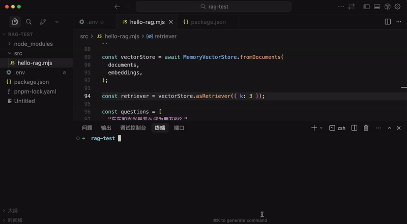
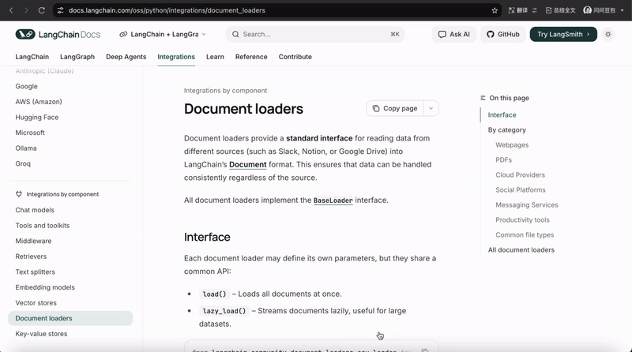
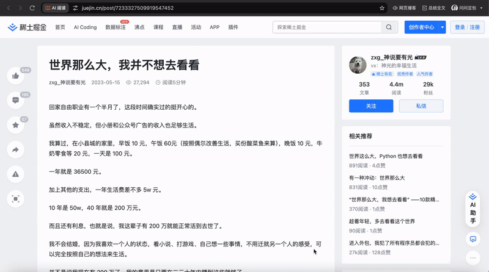
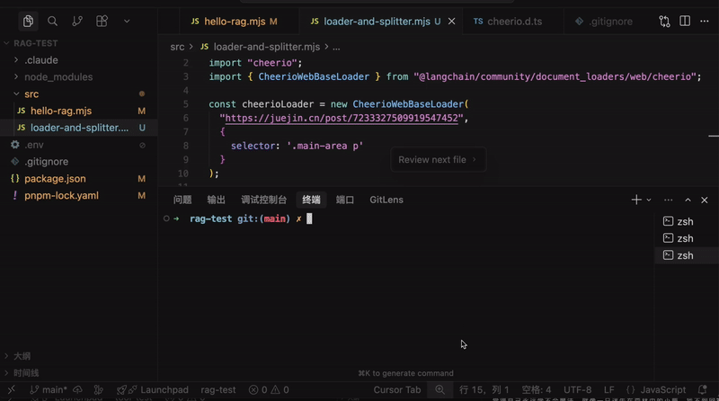

# 知识库的 loader 和 splitter：从各种来源加载文档并分割成小块

上节我们学了 RAG，它可以解决大模型的幻觉问题。

幻觉就是大模型对于它不知道的知识，会以为自己知道，然后胡乱回答。

解决方案 RAG 就是根据用户的 prompt，去知识库查询相关文档，加到 prompt 里给到大模型作为背景知识来回答。


这种相关文档的检索，要根据 prompt 的语义来搜，所以一般要结合向量来实现：

基于嵌入模型把文档向量化，存入向量数据库，查询的时候把 prompt 向量化，根据余弦相似度，来检索最相近的向量，然后把相关文档放到 prompt 里。


上节我们跑通了这个流程：

**🎬 [视频 1](http://mpvideo.qpic.cn/0bc3uyalaaaazuabea2s5nuvbjwdwctabmaa.f10002.mp4?dis_k=b81da2380104cff78ec9aba25d64de39&dis_t=1781680211&play_scene=10110&auth_info=AteAy+cGOK6NwI59d8PnxvIpZ1E1UGMdEWkELD9gBBs/ZQY0ZjMGajACDzYAamkaWEVqcSFa&auth_key=5d2a1ac9304acfcad32eb5d7aa7b52a7)**



会查询出几个相似度最高的文档放到 prompt 里，大模型基于这些来回答。

但上节我们是直接创建的 Document 对象，然后用嵌入模型存入了向量数据库：


实际上知识的来源可能有很多：

一个 word 文档、一个 pdf 文件、一个 youtube 视频、一个 url、一个 x 的推文等。

这种显然就不是直接创建 Document 对象了，而是要用各种 loader 来转换：


经过对应的 loader 处理后，变成 Document，之后再由嵌入模型向量化后存入知识库。

知识有各种来源，所以对应的各种 loader 也很多：

现在 langchain 文档里有 180+ loader：

https://docs.langchain.com/oss/python/integrations/document_loaders

**🎬 [视频 2](http://mpvideo.qpic.cn/0b2e34ahkaaa5qan7hs2izuvbx6doxpqa5ia.f10002.mp4?dis_k=091acf0ccf5440c9153c03d17a2e69b2&dis_t=1781680211&play_scene=10110&auth_info=WJG77vYHParcktIsfJHmxvcrM1JuAzQYET5SKTFpVEtlNFcxZTEDbmFQU2cLOGgaXUc+cnoJ&auth_key=1902625bfdc7ab9aadfacd656b378e77)**



你可以把各种知识来源通过 loader 转化为文档存入知识库。

当然，有的文档可能会很大，比如一个 pdf 文件可能是一本书的大小。

这种很明显不能直接把转化后的 Document 向量化，需要先拆分文档。

也就是需要 Splitter


大的文档经过 TextSplitter 分割后，变成一个个小文档，再给到嵌入模型做向量化。

分割最简单的就是按照字符，比如换行符 \n

但并不是每一行一个 Document，而是要设置一个 chunk size，按照换行符分割好的内容加入到这个 Chunk，当达到 chunk size 后，再继续生成下个 Chunk。


这个 Chunk 也是 Document 对象，只是文档内容是分割好的一个个大小合适的块。

我们写代码来跑一边这个流程。

在上节的 rag-test 项目里继续写：

创建 src/loader-and-splitter.mjs

```
import "dotenv/config";
import"cheerio";
import { CheerioWebBaseLoader } from"@langchain/community/document_loaders/web/cheerio";

const cheerioLoader = new CheerioWebBaseLoader(
"https://juejin.cn/post/7233327509919547452",
  {
    selector: '.main-area p'
  }
);

const documents = await cheerioLoader.load();

console.log(documents);
```

我们用 CheerioWebBaseLoader 这个 loader 来加载一个网页。

安装下用到的包：

```
pnpm install cheerio @langchain/community
```

各种 loader 显然是社区维护，所以在 @langchain/community 这个包下。

**🎬 [视频 3](http://mpvideo.qpic.cn/0bc3s4agyaaaieamljc27nuvbf6dnslqa3aa.f10002.mp4?dis_k=64fd73953a73bf3031008438bd343917&dis_t=1781680211&play_scene=10110&auth_info=C8fhz+hWOKuNl9J/eZfrkfJ/Zls4UzMaFmgEeThrUEg2PFBmbGQGbzBVUzQOPmVNWBNreyxZ&auth_key=3c8010fdb85d368a1079a3f2fa5b74f9)**



这里我们用 loader 加载网页，取出 .main-area 下所有 p 标签的内容。

跑一下：

**🎬 [视频 4](http://mpvideo.qpic.cn/0b2e2aanoaaaoaah4rk2czuvbugd27iabvya.f10002.mp4?dis_k=66df2c6522d60629dcd97f744e958586&dis_t=1781680211&play_scene=10110&auth_info=ApfOz8UAOaGMnN52eJfpk/B6NlQ4UmBJEzpUeDE8Ahw/MwJiYDIHZTFeXz0PPmdPWhY7dCxY&auth_key=be344709926abe60e6006170e13cd737)**



可以看到，网页内容中选择器的部分被取出来了，放入了 Document 对象。

现在的 Document 太大了，我们分割下：


splitter 在 @langchain/textsplitters 这个包下，安装下：

```
pnpm install @langchain/textsplitters
```

我们指定了 chunkSize 是 400 个字符，然后前后重复 50 个字符。

分割符是优先 。 其次 ！？

跑一下：

**🎬 [视频 5](http://mpvideo.qpic.cn/0bc35qaasaaaa4akbrc27juvb3gdbhwaacia.f10002.mp4?dis_k=4133aca7b38079303d5967356b4dc20d&dis_t=1781680211&play_scene=10110&auth_info=ArXGkqIEPqzdx9l+KpXuxKUpNgM6AmEVFT1beThrBU0/MlNmYTAAaGAFWDVdPGAYD0U7Iy4I&auth_key=22a378de1c4f64c5f137dd412fe1c52a)**


可以看到，文档被分成了 4 个小的文档。

每个文档是都是 400 字符左右，前后重复了 50 个字符。

这样分割好的文档用来做 RAG 性能显然会更好，不需要加载整个大文档。

我们把完整的 RAG 流程写一下：

创建 src/loader-and-splitter2.mjs

```
import "dotenv/config";
import"cheerio";
import { ChatOpenAI, OpenAIEmbeddings } from"@langchain/openai";
import { RecursiveCharacterTextSplitter } from"@langchain/textsplitters";
import { MemoryVectorStore } from"@langchain/classic/vectorstores/memory";
import { CheerioWebBaseLoader } from"@langchain/community/document_loaders/web/cheerio";

const model = new ChatOpenAI({
temperature: 0,
model: process.env.MODEL_NAME,
apiKey: process.env.OPENAI_API_KEY,
configuration: {
    baseURL: process.env.OPENAI_BASE_URL,
  },
});

const embeddings = new OpenAIEmbeddings({
apiKey: process.env.OPENAI_API_KEY,
model: process.env.EMBEDDINGS_MODEL_NAME,
configuration: {
    baseURL: process.env.OPENAI_BASE_URL
  },
});

const cheerioLoader = new CheerioWebBaseLoader(
"https://juejin.cn/post/7233327509919547452",
  {
    selector: '.main-area p'
  }
);

const documents = await cheerioLoader.load();

console.assert(documents.length === 1);
console.log(`Total characters: ${documents[0].pageContent.length}`);

const textSplitter = new RecursiveCharacterTextSplitter({
chunkSize: 500,  // 每个分块的字符数
chunkOverlap: 50,  // 分块之间的重叠字符数
separators: ["。", "！", "？"],  // 分割符，优先使用段落分隔
});

const splitDocuments = await textSplitter.splitDocuments(documents);

console.log(`文档分割完成，共 ${splitDocuments.length} 个分块\n`);

console.log("正在创建向量存储...");
const vectorStore = await MemoryVectorStore.fromDocuments(
  splitDocuments,
  embeddings,
);
console.log("向量存储创建完成\n");

const retriever = vectorStore.asRetriever({ k: 2 });

const questions = [
"父亲的去世对作者的人生态度产生了怎样的根本性逆转？"
];

// RAG 流程：对每个问题进行检索和回答
for (const question of questions) {
console.log("=".repeat(80));
console.log(`问题: ${question}`);
console.log("=".repeat(80));

// 使用 retriever 获取相关文档
const retrievedDocs = await retriever.invoke(question);

// 使用 similaritySearchWithScore 获取相似度评分
const scoredResults = await vectorStore.similaritySearchWithScore(question, 2);

// 打印检索到的文档和相似度评分
console.log("\n【检索到的文档及相似度评分】");
  retrievedDocs.forEach((doc, i) => {
    // 找到对应的评分
    const scoredResult = scoredResults.find(([scoredDoc]) =>
      scoredDoc.pageContent === doc.pageContent
    );
    const score = scoredResult ? scoredResult[1] : null;
    const similarity = score !== null ? (1 - score).toFixed(4) : "N/A";
    
    console.log(`\n[文档 ${i + 1}] 相似度: ${similarity}`);
    console.log(`内容: ${doc.pageContent}`);
    if (doc.metadata && Object.keys(doc.metadata).length > 0) {
      console.log(`元数据:`, doc.metadata);
    }
  });

// 构建 prompt
const context = retrievedDocs
    .map((doc, i) =>`[片段${i + 1}]\n${doc.pageContent}`)
    .join("\n\n━━━━━\n\n");

const prompt = `你是一个文章辅助阅读助手，根据文章内容来解答：

文章内容：
${context}

问题: ${question}

你的回答:`;

console.log("\n【AI 回答】");
const response = await model.invoke(prompt);
console.log(response.content);
console.log("\n");
}
```

整体流程和上节一样：用嵌入模型把文档存入向量数据库，先检索和用户的问题相似度最高的 2 个文档，把它加入 prompt，然后调用大模型基于文档回答。

**🎬 [视频 6](http://mpvideo.qpic.cn/0bc3seakuaaaseaabbc24juvbeodvkiqbkqa.f10002.mp4?dis_k=4dc22681693b876c7a9464a4dfa00334&dis_t=1781680211&play_scene=10110&auth_info=D+DzgupTOvmJlNh9epW7lKR6Y1o8VmseRzJVfGtvAEEyMlA0YGIEPTRWWTYNPDVIDhZueihc&auth_key=b4665d35face7532e34c20431f5230db)**


可以看到，loader 加载了文档，用 splitter 分成了 4 个分块（chunk）。

回答的时候检索了相似度最高的 2 个文档块，基于这个做了回答。

> 代码上传了课程仓库： https://github.com/QuarkGluonPlasma/ai-agent-course-code

## 总结

这节我们学了 loader 和 splitter。

loader 可以从各种地方加载内容作为 Document，比如 word、pdf、网页、youtube、x 的推文等等。

现在有 180+ 的 loader，社区维护，所以是在 @langchain/community 这个包。

加载后的 Document 可能会很大，需要分割成一个个小的文档，所以需要 Splitter。

splitter 在 @langchain/text-splitters 这个包。

我们写了一个读取网页里的文章内容作为文档，分割后放入知识库的 RAG 案例。

这节只要理解这俩概念就行，具体 loader 和 splitter 有很多类型，下节我们详细过一遍。
