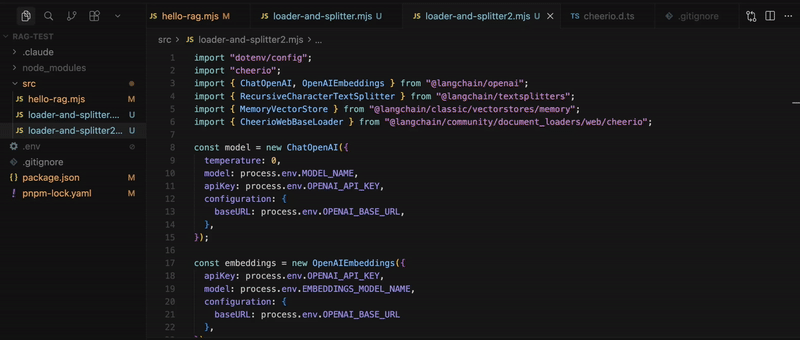
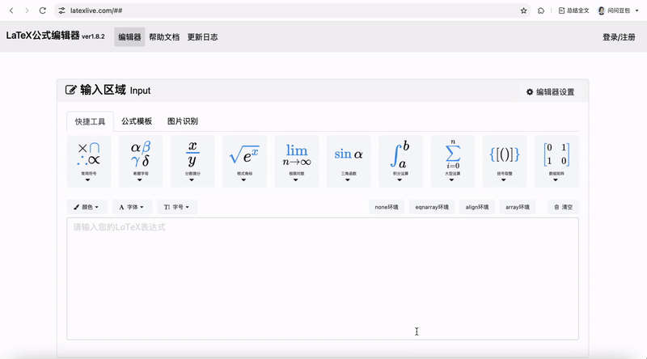
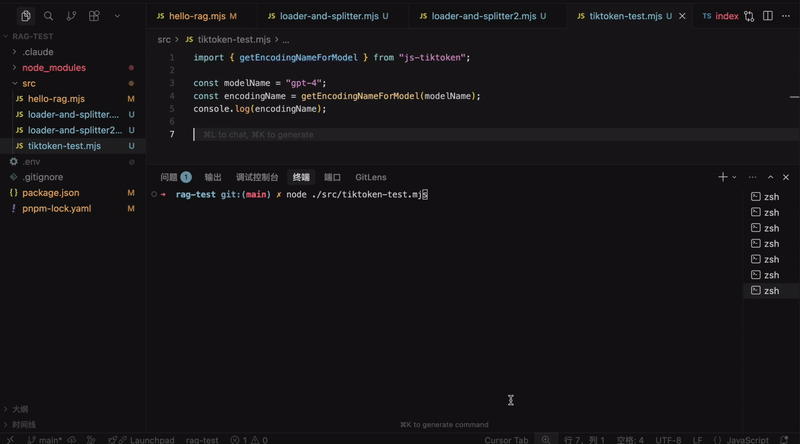
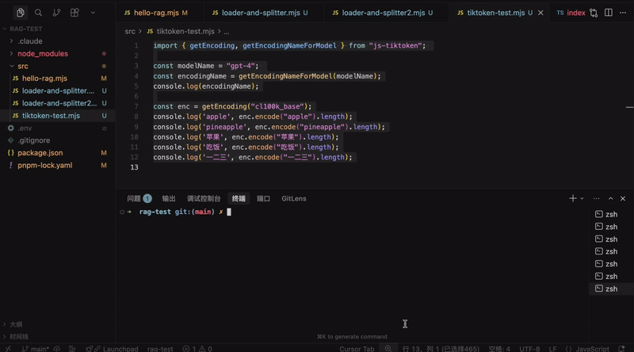
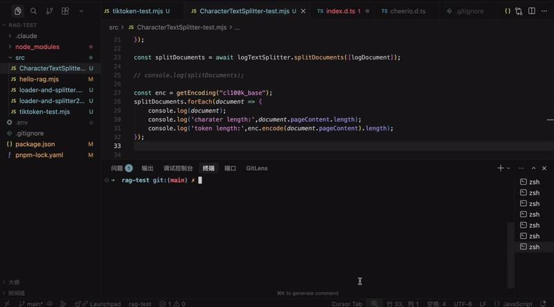
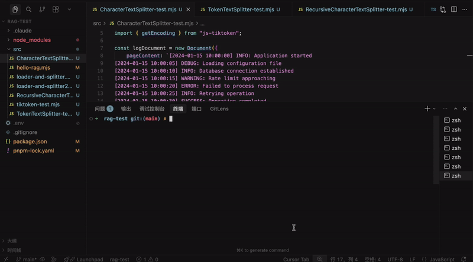
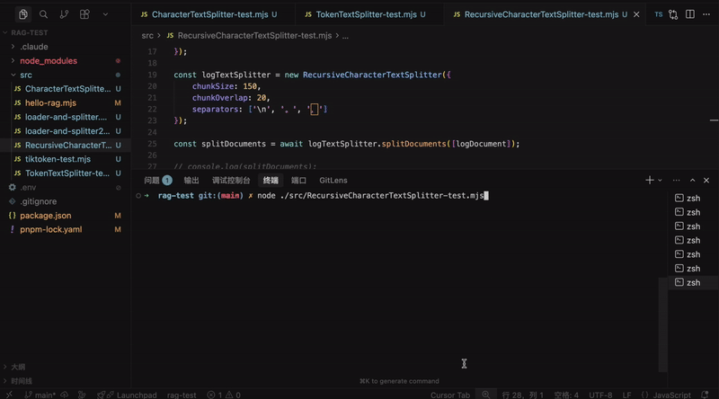
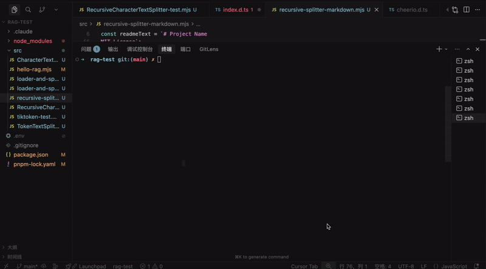
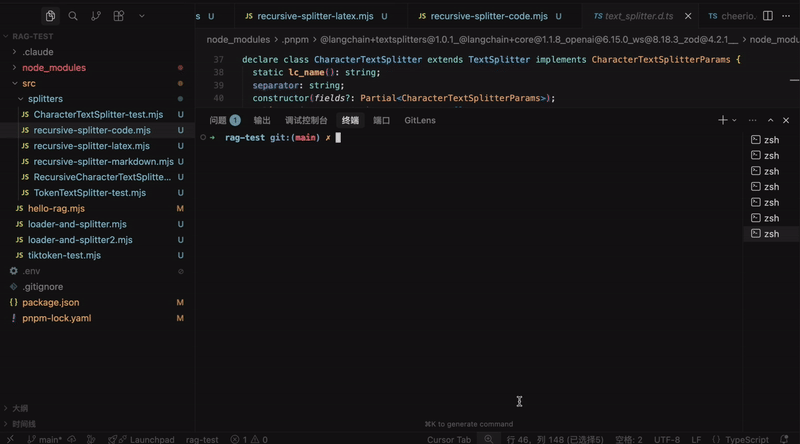

# LangChain 全部 Splitter，其实只需要其中的一个

上节我们学了 loader 和 splitter


知识可能有各种来源，比如一个视频、一个 pdf、一个网页、一个 word 文档

这时候就需要通过各种 loader 从中提取信息，把它们转换成 Document

但是 Document 可能会很大，需要用 Splitter 分割成一个个的比较小的 Document（chunk）

之后用嵌入模型，把分块的文档向量化后存入向量数据库。

上节跑通了这个流程：

**🎬 [视频 1](http://mpvideo.qpic.cn/0bc3seakuaaaseaabbc24juvbeodvkiqbkqa.f10002.mp4?dis_k=a8a8fb852e8f52f675c324ae98c2061c&dis_t=1781680319&play_scene=10110&auth_info=XLDovLUPKrGAsaB3TdSfsZYMWx89RDNPVS06FlJGb3dhDSIYSToUdT1zITw6fRFtPGBWPylO&auth_key=936735ee32682f1cbda37ebdab713f70)**


这节我们把所有的 Splitter 过一遍。

首先要区分 sperator 和 chunk size 的概念：

比如上节我们这样分割的 Document：


首先按照 。的 sperator 来分割字符串，然后按照 chunk size 放入一个个 Document，也就是这样：


如果分割后还是大于 chunk size，就需要按照后面的 sperator 继续分割，然后加上 overlap：


注意，**overloap 只有文本超过 chunk size，文本被打断了才会加**，不是所有的块都会有 overlap

比如上面那段话超过了 chunk size，分割到两个 chunk 里，第二个 chunk 就会按照设置重复一部分内容


设置这个是为了保证语义连贯性

通常设置为 chunkSize 的 10% - 20%

牺牲了一点存储空间（因为数据重复了），换取了模型对上下文理解的完整性。

那 langchain 都有哪些 splitter 呢？

我们看下 @langchain/textsplitters 这个包：

**🎬 [视频 2](http://mpvideo.qpic.cn/0bc3fqas2aabpiaaghldinuvclgdfuwaclia.f10002.mp4?dis_k=7bb9e5e7a61c3821f8def0da3ecb3064&dis_t=1781680319&play_scene=10110&auth_info=ZpOI2w8tvNC0pHkagp7vkgoIRGoTYR5UdTEQAxRqdjRYLRsTZRN4bXYlMm0rEDM4ZgVkfhk=&auth_key=782be74a2d40be5b26d761ca40ec4165)**



可以看到这个包导出的 splitter，以及它们的继承关系：


所有的 Splitter 都继承自 TextSplitter，包括 RecursiveCharacterTextSplitter 等。

而 MarkdownTextSplitter、LatexTextSplitter 又继承自 RecursiveCharacterTextSplitter。

其实很容易理解：

CharacterTextSplitter 是按照某个字符来分割，比如按照句号

RecursiveCharacterTextSplitter 是递归分割，比如“ 。 ？ ！”就是先尝试按照 。 分割，如果分割后大于 chunk 剩余空间再按照 ？ 分割，是一个递归过程。

而 MarkdownTextSplitter 自然就是按照 #、##、### 等一级级标题来递归分割，所以是 RecursiveCharacterTextSplitter 的子类。

Latex 是写数学公式的语法，比如这样：

https://www.latexlive.com/

**🎬 [视频 3](http://mpvideo.qpic.cn/0bc364acuaaaneaaiitcbfuvb56dfl3qakqa.f10002.mp4?dis_k=40aa633f340ca569fc861ea76d4d005d&dis_t=1781680319&play_scene=10110&auth_info=W5WDr6Vbe7rTsPF/SICY4ZldDUQ4R2JPByJmQQRGaXNmWCoYEGpFfm5ycDQ/KRY9MzEAZCxN&auth_key=172793bfc0aaf137561f5d4a611d79a3)**



它就是一种描述数学公式的语法，和 markdown 一样，自然也是递归按照某些字符分割的。

所以也是继承自 RecursiveCharacterTextSplitter

那 TokenTextSplitter 呢？

这个是另一种分割策略。

我们按照字符分割，分割出来的文档的 token 大小是不一定的。

token 是大模型输入的一个单位，可能一个单词是 1 到 2 个 token：

apple 是 1 个 token

pineapple 是 2 个 token

苹果是 1-2 个 token

我们试一下就知道了，用 js-tiktoken 这个包，它是 openai 模型的分词器


安装下：

```
pnpm install js-tiktoken
```

创建 src/tiktoken-test.mjs

```
import { getEncodingNameForModel } from "js-tiktoken"; 

const modelName = "gpt-4"; 
const encodingName = getEncodingNameForModel(modelName);
console.log(encodingName);
```

我们打印下 gpt-4 这个模型的编码的名字

**🎬 [视频 4](http://mpvideo.qpic.cn/0b2exqatwaabm4abkxldqnuvdpgdho6acoya.f10002.mp4?dis_k=eac2ac53e71e902cf80a06895bdc4556&dis_t=1781680319&play_scene=10110&auth_info=Cczo4uQKK7yG5vJ+Ttid5cNdVkxvRjEWCSFgEQNCbHM0CXsaQz0VeDskczU5cRM5aTFbbHtM&auth_key=731547a0bbffe78e7ccdc60c4d2ec3ff)**



然后可以用这个编码来计算下 token 数量：

```
import { getEncoding, getEncodingNameForModel } from "js-tiktoken"; 

const modelName = "gpt-4"; 
const encodingName = getEncodingNameForModel(modelName);
console.log(encodingName);

const enc = getEncoding("cl100k_base");
console.log('apple', enc.encode("apple").length);
console.log('pineapple', enc.encode("pineapple").length);
console.log('苹果', enc.encode("苹果").length);
console.log('吃饭', enc.encode("吃饭").length);
console.log('一二三', enc.encode("一二三").length);
```

**🎬 [视频 5](http://mpvideo.qpic.cn/0bc3giacyaaay4aaeplcdnuvamwdfqzaalaa.f10002.mp4?dis_k=9d6e89c7c07f25ba4304127f4665848e&dis_t=1781680319&play_scene=10110&auth_info=WruhvdFWceqC4PV4TdOYtcEPXUw6RzUZViA0Q1VObX5nVX5PFGRPLj8idDM6ehZpa2NQbC5N&auth_key=607d3fba758a4e7544a299ca88922e2f)**



可以看到，字符和 token 数量并没有一个确定的关系，与不同模型的分词器有关。

这样我们按照字符数来计算 chunk size 就没法准确估算 token 大小。

对于需要精准控制 token 数量的场景就不大合适了。

这时候就可以用 TokenTextSplitter，它是按照 token 数来分割的。

回过头来再看下所有的 Splitter：


关系就比较清晰了。

先用一下 CharacterTextSplitter

创建 src/CharacterTextSplitter-test.mjs

```
import "dotenv/config";
import"cheerio";
import { CharacterTextSplitter } from"@langchain/textsplitters";
import { Document } from"@langchain/core/documents";
import { getEncoding } from"js-tiktoken"; 

const logDocument = new Document({
    pageContent: `[2024-01-15 10:00:00] INFO: Application started
[2024-01-15 10:00:05] DEBUG: Loading configuration file
[2024-01-15 10:00:10] INFO: Database connection established
[2024-01-15 10:00:15] WARNING: Rate limit approaching
[2024-01-15 10:00:20] ERROR: Failed to process request
[2024-01-15 10:00:25] INFO: Retrying operation
[2024-01-15 10:00:30] SUCCESS: Operation completed`
});

const logTextSplitter = new CharacterTextSplitter({
    separator: '\n',
    chunkSize: 200,
    chunkOverlap: 20
});

const splitDocuments = await logTextSplitter.splitDocuments([logDocument]);

// console.log(splitDocuments);

const enc = getEncoding("cl100k_base");
splitDocuments.forEach(document => {
    console.log(document);
    console.log('charater length:',document.pageContent.length);
    console.log('token length:',enc.encode(document.pageContent).length);
});
```

一段日志文本，按照换行符来分割，每个块 200 字符。

打印下每个块的字符数，然后用 js-tiktoken 看一下 token数

跑一下：

**🎬 [视频 6](http://mpvideo.qpic.cn/0bc3eeawqaabueaen53dhvuvciodnaqqc2aa.f10002.mp4?dis_k=19f156ab7ec8ba09891ca0ab05ed9c94&dis_t=1781680319&play_scene=10110&auth_info=C6O9pPhbfujXtKAsE4PM55kDV01tFzdPUiQ3EARPOn82XSMfQGlALGp2IWdkKkI7M29abXkd&auth_key=2b129b99d62d6da81d75f51a1d35ff82)**



可以看到，按照换行符分割文本，然后按照 chunk size 放到了 3 个块里。

有同学可能会问，chunk 的大小也没有到 200 啊？

因为 splitter 会优先保证语义完整，宁愿 chunk 小一点。

这里到了 160 左右字符的时候，发现加上下一个文本就超过 200 了，所以会放到下一个块。

这里因为没有被断开的文本，所以就没有需要加 overlap 重复的，**只有被断开的文本才有 overlap**

我们加一个长的文本试一下：

```
const logDocument = new Document({
    pageContent: `[2024-01-15 10:00:00] INFO: Application started
[2024-01-15 10:00:05] DEBUG: Loading configuration file
[2024-01-15 10:00:10] INFO: Database connection established
[2024-01-15 10:00:15] WARNING: Rate limit approaching
[2024-01-15 10:00:20] ERROR: Failed to process request
[2024-01-15 10:00:25] INFO: Retrying operation
[2024-01-15 10:00:30] SUCCESS: Operation completed
[2026-01-10 14:30:00] INFO: 系统开始执行大规模数据迁移任务，本次迁移涉及核心业务数据库中的用户表、订单表、商品库存表、物流信息表、支付记录表、评论数据表等共计十二个关键业务表，预计处理数据量约500万条记录，数据总大小预估为280GB，迁移过程将采用分批次增量更新策略以减少对生产环境的影响，同时启用双写机制确保数据一致性，任务预计总耗时约3小时15分钟，迁移完成后将自动触发全面的数据一致性校验流程以及性能基准测试，请相关运维人员和DBA团队密切关注系统资源使用情况、网络带宽占用率以及任务执行进度，如遇异常情况请立即启动应急预案并通知技术负责人
`
});
```

**🎬 [视频 7](http://mpvideo.qpic.cn/0bc3ieabkaaazyadxalcifuvaqodcvaqafia.f10002.mp4?dis_k=8754c3d77122623306a91be2e9b81b99&dis_t=1781680319&play_scene=10110&auth_info=Bv/Iya0Je+2CtPR9Gdef5JMLWB03R2VLAnE7F1hHO387VC1MRT9FKT92dTZufhE4OWdVPSNN&auth_key=73aa7c0dbe1f4956b77ba5bb412c1140)**



看到问题了么？

CharacterTextSplitter 非常死板，你告诉它按照换行符分割，它就会严格按照这个，就算超过了 chunk size 也不拆分。

所以一般还是用 RecursiveCharacterTextSplitter

创建 src/RecursiveCharacterTextSplitter-test.mjs

```
import "dotenv/config";
import"cheerio";
import { RecursiveCharacterTextSplitter } from"@langchain/textsplitters";
import { Document } from"@langchain/core/documents";
import { getEncoding } from"js-tiktoken"; 

const logDocument = new Document({
    pageContent: `[2024-01-15 10:00:00] INFO: Application started
[2024-01-15 10:00:05] DEBUG: Loading configuration file
[2024-01-15 10:00:10] INFO: Database connection established
[2024-01-15 10:00:15] WARNING: Rate limit approaching
[2024-01-15 10:00:20] ERROR: Failed to process request
[2024-01-15 10:00:25] INFO: Retrying operation
[2024-01-15 10:00:30] SUCCESS: Operation completed
[2026-01-10 14:30:00] INFO: 系统开始执行大规模数据迁移任务，本次迁移涉及核心业务数据库中的用户表、订单表、商品库存表、物流信息表、支付记录表、评论数据表等共计十二个关键业务表，预计处理数据量约500万条记录，数据总大小预估为280GB，迁移过程将采用分批次增量更新策略以减少对生产环境的影响，同时启用双写机制确保数据一致性，任务预计总耗时约3小时15分钟，迁移完成后将自动触发全面的数据一致性校验流程以及性能基准测试，请相关运维人员和DBA团队密切关注系统资源使用情况、网络带宽占用率以及任务执行进度，如遇异常情况请立即启动应急预案并通知技术负责人
`
});

const logTextSplitter = new RecursiveCharacterTextSplitter({
    chunkSize: 150,
    chunkOverlap: 20,
    separators: ['\n', '。', '，']
});

const splitDocuments = await logTextSplitter.splitDocuments([logDocument]);

// console.log(splitDocuments);

const enc = getEncoding("cl100k_base");
splitDocuments.forEach(document => {
    console.log(document);
    console.log('charater length:',document.pageContent.length);
    console.log('token length:',enc.encode(document.pageContent).length);
});
```

它可以指定多个分隔符：


当 “\n” 分割后还是大，就会用 “。” 还是不行再尝试用 “，”

**🎬 [视频 8](http://mpvideo.qpic.cn/0bc37uaamaaaieacqalcljuvb7oda36qabqa.f10002.mp4?dis_k=25e466fcc1dd7fc80246a84f256e7b35&dis_t=1781680319&play_scene=10110&auth_info=CoWLtJVffu/W4PQrT9bLtJgLXEg4Fz8aViY3QwVBO3U3Xi8cRWpAK2sidWA4f0VoMmdRaCwd&auth_key=7556f241666c82936d1a17c0e6f17252)**



这样就明显好很多：


这两段文本是用换行符分割的。

按照换行符分割后下面的文本超过 chunk size，就会尝试按照句号逗号分割，然后加上 overlap：


最后这个是按照逗号分隔的，也没超过 chunk size，就没有 overlap了：


所以说 RecursiveCharacterTextSplitter 这种递归的方式灵活太多了。

绝大多数情况下，用这个就可以了。

然后我们再来试一下 TokenTextSplitter：

创建 src/TokenTextSplitter-test.mjs

```
import "dotenv/config";
import"cheerio";
import { TokenTextSplitter } from"@langchain/textsplitters";
import { Document } from"@langchain/core/documents";
import { getEncoding } from"js-tiktoken"; 

const logDocument = new Document({
    pageContent: `[2024-01-15 10:00:00] INFO: Application started
[2024-01-15 10:00:05] DEBUG: Loading configuration file
[2024-01-15 10:00:10] INFO: Database connection established
[2024-01-15 10:00:15] WARNING: Rate limit approaching
[2024-01-15 10:00:20] ERROR: Failed to process request
[2024-01-15 10:00:25] INFO: Retrying operation
[2024-01-15 10:00:30] SUCCESS: Operation completed`
});

const logTextSplitter = new TokenTextSplitter({
    chunkSize: 50,        // 每个块最多 50 个 Token
    chunkOverlap: 10,    // 块之间重叠 10 个 Token
    encodingName: 'cl100k_base',  // OpenAI 使用的编码方式
  });

const splitDocuments = await logTextSplitter.splitDocuments([logDocument]);

// console.log(splitDocuments);

const enc = getEncoding("cl100k_base");
splitDocuments.forEach(document => {
    console.log(document);
    console.log('charater length:',document.pageContent.length);
    console.log('token length:',enc.encode(document.pageContent).length);
});
```

用这个 splitter，然后指定下编码：


跑一下：


可以看到，它优先保证 token 正好是 50，为了这个不惜强行打断文本。

当然，打断后也加了 overlap：


RecursiveCharacterTextSplitter 分出的 chunk 可能大于 chunk size，也可以小，优先保证语义完整，是按照分割符来分割。

但是 TokenTextSplitter 不是，它会只会保证 token 数量

这种不管不顾的分割显然不靠谱，不一定在什么地方就断开了。

还是 RecursiveCharacterTextSplitter 那种更科学。

那能不能用 RecursiveCharacterTextSplitter 的分割方式，然后按照 token 长度来设置 chunk size 呢？

可以的。重写一下它的长度计算函数就可以了：


这样，chunk size 指的就是 token 的长度

```
const enc = getEncoding("cl100k_base");

const logTextSplitter = new RecursiveCharacterTextSplitter({
    chunkSize: 150,
    chunkOverlap: 20,
    separators: ['\n', '。', '，'],
    lengthFunction: (text) => enc.encode(text).length,
});
```

现在就是按照现在的 token 数量作为分割依据了：


这样就完全不需要用 TokenTextSplitter。

最后再来看一下 markdown、latex、代码的分割。

其实这些很明显，都是 RecursiveCharacterTextSplitter 实现的。

比如 markdown 是按照 #、##、### 的子标题来递归分割

latex 是按照那些数学公式的语法来分割

代码则是分语言来用不同的分割符。

但总体来说都是递归分割，所以他们都是用 RecursiveCharacterTextSplitter 实现的。

我们快速测一下：

创建 recursive-splitter-markdown.mjs

```
import "dotenv/config";
import"cheerio";
import { Document } from"@langchain/core/documents";
import { MarkdownTextSplitter } from"@langchain/textsplitters";

const readmeText = `# Project Name

> A brief description of your project

[](LICENSE)

## Features

- ✨ Feature 1
- 🚀 Feature 2
- 💡 Feature 3

## Installation

\`\`\`bash
npm install project-name
\`\`\`

## Usage

### Basic Usage

\`\`\`javascript
import { Project } from 'project-name';

const project = new Project();
project.init();
\`\`\`

### Advanced Usage

\`\`\`javascript
const project = new Project({
  config: {
    apiKey: 'your-api-key',
    timeout: 5000,
  }
});

await project.run();
\`\`\`

## API Reference

### \`Project\`

Main class for the project.

#### Methods

- \`init()\`: Initialize the project
- \`run()\`: Run the project
- \`stop()\`: Stop the project

## Contributing

Contributions are welcome! Please read our [contributing guide](CONTRIBUTING.md).

## License

MIT License`;

const readmeDoc = new Document({
    pageContent: readmeText
});

const markdownTextSplitter = new MarkdownTextSplitter({
    chunkSize: 400,
    chunkOverlap: 80
});

const splitDocuments = await markdownTextSplitter.splitDocuments([readmeDoc]);

// console.log(splitDocuments);

splitDocuments.forEach(document => {
    console.log(document);
    console.log('charater length:',document.pageContent.length);
});
```

创建 MarkdownTextSplitter，不用指定分割符，内置了。


跑一下：

**🎬 [视频 9](http://mpvideo.qpic.cn/0bc3zuaqwaabrmackpddhfuvdtodbpgqccya.f10002.mp4?dis_k=6e38880579ad5da7eebbec66601aef4b&dis_t=1781680319&play_scene=10110&auth_info=XeTf+rFRcLmAtPwuT9TJtpdeCx5sE2QYBiIyRAETP3JgWn9KSWROfT12fWU4fUdqPTIGPngZ&auth_key=b2a75f6b0179311d3f11f6a164c1ab56)**



可以看到，都是从标题处断开的，也就是根据语法分割的。

再来试下 letex

创建 src/recursive-splitter-latex.mjs

```
import "dotenv/config";
import"cheerio";
import { Document } from"@langchain/core/documents";
import { LatexTextSplitter } from"@langchain/textsplitters";

const latexText = `\int x^{\mu}\mathrm{d}x=\frac{x^{\mu +1}}{\mu +1}+C, \left({\mu \neq -1}\right) \int \frac{1}{\sqrt{1-x^{2}}}\mathrm{d}x= \arcsin x +C \int \frac{1}{\sqrt{1-x^{2}}}\mathrm{d}x= \arcsin x +C \begin{pmatrix}  
  a_{11} & a_{12} & a_{13} \\  
  a_{21} & a_{22} & a_{23} \\  
  a_{31} & a_{32} & a_{33}  
\end{pmatrix} `;

const latexDoc = new Document({
    pageContent: latexText
});

const markdownTextSplitter = new LatexTextSplitter({
    chunkSize: 200,
    chunkOverlap: 40
});

const splitDocuments = await markdownTextSplitter.splitDocuments([latexDoc]);

// console.log(splitDocuments);

splitDocuments.forEach(document => {
    console.log(document);
    console.log('charater length:',document.pageContent.length);
});
```

跑一下：


也是按照正确的语法分割的。

最后来试下代码的：

创建 src/recursive-splitter-code.mjs

```
import "dotenv/config";
import"cheerio";
import { Document } from"@langchain/core/documents";
import { LatexTextSplitter, RecursiveCharacterTextSplitter } from"@langchain/textsplitters";

const jsCode = `// Complete shopping cart implementation
class Product {
  constructor(id, name, price, description) {
    this.id = id;
    this.name = name;
    this.price = price;
    this.description = description;
  }

  getFormattedPrice() {
    return '$' + this.price.toFixed(2);
  }
}

class ShoppingCart {
  constructor() {
    this.items = [];
    this.discountCode = null;
    this.taxRate = 0.08;
  }

  addItem(product, quantity = 1) {
    const existingItem = this.items.find(item => item.product.id === product.id);
    if (existingItem) {
      existingItem.quantity += quantity;
    } else {
      this.items.push({ product, quantity, addedAt: new Date() });
    }
    return this;
  }

  removeItem(productId) {
    this.items = this.items.filter(item => item.product.id !== productId);
    return this;
  }

  calculateSubtotal() {
    return this.items.reduce((total, item) => {
      return total + (item.product.price * item.quantity);
    }, 0);
  }

  calculateTotal() {
    const subtotal = this.calculateSubtotal();
    const discount = this.calculateDiscount();
    const tax = (subtotal - discount) * this.taxRate;
    return subtotal - discount + tax;
  }

  calculateDiscount() {
    if (!this.discountCode) return 0;
    const discounts = { 'SAVE10': 0.10, 'SAVE20': 0.20, 'WELCOME': 0.15 };
    return this.calculateSubtotal() * (discounts[this.discountCode] || 0);
  }
}

// Usage example
const product1 = new Product(1, 'Laptop', 999.99, 'High-performance laptop');
const product2 = new Product(2, 'Mouse', 29.99, 'Wireless mouse');
const cart = new ShoppingCart();
cart.addItem(product1, 1).addItem(product2, 2);
console.log('Total:', cart.calculateTotal());`;

const jsCodeDoc = new Document({
    pageContent: jsCode
});

const codeSplitter = RecursiveCharacterTextSplitter.fromLanguage('js', {
    chunkSize: 300,
    chunkOverlap: 60,
})

const splitDocuments = await codeSplitter.splitDocuments([jsCodeDoc]);

// console.log(splitDocuments);

splitDocuments.forEach(document => {
    console.log(document);
    console.log('charater length:',document.pageContent.length);
});
```

用 RecursiveCharacterTextSplitter.fromLanguage 这个方法，指定语言，就会按照对应的语法来分割。

支持的语言有很多，包括： java、go、js、html、python、rust、swift、markdown 等

我们用最熟悉的 js 来测试下这个分割。

**🎬 [视频 10](http://mpvideo.qpic.cn/0bc3reapyaaa4uane5lcwjuvbcod7seqb7aa.f10002.mp4?dis_k=53c00df23b174b789d15bcafde690d12&dis_t=1781680319&play_scene=10110&auth_info=DZHSo9tYLO+HsKd+HNXP4JgCCk07FGRPVnBnQ1lGPXcwWSkaQWwSKzpyJjVrfEE8Mm4HbS8e&auth_key=2bd1efc21b546767f85a93f39ffabdaf)**



可以看到，完全没有破坏代码完整性，确实是按照语法分割的。

这样，我们就把所有 splitter 过了一遍：


其实看到这里你应该也有答案了，基本就用 RecursiveCharacterTextSplitter 就行。

另外两个都有很明显的缺点：

CharacterTextSplitter 功能 RecursiveCharacterTextSplitter 里都有

TokenTextSplitter 严格按照 token，会破坏文档语义，不如 RecursiveCharacterTextSplitter 重写 lengthFunction

另外两个则是 RecursiveCharacterTextSplitter 的子功能。

> 代码上传了课程仓库： https://github.com/QuarkGluonPlasma/ai-agent-course-code

## 总结

这节我们把所有 splitter 过了一遍。

结论是直接用 RecursiveCharacterTextSplitter 就行。

splitter 是先按照 sperator 来分割，然后按照 chunk size 放到一个个 chunk 里。

chunk 的实际大小可能小于 chunk size 也可以大于。

如果分割后文本长度大于 chunk size，会继续按照后面的 sperator 拆分，然后放到两个 chunk 里，加上 overlap 来保证语义连贯。

如果从前到后尝试 sperator，尝试到最后一个，拆分完还是大于 chunk size 就不会再拆分了。

默认是按照字符计数，如果你想严格控制 token 大小，比如需要计费的场景，就可以实现 lengthFunction 用 token 的方式计算长度。

RecursiveCharacterTextSplitter 还支持代码分割，用 fromLanguage 的静态方法，这个在处理代码文档的时候很有用。

虽然这节讲了很多，但是结论很简单，就是用 RecursiveCharacterTextSplitter 就好了。
