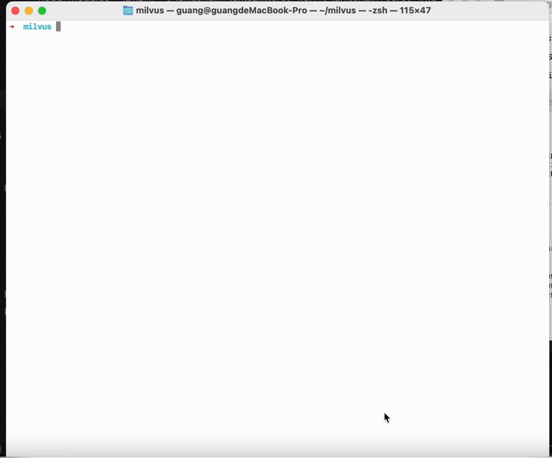
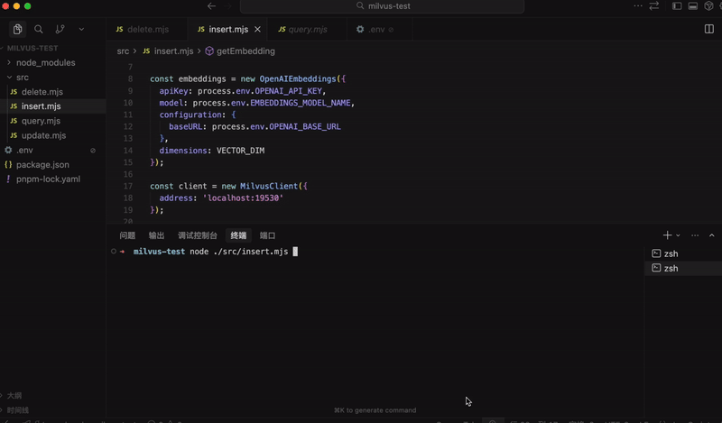
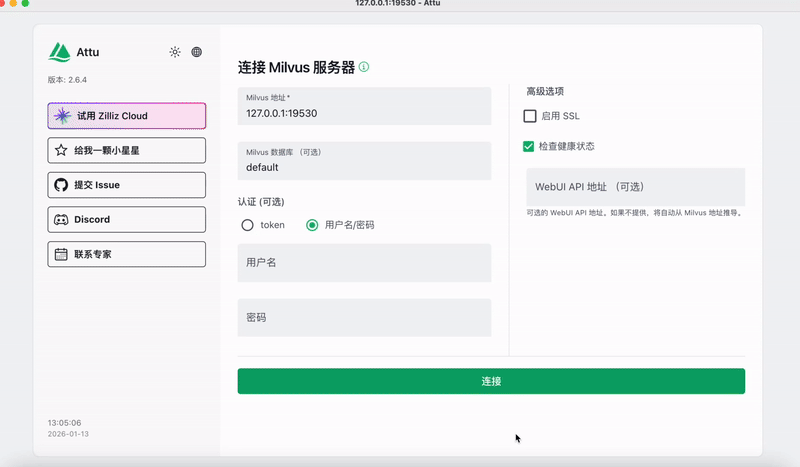
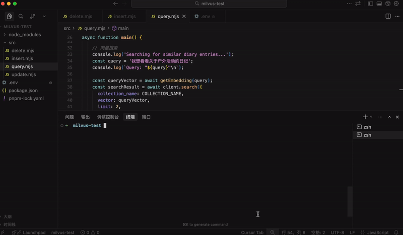
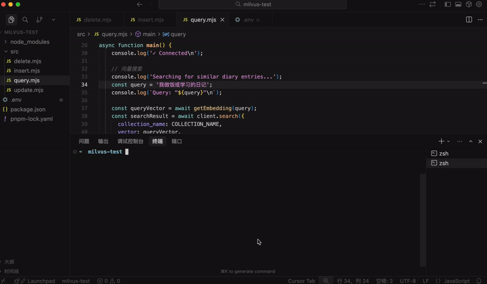
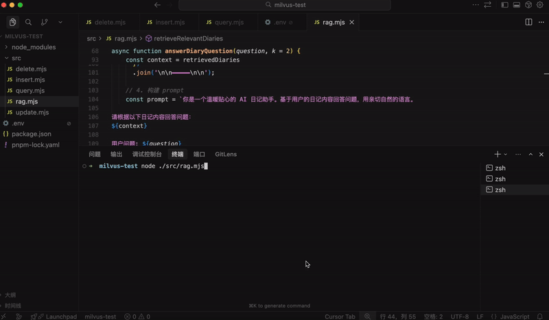
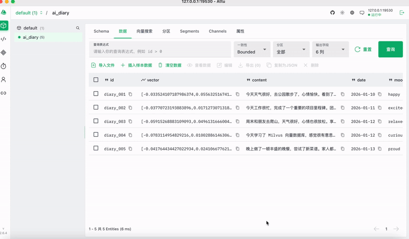
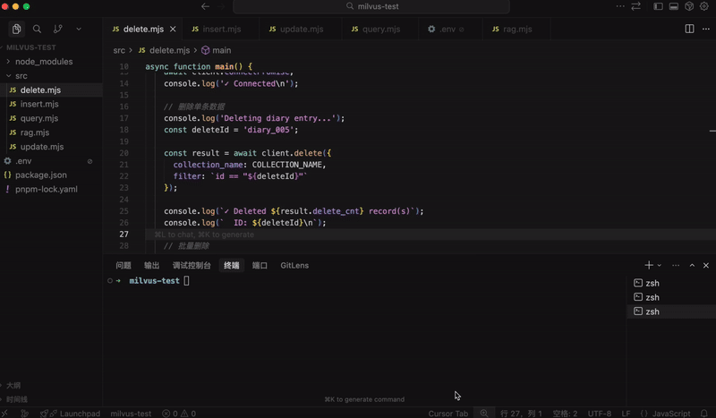

# 向量数据库 Milvus：做 AI Agent 开发必备技术

前面我们实现了 RAG：


文档向量化放到向量数据库，每次查询根据向量化的 query 去数据库做相似度匹配，查出相关文档放到 prompt 里给大模型，大模型来生成回答。

但之前向量数据库是放在内存里的：


而实际上 AI Agent 产品都会用 Milvus 这种向量数据库。

就像 web 应用会把数据存在 mysql 里，基于对数据的增删改查实现各种业务功能。


根据 id 或者关键词去关联查询一系列表的数据。

而 AI Agent 应用会把知识、记忆放在 Milvus 数据库中，基于对知识的检索、增删改实现各种功能。


不同的是这里涉及到向量化，就需要嵌入模型，比如检索、新增、修改。

但是删除直接根据 id，不需要嵌入模型。

有同学可能会问，把数据存在 MySQL 里，和现在存在 Milvus 里有什么不同么？

你在 MySQL 里查询数据，只能用 id、关键词匹配。

而在 Milvus 里查询知识，是根据语义匹配的，你可以用自然语言来检索。

这两种功能一般都需要。

比如你做了一个 AI 日记本：

- 查询日记列表可以从 MySQL 来查，不走 AI
- 查询“我哪几天的日记心情比较好”，就要去 Milvus 做向量相似度检索，然后交给 AI 生成回答

所以一般会做 mysql 和 milvus 的双写，也就是同时对两个数据库做增删改，保持数据同步。


这节我们先学下 Milvus，做下增删改查，跑通基于 Mivlus 的 RAG 流程。

本地跑 Milvus 需要安装 docker：

https://www.docker.com/


下载后安装，会有桌面端和命令行工具：


如果 docker 命令可用了，就代表装好了。

打开桌面端：


images 是下载的镜像列表。

containers 是镜像跑起来的容器列表。

这里对 docker 不熟也没关系，下节会讲，这节重点是 mivlus。

创建一个目录用来放 milvus 的 docker 配置文件和数据：


从这里下载 milvus 的 docker compose 配置文件：

https://github.com/milvus-io/milvus/releases


把配置文件拿到刚才这个目录，跑一下 docker compose

```
docker compose -f ./milvus-standalone-docker-compose.yml up -d
```

用到的镜像根据配置文件自动下载：

**🎬 [视频 1](http://mpvideo.qpic.cn/0b2ecaavmaabveaixklezjuvcegdkyiacvqa.f10002.mp4?dis_k=281a2d6b2c1ed57ca2ac82e0942eb364&dis_t=1781680368&play_scene=10110&auth_info=DverioAFOaD8ispbPbCU84MCSUBDHTxcLD1gGB01KxgzYnkdYzYHZEFISxBKGRovKW5EYFcX&auth_key=636432047671823111e5c8dc6975e40f)**



跑起来之后，在 docker 桌面端这里也可以看到：

下载的镜像：


跑起来的容器：


milvus 数据库是跑在 19530 这个端口。

访问这个 url 可以做健康度检查：

http://localhost:9091/healthz


然后我们用 node 来连接 milvus 服务做增删改查。

创建项目：

```
mkdir milvus-test
cd milvus-test
npm init -y
```


安装 milvus 的 node sdk：

```
pnpm install @zilliz/milvus2-sdk-node
```

还有 langchain：

```
pnpm install @langchain/openai dotenv
```

这里的配置文件 .env 大家自己创建下：

```
# OpenAI API 配置
OPENAI_API_KEY=sk-xxx
OPENAI_BASE_URL=https://dashscope.aliyuncs.com/compatible-mode/v1
MODEL_NAME=qwen-plus
EMBEDDINGS_MODEL_NAME=text-embedding-v3
```

写下插入数据的代码：

创建 src/insert.mjs

```
import "dotenv/config";
import { MilvusClient, DataType, MetricType, IndexType } from '@zilliz/milvus2-sdk-node';
import { OpenAIEmbeddings } from "@langchain/openai";

const COLLECTION_NAME = 'ai_diary';
const VECTOR_DIM = 1024;

const embeddings = new OpenAIEmbeddings({
  apiKey: process.env.OPENAI_API_KEY,
  model: process.env.EMBEDDINGS_MODEL_NAME,
  configuration: {
    baseURL: process.env.OPENAI_BASE_URL
  },
  dimensions: VECTOR_DIM
});

const client = new MilvusClient({
  address: 'localhost:19530'
});

async function getEmbedding(text) {
  const result = await embeddings.embedQuery(text);
  return result;
}

async function main() {
  try {
    console.log('Connecting to Milvus...');
    await client.connectPromise;
    console.log('✓ Connected\n');

    // 创建集合
    console.log('Creating collection...');
    await client.createCollection({
      collection_name: COLLECTION_NAME,
      fields: [
        { name: 'id', data_type: DataType.VarChar, max_length: 50, is_primary_key: true },
        { name: 'vector', data_type: DataType.FloatVector, dim: VECTOR_DIM },
        { name: 'content', data_type: DataType.VarChar, max_length: 5000 },
        { name: 'date', data_type: DataType.VarChar, max_length: 50 },
        { name: 'mood', data_type: DataType.VarChar, max_length: 50 },
        { name: 'tags', data_type: DataType.Array, element_type: DataType.VarChar, max_capacity: 10, max_length: 50 }
      ]
    });
    console.log('Collection created');

    // 创建索引
    console.log('\nCreating index...');
    await client.createIndex({
      collection_name: COLLECTION_NAME,
      field_name: 'vector',
      index_type: IndexType.IVF_FLAT,
      metric_type: MetricType.COSINE,
      params: { nlist: 1024 }
    });
    console.log('Index created');

    // 加载集合
    console.log('\nLoading collection...');
    await client.loadCollection({ collection_name: COLLECTION_NAME });
    console.log('Collection loaded');

    // 插入日记数据
    console.log('\nInserting diary entries...');
    const diaryContents = [
      {
        id: 'diary_001',
        content: '今天天气很好，去公园散步了，心情愉快。看到了很多花开了，春天真美好。',
        date: '2026-01-10',
        mood: 'happy',
        tags: ['生活', '散步']
      },
      {
        id: 'diary_002',
        content: '今天工作很忙，完成了一个重要的项目里程碑。团队合作很愉快，感觉很有成就感。',
        date: '2026-01-11',
        mood: 'excited',
        tags: ['工作', '成就']
      },
      {
        id: 'diary_003',
        content: '周末和朋友去爬山，天气很好，心情也很放松。享受大自然的感觉真好。',
        date: '2026-01-12',
        mood: 'relaxed',
        tags: ['户外', '朋友']
      },
      {
        id: 'diary_004',
        content: '今天学习了 Milvus 向量数据库，感觉很有意思。向量搜索技术真的很强大。',
        date: '2026-01-12',
        mood: 'curious',
        tags: ['学习', '技术']
      },
      {
        id: 'diary_005',
        content: '晚上做了一顿丰盛的晚餐，尝试了新菜谱。家人都说很好吃，很有成就感。',
        date: '2026-01-13',
        mood: 'proud',
        tags: ['美食', '家庭']
      }
    ];

    console.log('Generating embeddings...');
    const diaryData = await Promise.all(
      diaryContents.map(async (diary) => ({
        ...diary,
        vector: await getEmbedding(diary.content)
      }))
    );

    const insertResult = await client.insert({
      collection_name: COLLECTION_NAME,
      data: diaryData
    });
    console.log(`✓ Inserted ${insertResult.insert_cnt} records\n`);

  } catch (error) {
    console.error('Error:', error.message);
  }
}

main();
```

在 milvus 里是这样存储数据的：


可以分为多个 database，每个 database 下有多个 collection

每个 collection 下是符合 schema 的 entity，也就是数据。

所以我们插入数据，就定义一个 schema，然后插入 entity 就好了。

同时要建立一个向量字段的索引，用来快速查询。

也就是这样：


这就是 schema，创建 collection 集合的时候需要指定。

具体字段包含 id、vector、content、date、mode、tags

其实和 mysql 的表差不多，唯一的区别是 vector 这个字段，我们设置了 FloatVector 类型，也就是向量，指定维度是 1024 维。

这样我们后面插入数据，也要把嵌入模型指定为 1024 的维度。


这个集合名是 ai_diary，用来放日记数据的。

向量字段需要建立索引：


metric_type 指定用余弦相似度作为距离度量

余弦相似度的原理前面讲过：


之后就可以插入数据了：


插入数据比较简单，就是调用 insert 方法，指定 collection name 和 data

只不过这里的 vector 字段需要用嵌入模型来向量化一下。

跑一下：

**🎬 [视频 2](http://mpvideo.qpic.cn/0bc3b4aa6aaatianezlforuvad6db4hqadya.f10002.mp4?dis_k=1ea07c402da3348389319ebc68e74cfc&dis_t=1781680368&play_scene=10110&auth_info=V9Xjxa1XPvPzhp0Ja+DEpIBfGRFGGj4OLDowTko0JEhqaStPYmEAN05EHEIcSUp4KjMUMVIQ&auth_key=77d0802a985ad2a596e0a68dedd28cea)**



接下来做一下查询。

先不着急用代码写，我们可以安装一个 GUI 工具：

https://github.com/zilliztech/attu?tab=readme-ov-file#quick-start

Attu 是 Milvus 生态最好的 GUI 工具。

https://github.com/zilliztech/attu/releases


下载后安装下：


用默认配置连接就行：


和 node.js 那边一样。

**🎬 [视频 3](http://mpvideo.qpic.cn/0b2eeeaqeaabmean6wteubuvciodaiqqcaqa.f10002.mp4?dis_k=89fb3663691728bc7e08e6e6c921aca9&dis_t=1781680368&play_scene=10110&auth_info=WKPTzOIBOaamh8oPPuDD/okDHkNCTzwNKGdgSks4fhhlNShGPjIHYhtFS0RJSU0iI28TY1ZF&auth_key=e78b74d45baa572581e07adda8d35002)**



可以看到所有的集合，集合下所有的 Entity


可以看到我们刚创建的 ai_diary 的 collection，以及下面的 5 条数据

vector 是向量，用来做语义检索的。

其他字段是元信息，会一并查出来返回。

我们写下查询：

创建 src/query.mjs

```
import "dotenv/config";
import { MilvusClient, MetricType } from '@zilliz/milvus2-sdk-node';
import { OpenAIEmbeddings } from "@langchain/openai";

const COLLECTION_NAME = 'ai_diary';
const VECTOR_DIM = 1024;

const embeddings = new OpenAIEmbeddings({
  apiKey: process.env.OPENAI_API_KEY,
  model: process.env.EMBEDDINGS_MODEL_NAME,
  configuration: {
    baseURL: process.env.OPENAI_BASE_URL
  },
  dimensions: VECTOR_DIM
});

const client = new MilvusClient({
  address: 'localhost:19530'
});

async function getEmbedding(text) {
  const result = await embeddings.embedQuery(text);
  return result;
}

async function main() {
  try {
    console.log('Connecting to Milvus...');
    await client.connectPromise;
    console.log('✓ Connected\n');

    // 向量搜索
    console.log('Searching for similar diary entries...');
    const query = '我想看看关于户外活动的日记';
    console.log(`Query: "${query}"\n`);

    const queryVector = await getEmbedding(query);
    const searchResult = await client.search({
      collection_name: COLLECTION_NAME,
      vector: queryVector,
      limit: 2,
      metric_type: MetricType.COSINE,
      output_fields: ['id', 'content', 'date', 'mood', 'tags']
    });

    console.log(`Found ${searchResult.results.length} results:\n`);
    searchResult.results.forEach((item, index) => {
      console.log(`${index + 1}. [Score: ${item.score.toFixed(4)}]`);
      console.log(`   ID: ${item.id}`);
      console.log(`   Date: ${item.date}`);
      console.log(`   Mood: ${item.mood}`);
      console.log(`   Tags: ${item.tags?.join(', ')}`);
      console.log(`   Content: ${item.content}\n`);
    });

  } catch (error) {
    console.error('Error:', error.message);
  }
}

main();
```

是把 query 向量化，做余弦相似度的检索：


跑一下：

**🎬 [视频 4](http://mpvideo.qpic.cn/0b2ez4alsaaajqagiztfqvuvbt6dxhhqboia.f10002.mp4?dis_k=5d0157527f65ce7658d713b6a2523d5b&dis_t=1781680368&play_scene=10110&auth_info=WvnTruIBPqakjM0MbOeXpYReSBBETj8MKThnSBplK01naHxJajcAYhlOTEcbThl5LjJFMFBE&auth_key=3f15bb379ea6ae7ddf5a129d04216d17)**



可以看到，检索出了两条户外活动的日记。

改一下 query，查询做饭、学习的日记：

再试一下：

**🎬 [视频 5](http://mpvideo.qpic.cn/0bc3b4abcaaak4amzalfnfuvad6dcehqaeia.f10002.mp4?dis_k=d0f2148422917fc798fe3b5ea455054c&dis_t=1781680368&play_scene=10110&auth_info=VpLRlqVTafWkis0Lb7aWpNUKHhNATTIKLGxoTE5mf0xraH4baGZXMRlITEAYHxh4f2YTM1RH&auth_key=525d7d85fc999cc9bc5bf2f1ee86f4ec)**



这次查了做饭和学习的日记，也搜出来了。

你用 MySQL 做关键词搜索可以做到么？

很明显不能，这就是为啥用向量数据库！

然后我们把它和 RAG 流程结合来跑一下完整流程：

创建 src/rag.mjs

```
import "dotenv/config";
import { MilvusClient, MetricType } from '@zilliz/milvus2-sdk-node';
import { ChatOpenAI, OpenAIEmbeddings } from "@langchain/openai";

const COLLECTION_NAME = 'ai_diary';
const VECTOR_DIM = 1024;

// 初始化 OpenAI Chat 模型
const model = new ChatOpenAI({
  temperature: 0.7,
  model: process.env.MODEL_NAME,
  apiKey: process.env.OPENAI_API_KEY,
  configuration: {
    baseURL: process.env.OPENAI_BASE_URL,
  },
});

// 初始化 Embeddings 模型
const embeddings = new OpenAIEmbeddings({
  apiKey: process.env.OPENAI_API_KEY,
  model: process.env.EMBEDDINGS_MODEL_NAME,
  configuration: {
    baseURL: process.env.OPENAI_BASE_URL
  },
  dimensions: VECTOR_DIM
});

// 初始化 Milvus 客户端
const client = new MilvusClient({
  address: 'localhost:19530'
});

/**
 * 获取文本的向量嵌入
 */
async function getEmbedding(text) {
  const result = await embeddings.embedQuery(text);
  return result;
}

/**
 * 从 Milvus 中检索相关的日记条目
 */
async function retrieveRelevantDiaries(question, k = 2) {
  try {
    // 生成问题的向量
    const queryVector = await getEmbedding(question);

    // 在 Milvus 中搜索相似的日记
    const searchResult = await client.search({
      collection_name: COLLECTION_NAME,
      vector: queryVector,
      limit: k,
      metric_type: MetricType.COSINE,
      output_fields: ['id', 'content', 'date', 'mood', 'tags']
    });

    return searchResult.results;
  } catch (error) {
    console.error('检索日记时出错:', error.message);
    return [];
  }
}

/**
 * 使用 RAG 回答关于日记的问题
 */
async function answerDiaryQuestion(question, k = 2) {
  try {
    console.log('='.repeat(80));
    console.log(`问题: ${question}`);
    console.log('='.repeat(80));

    // 1. 检索相关日记
    console.log('\n【检索相关日记】');
    const retrievedDiaries = await retrieveRelevantDiaries(question, k);

    if (retrievedDiaries.length === 0) {
      console.log('未找到相关日记');
      return '抱歉，我没有找到相关的日记内容。';
    }

    // 2. 打印检索到的日记及相似度
    retrievedDiaries.forEach((diary, i) => {
      console.log(`\n[日记 ${i + 1}] 相似度: ${diary.score.toFixed(4)}`);
      console.log(`日期: ${diary.date}`);
      console.log(`心情: ${diary.mood}`);
      console.log(`标签: ${diary.tags?.join(', ')}`);
      console.log(`内容: ${diary.content}`);
    });

    // 3. 构建上下文
    const context = retrievedDiaries
      .map((diary, i) => {
        return `[日记 ${i + 1}]
日期: ${diary.date}
心情: ${diary.mood}
标签: ${diary.tags?.join(', ')}
内容: ${diary.content}`;
      })
      .join('\n\n━━━━━\n\n');

    // 4. 构建 prompt
    const prompt = `你是一个温暖贴心的 AI 日记助手。基于用户的日记内容回答问题，用亲切自然的语言。

请根据以下日记内容回答问题：
${context}

用户问题: ${question}

回答要求：
1. 如果日记中有相关信息，请结合日记内容给出详细、温暖的回答
2. 可以总结多篇日记的内容，找出共同点或趋势
3. 如果日记中没有相关信息，请温和地告知用户
4. 用第一人称"你"来称呼日记的作者
5. 回答要有同理心，让用户感到被理解和关心

AI 助手的回答:`;

    // 5. 调用 LLM 生成回答
    console.log('\n【AI 回答】');
    const response = await model.invoke(prompt);
    console.log(response.content);
    console.log('\n');

    return response.content;
  } catch (error) {
    console.error('回答问题时出错:', error.message);
    return '抱歉，处理您的问题时出现了错误。';
  }
}

async function main() {
  try {
    console.log('连接到 Milvus...');
    await client.connectPromise;
    console.log('✓ 已连接\n');

    await answerDiaryQuestion("我最近做了什么让我感到快乐的事情？", 2);
  } catch (error) {
    console.error('错误:', error.message);
  }
}

main();
```

这次把温度调高点，让 AI 可以发挥创造性回答：


我们先把 query 向量化，去 Milvus 里查出相关数据：


然后把这些加到 prompt 里让大模型回答：


跑一下：

**🎬 [视频 6](http://mpvideo.qpic.cn/0b2e4iaiaaaajmaf3fdfhnuvbywdqdrabaaa.f10002.mp4?dis_k=636c33859f5d2fbc8025de373142869b&dis_t=1781680368&play_scene=10110&auth_info=V/3K6JNUb6f2j8wMZ7WbpYcJTkJCSjILJzhkGUtmfhhqYCpLP2FRY0tNTUcQHBV5LWVDYlZA&auth_key=bc5980a27e27da411134be7e395a77c0)**



可以看到，大模型基于我们的问题，查询了相关的日记，然后做了回答。

完全是根据语义检索的！

实际的 AI Agent 里就是这样来做 RAG 的。

最后，我们做了 query、insert，自然要把 update 和 delete 也测一下：

创建 src/update.mjs

```
import "dotenv/config";
import { MilvusClient } from '@zilliz/milvus2-sdk-node';
import { OpenAIEmbeddings } from "@langchain/openai";

const COLLECTION_NAME = 'ai_diary';
const VECTOR_DIM = 1024;

const embeddings = new OpenAIEmbeddings({
  apiKey: process.env.OPENAI_API_KEY,
  model: process.env.EMBEDDINGS_MODEL_NAME,
  configuration: {
    baseURL: process.env.OPENAI_BASE_URL
  },
  dimensions: VECTOR_DIM
});

const client = new MilvusClient({
  address: 'localhost:19530'
});

async function getEmbedding(text) {
  const result = await embeddings.embedQuery(text);
  return result;
}

async function main() {
  try {
    console.log('Connecting to Milvus...');
    await client.connectPromise;
    console.log('✓ Connected\n');

    // 更新数据（Milvus 通过 upsert 实现更新）
    console.log('Updating diary entry...');
    const updateId = 'diary_001';
    const updatedContent = {
      id: updateId,
      content: '今天下了一整天的雨，心情很糟糕。工作上遇到了很多困难，感觉压力很大。一个人在家，感觉特别孤独。',
      date: '2026-01-10',
      mood: 'sad',
      tags: ['生活', '散步', '朋友']
    };

    console.log('Generating new embedding...');
    const vector = await getEmbedding(updatedContent.content);
    const updateData = { ...updatedContent, vector };

    const result = await client.upsert({
      collection_name: COLLECTION_NAME,
      data: [updateData]
    });

    console.log(`✓ Updated diary entry: ${updateId}`);
    console.log(`  New content: ${updatedContent.content}`);
    console.log(`  New mood: ${updatedContent.mood}`);
    console.log(`  New tags: ${updatedContent.tags.join(', ')}\n`);

  } catch (error) {
    console.error('Error:', error.message);
  }
}

main();
```

因为要向量化，所以也要嵌入模型。


调用 upsert 方法，数据里带上 id 即可。

**🎬 [视频 7](http://mpvideo.qpic.cn/0bc3kmackaaawmapri3fijuvau6devjqajia.f10002.mp4?dis_k=07ee7f1f648f8108eee836fc70311583&dis_t=1781680368&play_scene=10110&auth_info=Csv6jaUAOvPyjssPbraa9IENHURGHztYKGppG0ExLEM3NX1GaDIEN09MSkQZHxQoK2EQZFIV&auth_key=c026db264bea387dffa0b39490cf8f4f)**



这样，更新就完成了。

最后测一下删除：

创建 src/delete.mjs

```
import "dotenv/config";
import { MilvusClient } from '@zilliz/milvus2-sdk-node';

const COLLECTION_NAME = 'ai_diary';

const client = new MilvusClient({
  address: 'localhost:19530'
});

async function main() {
  try {
    console.log('Connecting to Milvus...');
    await client.connectPromise;
    console.log('✓ Connected\n');

    // 删除单条数据
    console.log('Deleting diary entry...');
    const deleteId = 'diary_005';

    const result = await client.delete({
      collection_name: COLLECTION_NAME,
      filter: `id == "${deleteId}"`
    });

    console.log(`✓ Deleted ${result.delete_cnt} record(s)`);
    console.log(`  ID: ${deleteId}\n`);

    // 批量删除
    console.log('Batch deleting diary entries...');
    const deleteIds = ['diary_002', 'diary_003'];
    const idsStr = deleteIds.map(id => `"${id}"`).join(', ');

    const batchResult = await client.delete({
      collection_name: COLLECTION_NAME,
      filter: `id in [${idsStr}]`
    });

    console.log(`✓ Batch deleted ${batchResult.delete_cnt} record(s)`);
    console.log(`  IDs: ${deleteIds.join(', ')}\n`);

    // 条件删除
    console.log('Deleting by condition...');
    const conditionResult = await client.delete({
      collection_name: COLLECTION_NAME,
      filter: `mood == "sad"`
    });

    console.log(`✓ Deleted ${conditionResult.delete_cnt} record(s) with mood="sad"\n`);

  } catch (error) {
    console.error('Error:', error.message);
  }
}

main();
```

这个不用向量化数据，也就不用嵌入模型。

这里用了 filter

根据条件来删除，或者 id in [1,2,3] 这样来批量删除。

我们这里删了一个 mood 为 sad 的，一个 id 为 2、3 的，一个 id 为 5 的

跑一下：

**🎬 [视频 8](http://mpvideo.qpic.cn/0b2em4akuaaawuahpi3fybuvaz6dvjtqbkqa.f10002.mp4?dis_k=6d2f461947dfd98104a243912f352894&dis_t=1781680368&play_scene=10110&auth_info=X8W3oo4FZaH32MsLbbub84deSkdFTzsHKmk1Gx05JEpiZHlMbzdbZUoaSkAaEhUvLTJHZ1FF&auth_key=537df32bbd7d4872fcaa81a1ceb734b2)**



可以看到，数据都被正确删除了。

这样我们就完成了对 Milvus 数据的增删改查。

> 代码上传了课程仓库： https://github.com/QuarkGluonPlasma/ai-agent-course-code

## 总结

这节我们学了 Milvus 向量数据库。

MySQL 数据库只能根据 id、关键词去检索，涉及到语义检索的，我们都会存到 Milvus 里。

我们用 docker compose 跑了 Milvus 数据库，然后在 attu （GUI 工具） 和 node 代码里连上，并做了增删改查。

Milvus 分为 database、collection、entity 这三级，collection 要指定数据结构也就是 schema。

vector 向量字段需要做索引，用来快速检索。

我们把 Milvus 接入了 RAG 流程，实现了 AI 日记本的功能。可以根据自然语言去做语义检索，查出最相关的日记。

MySQL 和 Milvus 分别用于不同的场景，一个是做精确查询，可以关联查出很多表的数据，一个是做语义检索，可以用自然语言来查询。

实际上一般会做双写，同时对两者做增删改查。

后面项目里我们也会同时用 MySQL 和 Milvus。

做 AI Agent 项目，Milvus 向量数据库是是必备技术，可以写到简历上，围绕这个聊很多功能的实现，比如知识、记忆等，需要重点掌握。
