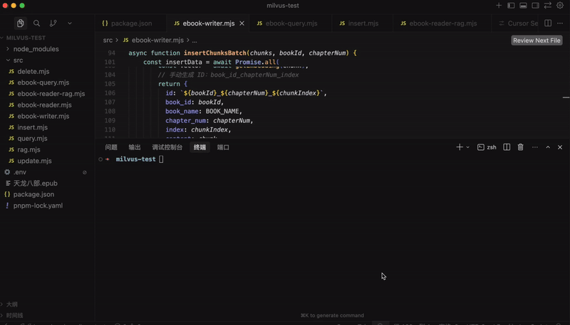
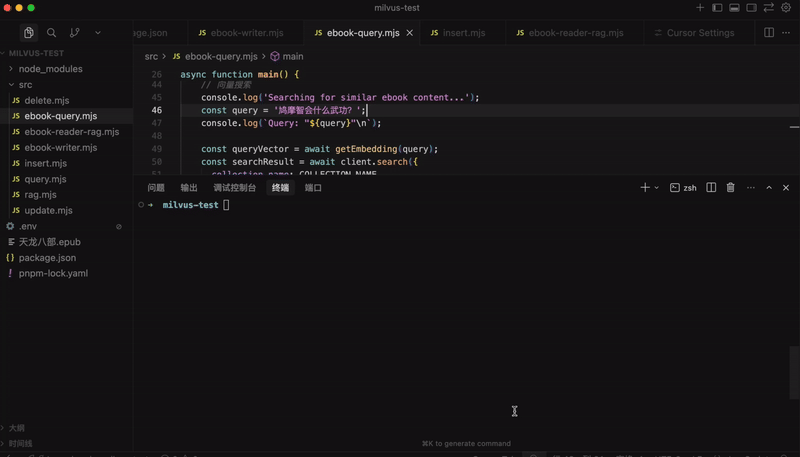

# Milvus + RAG 实战：电子书语义检索助手

我们学了 loader、splitter、向量数据库 Milvus，这样我们 RAG 流程就完整跑通了：


用 loader 从各种来源加载文档，用 splitter 分块，然后用嵌入模型向量化后存到向量数据库 Milvus。


查询的时候，把 query 也用嵌入模型向量化，根据余弦相似度，匹配最相近的文档返回


也就是这样：


这个流程涉及到的技术我们已经详细了一遍。

这节我们就来做一个综合性的小实战：电子书语义检索助手。

我有一些 .epub 格式的电子书：

**🎬 [视频 1](http://mpvideo.qpic.cn/0bc3m4a3waab7aajyullanuvcz6dxntqdoya.f10002.mp4?dis_k=d2e9ce8c758b986959be23630d083f87&dis_t=1781680403&play_scene=10110&auth_info=XrOFyI8DOKiBl412ecXtkq8rMFpuV2cVRzNafDFtWBpjNldjZzYGbDxVDD0ObGNOBUc9enpd&auth_key=d95fe4af0ddb556eb2f4b55e50da8849)**


比如《天龙八部》这本书，还是挺厚的。

如果我想从中查一下段誉会什么武功

怎么查？

用 mysql 那种关键词查询可以么？

很明显不行，你关键词都不知道怎么定。

这种只能用向量数据库语义查询，然后交给大模型来生成回答，也就是用 RAG 来做。

我们来写一下：

还是在之前 milvus-test 那个项目。

创建 src/ebook-writer.mjs

先看下代码：


整体分为 3 步：

- 连接 Milvus
- 创建 ebook 的集合
- 加载 epub 文件用 splitter 分块存入 Milvus

集合的 schema 是这样的：


首先我们 hasCollection 判断集合是否存在，不存在就 createCollection

包含 id、book_id、book_name、chapter_num（第几章）、index（第几个分块）、content（内容）、vector（向量）

向量 vector 字段是做语义匹配的，其余的都是元信息，记录了书名、第几章、第几个分块。

book_id 这个是用来和 mysql 里 book 表关联的，这里暂时不用。

然后 createIndex 创建了 vector 字段的索引

最后要 loadCollection 把这个集合加载到内存才能做快速语义检索。


hasCollection、createCollection、createIndex、loadCollection 这些都很容易理解，后面经常写。

然后是 loader 加载 epub 的文件，并 splitter 分块：


首先用 EPubLoader 加载 epub 文件，并对每一章做下分割。

但每一章内容还是太多了，再用 RecursiveCharacterTextSplitter 对每章内容以每 500 个字符分下块：


分块之后调用插入方法。


插入逻辑就是对 content 用嵌入模型向量化，然后调用 insert 方法插入到 Milvus 的集合中。

完整代码如下：

```
import "dotenv/config";
import { parse } from'path';
import { MilvusClient, DataType, MetricType, IndexType } from'@zilliz/milvus2-sdk-node';
import { OpenAIEmbeddings } from"@langchain/openai";
import { EPubLoader } from"@langchain/community/document_loaders/fs/epub";
import { RecursiveCharacterTextSplitter } from"@langchain/textsplitters";

const COLLECTION_NAME = 'ebook_collection';
const VECTOR_DIM = 1024;
const CHUNK_SIZE = 500; // 拆分到 500 个字符
const EPUB_FILE = './天龙八部.epub';

// 从文件名提取书名（去掉扩展名）
const BOOK_NAME = parse(EPUB_FILE).name;

// 初始化 Embeddings 模型
const embeddings = new OpenAIEmbeddings({
apiKey: process.env.OPENAI_API_KEY,
model: process.env.EMBEDDINGS_MODEL_NAME,
configuration: {
    baseURL: process.env.OPENAI_BASE_URL
  },
dimensions: VECTOR_DIM
});

// 初始化 Milvus 客户端
const client = new MilvusClient({
address: 'localhost:19530'
});

/**
 * 获取文本的向量嵌入
 */
async function getEmbedding(text) {
const result = await embeddings.embedQuery(text);
return result;
}

/**
 * 创建或获取集合
 */
async function ensureCollection(bookId) {
try {
    // 检查集合是否存在
    const hasCollection = await client.hasCollection({
      collection_name: COLLECTION_NAME
    });

    if (!hasCollection.value) {
      console.log('创建集合...');
      await client.createCollection({
        collection_name: COLLECTION_NAME,
        fields: [
          { name: 'id', data_type: DataType.VarChar, max_length: 100, is_primary_key: true },
          { name: 'book_id', data_type: DataType.VarChar, max_length: 100 },
          { name: 'book_name', data_type: DataType.VarChar, max_length: 200 },
          { name: 'chapter_num', data_type: DataType.Int32 },
          { name: 'index', data_type: DataType.Int32 },
          { name: 'content', data_type: DataType.VarChar, max_length: 10000 },
          { name: 'vector', data_type: DataType.FloatVector, dim: VECTOR_DIM }
        ]
      });
      console.log('✓ 集合创建成功');

      // 创建索引
      console.log('创建索引...');
      await client.createIndex({
        collection_name: COLLECTION_NAME,
        field_name: 'vector',
        index_type: IndexType.IVF_FLAT,
        metric_type: MetricType.COSINE,
        params: { nlist: 1024 }
      });
      console.log('✓ 索引创建成功');
    } 
      
    // 确保集合已加载
    try {
      await client.loadCollection({ collection_name: COLLECTION_NAME });
      console.log('✓ 集合已加载');
    } catch (error) {
      console.log('✓ 集合已处于加载状态');
    }

  } catch (error) {
    console.error('创建集合时出错:', error.message);
    throw error;
  }
}

/**
 * 将文档块批量插入到 Milvus（流式处理）
 */
async function insertChunksBatch(chunks, bookId, chapterNum) {
try {
    if (chunks.length === 0) {
      return0;
    }

    // 为每个文档块生成向量并构建插入数据
    const insertData = awaitPromise.all(
      chunks.map(async (chunk, chunkIndex) => {
        const vector = await getEmbedding(chunk);
        // 手动生成 ID：book_id_chapterNum_index
        return {
          id: `${bookId}_${chapterNum}_${chunkIndex}`,
          book_id: bookId,
          book_name: BOOK_NAME,
          chapter_num: chapterNum,
          index: chunkIndex,
          content: chunk,
          vector: vector
        };
      })
    );

    // 批量插入到 Milvus
    const insertResult = await client.insert({
      collection_name: COLLECTION_NAME,
      data: insertData
    });

    return Number(insertResult.insert_cnt) || 0;
  } catch (error) {
    console.error(`插入章节 ${chapterNum} 的数据时出错:`, error.message);
    console.error('错误详情:', error);
    throw error;
  }
}

/**
 * 加载 EPUB 文件并进行流式处理（边处理边插入）
 */
async function loadAndProcessEPubStreaming(bookId) {
try {
    console.log(`\n开始加载 EPUB 文件: ${EPUB_FILE}`);
    
    // 使用 EPubLoader 加载文件，按章节拆分
    const loader = new EPubLoader(
      EPUB_FILE,
      {
        splitChapters: true,
      }
    );

    const documents = await loader.load();
    console.log(`✓ 加载完成，共 ${documents.length} 个章节\n`);

    // 创建文本拆分器，拆分到 500 个字符
    const textSplitter = new RecursiveCharacterTextSplitter({
      chunkSize: CHUNK_SIZE,
      chunkOverlap: 50, // 重叠 50 个字符，保持上下文连贯性
    });

    let totalInserted = 0;

    // 遍历每个章节，进行二次拆分并立即插入
    for (let chapterIndex = 0; chapterIndex < documents.length; chapterIndex++) {
      const chapter = documents[chapterIndex];
      const chapterContent = chapter.pageContent;
      
      console.log(`处理第 ${chapterIndex + 1}/${documents.length} 章...`);
      
      // 使用 splitter 进行二次拆分
      const chunks = await textSplitter.splitText(chapterContent);
      
      console.log(`  拆分为 ${chunks.length} 个片段`);
      
      if (chunks.length === 0) {
        console.log(`  跳过空章节\n`);
        continue;
      }

      console.log(`  生成向量并插入中...`);

      // 立即生成向量并插入该章节的所有片段
      const insertedCount = await insertChunksBatch(chunks, bookId, chapterIndex + 1);
      totalInserted += insertedCount;
      
      console.log(`  ✓ 已插入 ${insertedCount} 条记录（累计: ${totalInserted}）\n`);
    }

    console.log(`\n总共插入 ${totalInserted} 条记录\n`);
    return totalInserted;
  } catch (error) {
    console.error('加载 EPUB 文件时出错:', error.message);
    throw error;
  }
}

/**
 * 主函数
 */
asyncfunction main() {
try {
    console.log('='.repeat(80));
    console.log('电子书处理程序');
    console.log('='.repeat(80));

    // 连接 Milvus
    console.log('\n连接 Milvus...');
    await client.connectPromise;
    console.log('✓ 已连接\n');

    // 设置 book_id（
    const bookId = 1;

    // 确保集合存在
    await ensureCollection(bookId);

    // 加载和处理 EPUB 文件（流式处理，边处理边插入）
    await loadAndProcessEPubStreaming(bookId);

    console.log('='.repeat(80));
    console.log('处理完成！');
    console.log('='.repeat(80));

  } catch (error) {
    console.error('\n错误:', error.message);
    console.error(error.stack);
    process.exit(1);
  }
}

main();
```

安装下用到的依赖包：

```
pnpm install @langchain/community epub2 html-to-text @langchain/textsplitters 
```

loader 在 @langchain/community 这个包，因为是社区维护

splitter 都在 @langchain/textsplitters 这个包

跑一下：

**🎬 [视频 2](http://mpvideo.qpic.cn/0b2eeqarsaab6iad4jdl7nuvcjgddesacgia.f10002.mp4?dis_k=8294a6b9fb4d196618aa6d141edb1941&dis_t=1781680403&play_scene=10110&auth_info=Wsbl96wFOfzbldJ6f5ntzqIpYwA0BjAZQTtbfD5pWRlnMgBkYDcHOGZXUzEIMGMSCEVuICAM&auth_key=af5b13139b4f3dd2646e7f5b1ca9ca44)**



等《天龙八部》电子书全部拆分存入向量数据库。

一共 3000 多条记录：


每条都记录了元信息，比如章节数、每章的第几个分块。

不用担心分块多，对数据库来说，海量数据都一样存取。

接下来我们试下查询：

创建 src/ebook-query.mjs

```
import "dotenv/config";
import { MilvusClient, MetricType } from'@zilliz/milvus2-sdk-node';
import { OpenAIEmbeddings } from"@langchain/openai";

const COLLECTION_NAME = 'ebook_collection';
const VECTOR_DIM = 1024;

const embeddings = new OpenAIEmbeddings({
apiKey: process.env.OPENAI_API_KEY,
model: process.env.EMBEDDINGS_MODEL_NAME,
configuration: {
    baseURL: process.env.OPENAI_BASE_URL
  },
dimensions: VECTOR_DIM
});

const client = new MilvusClient({
address: 'localhost:19530'
});

async function getEmbedding(text) {
const result = await embeddings.embedQuery(text);
return result;
}

async function main() {
try {
    console.log('Connecting to Milvus...');
    await client.connectPromise;
    console.log('✓ Connected\n');

    // 确保集合已加载
    try {
      await client.loadCollection({ collection_name: COLLECTION_NAME });
      console.log('✓ 集合已加载\n');
    } catch (error) {
      // 如果已经加载，会报错，忽略即可
      if (!error.message.includes('already loaded')) {
        throw error;
      }
      console.log('✓ 集合已处于加载状态\n');
    }

    // 向量搜索
    console.log('Searching for similar ebook content...');
    const query = '段誉会什么武功？';
    console.log(`Query: "${query}"\n`);

    const queryVector = await getEmbedding(query);
    const searchResult = await client.search({
      collection_name: COLLECTION_NAME,
      vector: queryVector,
      limit: 3,
      metric_type: MetricType.COSINE,
      output_fields: ['id', 'book_id', 'chapter_num', 'index', 'content']
    });

    console.log(`Found ${searchResult.results.length} results:\n`);
    searchResult.results.forEach((item, index) => {
      console.log(`${index + 1}. [Score: ${item.score.toFixed(4)}]`);
      console.log(`   ID: ${item.id}`);
      console.log(`   Book ID: ${item.book_id}`);
      console.log(`   Chapter: 第 ${item.chapter_num} 章`);
      console.log(`   Index: ${item.index}`);
      console.log(`   Content: ${item.content}\n`);
    });

  } catch (error) {
    console.error('Error:', error.message);
  }
}

main();
```

把 query 用嵌入模型向量化，然后用余弦相似度做下匹配：


我们问一下鸠摩智会什么武功，匹配最相似的 5 条记录：

跑一下：

**🎬 [视频 3](http://mpvideo.qpic.cn/0bc32yadcaaaneabnzdkufuvbvwdghlaamia.f10002.mp4?dis_k=942b7261ce8ec866f48bcd7e4ce9b801&dis_t=1781680403&play_scene=10110&auth_info=WevO1MUHP/2AxtN+f5jrxfR/Z1Q8AzcVQGlafD4+VUBkZwBiMTIBOT0EUjUIMWUZXhNqdCgJ&auth_key=aef9727289ecb5a4ad2982017aea5929)**



可以看到，根据语义匹配出了一些相关文档。

你用 mysql 能搜出来么？

明显不能，这种就得用向量数据库 Milvus 做语义匹配。

当然，给一堆文档还不够，你得让大模型去理解文档，生成最终的回答。

我们写一下完整的 RAG 流程：

创建 src/ebook-reader-rag.mjs

```
import "dotenv/config";
import { MilvusClient, MetricType } from'@zilliz/milvus2-sdk-node';
import { ChatOpenAI, OpenAIEmbeddings } from"@langchain/openai";

const COLLECTION_NAME = 'ebook_collection';
const VECTOR_DIM = 1024;

// 初始化 OpenAI Chat 模型
const model = new ChatOpenAI({
temperature: 0.7,
model: process.env.MODEL_NAME,
apiKey: process.env.OPENAI_API_KEY,
configuration: {
    baseURL: process.env.OPENAI_BASE_URL,
  },
});

// 初始化 Embeddings 模型
const embeddings = new OpenAIEmbeddings({
apiKey: process.env.OPENAI_API_KEY,
model: process.env.EMBEDDINGS_MODEL_NAME,
configuration: {
    baseURL: process.env.OPENAI_BASE_URL
  },
dimensions: VECTOR_DIM
});

// 初始化 Milvus 客户端
const client = new MilvusClient({
address: 'localhost:19530'
});

/**
 * 获取文本的向量嵌入
 */
asyncfunction getEmbedding(text) {
const result = await embeddings.embedQuery(text);
return result;
}

/**
 * 从 Milvus 中检索相关的电子书内容
 */
async function retrieveRelevantContent(question, k = 3) {
try {
    // 生成问题的向量
    const queryVector = await getEmbedding(question);

    // 在 Milvus 中搜索相似的内容
    const searchResult = await client.search({
      collection_name: COLLECTION_NAME,
      vector: queryVector,
      limit: k,
      metric_type: MetricType.COSINE,
      output_fields: ['id', 'book_id', 'chapter_num', 'index', 'content']
    });

    return searchResult.results;
  } catch (error) {
    console.error('检索内容时出错:', error.message);
    return [];
  }
}

/**
 * 使用 RAG 回答关于《天龙八部》的问题
 */
async function answerEbookQuestion(question, k = 3) {
try {
    console.log('='.repeat(80));
    console.log(`问题: ${question}`);
    console.log('='.repeat(80));

    // 1. 检索相关内容
    console.log('\n【检索相关内容】');
    const retrievedContent = await retrieveRelevantContent(question, k);

    if (retrievedContent.length === 0) {
      console.log('未找到相关内容');
      return'抱歉，我没有找到相关的《天龙八部》内容。';
    }

    // 2. 打印检索到的内容及相似度
    retrievedContent.forEach((item, i) => {
      console.log(`\n[片段 ${i + 1}] 相似度: ${item.score.toFixed(4)}`);
      console.log(`书籍: ${item.book_id}`);
      console.log(`章节: 第 ${item.chapter_num} 章`);
      console.log(`片段索引: ${item.index}`);
      console.log(`内容: ${item.content.substring(0, 200)}${item.content.length > 200 ? '...' : ''}`);
    });

    // 3. 构建上下文
    const context = retrievedContent
      .map((item, i) => {
        return`[片段 ${i + 1}]
章节: 第 ${item.chapter_num} 章
内容: ${item.content}`;
      })
      .join('\n\n━━━━━\n\n');

    // 4. 构建 prompt
    const prompt = `你是一个专业的《天龙八部》小说助手。基于小说内容回答问题，用准确、详细的语言。

请根据以下《天龙八部》小说片段内容回答问题：
${context}

用户问题: ${question}

回答要求：
1. 如果片段中有相关信息，请结合小说内容给出详细、准确的回答
2. 可以综合多个片段的内容，提供完整的答案
3. 如果片段中没有相关信息，请如实告知用户
4. 回答要准确，符合小说的情节和人物设定
5. 可以引用原文内容来支持你的回答

AI 助手的回答:`;

    // 5. 调用 LLM 生成回答
    console.log('\n【AI 回答】');
    const response = await model.invoke(prompt);
    console.log(response.content);
    console.log('\n');

    return response.content;
  } catch (error) {
    console.error('回答问题时出错:', error.message);
    return'抱歉，处理您的问题时出现了错误。';
  }
}

asyncfunction main() {
try {
    console.log('连接到 Milvus...');
    await client.connectPromise;
    console.log('✓ 已连接\n');

    // 确保集合已加载
    try {
      await client.loadCollection({ collection_name: COLLECTION_NAME });
      console.log('✓ 集合已加载\n');
    } catch (error) {
      // 如果已经加载，会报错，忽略即可
      if (!error.message.includes('already loaded')) {
        throw error;
      }
      console.log('✓ 集合已处于加载状态\n');
    }

    // 问一个关于《天龙八部》的问题
    await answerEbookQuestion("鸠摩智会什么武功？",5);
  } catch (error) {
    console.error('错误:', error.message);
  }
}

main();
```

根据 query 查询出文档后，放到 prompt 里：


让大模型根据文档回答，并且引用原文片段。

跑一下：

**🎬 [视频 4](http://mpvideo.qpic.cn/0bc3k4ab6aaaaiadr4tku5uvav6dd5lqahya.f10002.mp4?dis_k=84e602ae2429faa9c3a021062088d5cf&dis_t=1781680403&play_scene=10110&auth_info=C6fr3o0HbKCBwN4tKJnrkqB4ZwNoUmYfHGwDKzE7Uhk2NlVlYjRSZDwCX2ZfMGVOChRqI3xY&auth_key=d91b21ebc0893732c205006c26bc5ab8)**


可以看到，大模型根据片段内容做了回答，并且引用了原文。

（等很久是因为我们还没做流式输出，其实一直在生成）

这样，电子书语义检索助手就完成了。

你也可以把电子书换成公司内部的文档，实现文档检索，流程一样。

> 代码上传了课程仓库： https://github.com/QuarkGluonPlasma/ai-agent-course-code

## 总结

这节我们把 loader、splitter、Milvus 向量数据库串了起来，做了一个电子书语义检索助手的小实战。

实际上公司项目就是这样来做 RAG 的，只不过 Milvus 存的内容不同，但流程一样。

现在语义检索出 Milvus 相关记录后，返回了 book_id，这个是对应 MySQL 里 book 表的 id，那是不是就可以顺带着关联查出 book 表和相关表的数据呢？

这就涉及到了 MySQL 和 Milvus 的联动，我们后面学到 MySQL 部分再继续深入。
