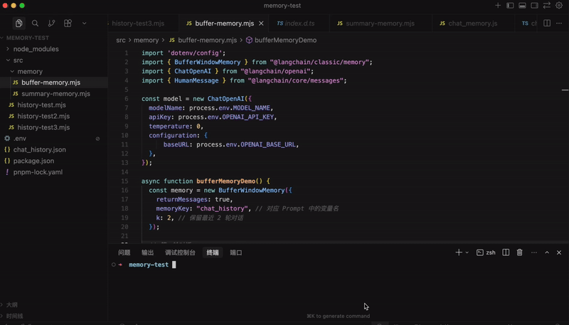
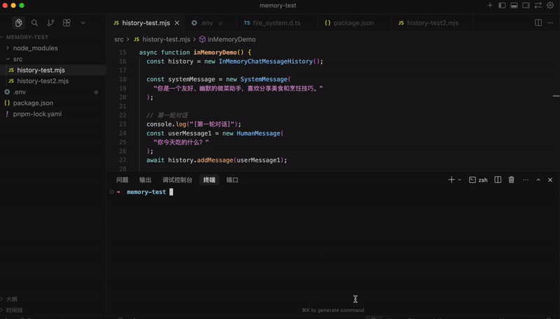
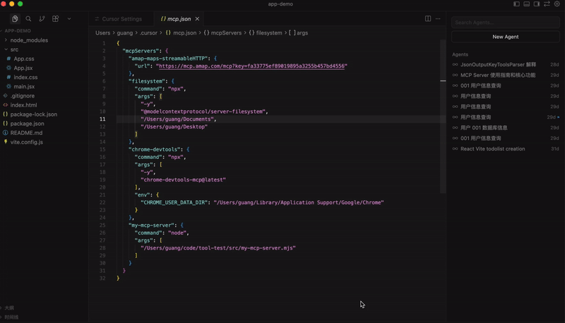
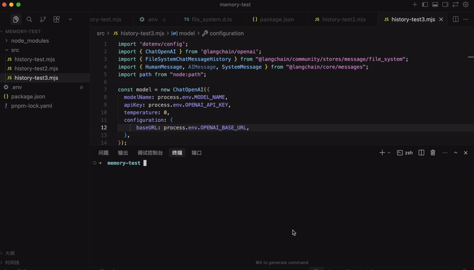
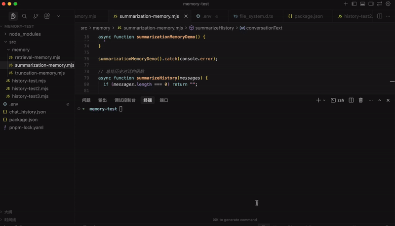
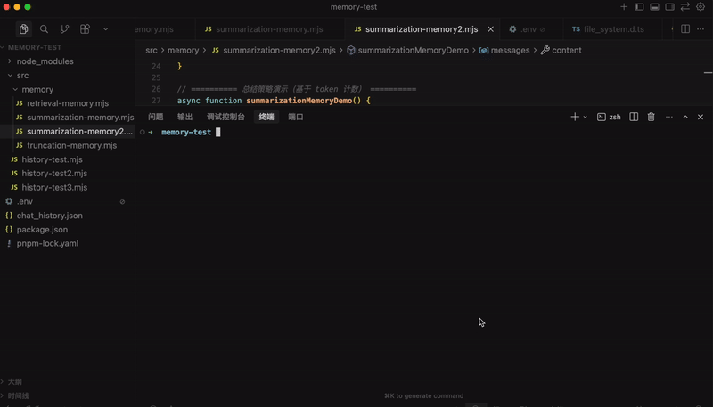
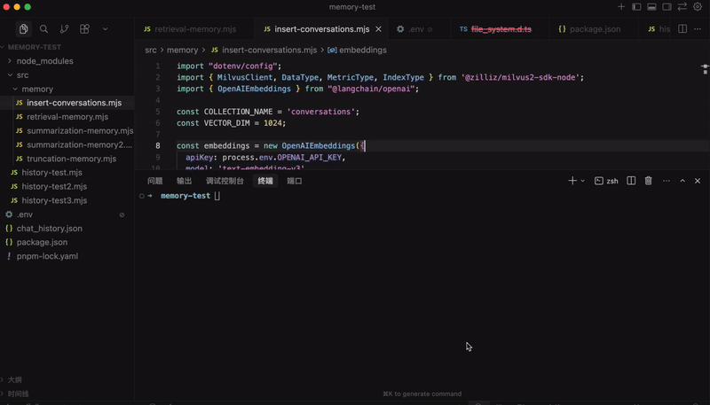
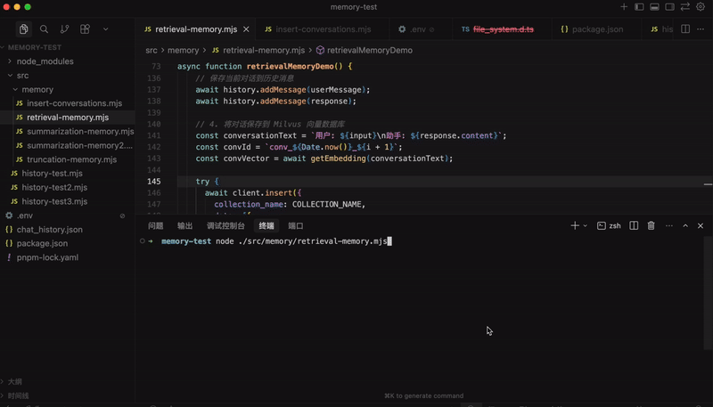
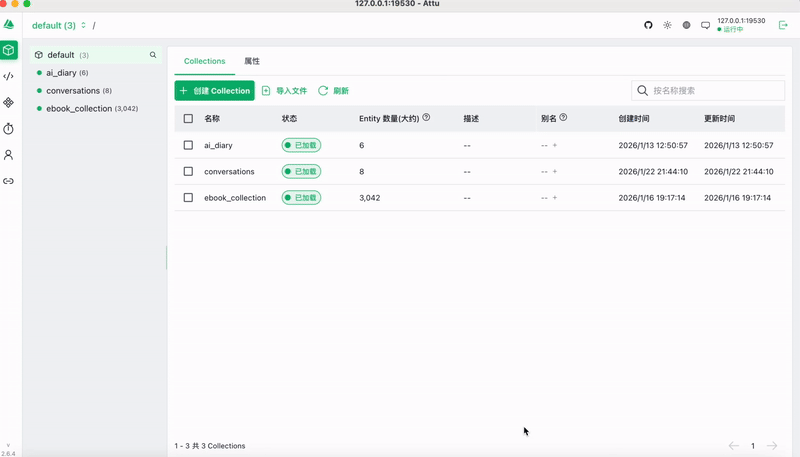

# Memory 管理的三大策略：截断、总结、检索

我们给大模型扩展了 tool，让它可以做一些事情而不只是回答问题。给大模型扩展了 RAG，基于 query 获取向量数据库里相关的知识放入 prompt。但这些其实都依赖一个东西：Memory

大模型是无状态的，你这次调用和下次调用没区别，它并不知道之前你问了什么，回答了什么。

有的同学说，不对啊，我明明可以基于上次的回答继续问。

这是因为你已经做了 Memory 管理。

记得我们之前写的这个循环么：


我们在 messages 数组放入了 SystemMessage，告诉大模型它的角色、功能，然后放入了 HumanMessage，也就是用户问的问题。

然后 invoke 大模型，这是第一次调用。

大模型返回了 AIMessage 和 tool_calls 信息。


我们基于 tool_calls 去调用工具，然后把结果封装成 ToolMessage 也放入 messages 数组。

这样 messages 数组里就有了 SystemMessage、HumanMessage、AIMessage、ToolMessage

循环继续调用大模型，这是第二次调用。


直到不再有 tool_calls，就把那个 AIMessage 返回，这就是最终回复。


这个过程我们循环调用了多次大模型。

你觉得大模型是怎么知道之前问过什么、回答过什么的？

就是基于 messages 数组，也就是 Memory。

如果不做 Memory 管理，大模型根本不知道之前回答过什么，所以说它是无状态的。

但这种 messages 数组不断 push 的 Memory 管理机制显然不靠谱。

因为大模型的上下文大小是有限的，比如 GPT-4o 大概是 200k token

不管这个限制是多大，当你无限往 memory 里增加 message 的时候，总是会超的。

所以我们要学一些 Memory 的管理策略。

先不看有哪些方案，你自己考虑下，应该怎么做呢？

- 有同学说，可以只保留最近的几条 message，之前的舍弃掉啊。
- 有同学说，直接舍弃之前的也不好，可以对之前的做一些总结，保留这个总结和最近的几条 message。
- 有同学说可以用我们刚学的向量数据库啊，根据语义检索之前的 message

没错，主流的也就是这三种思路，截断、总结、检索

其实你每天都在用 memory 的这些策略：

你用 cursor 或者 claude code 的时候，会有一个 token 的计数，当达到的时候，会触发总结，然后开始新的一轮计数：

cursor：


达到上下文限制，会自动触发总结。

claude code：


达到限制自动触发总结，或者也可以 /compact 手动总结（compact 是压实压紧的意思）

还有一个问题，就是 messages 存在哪，现在都是存在内存中的，而实际上可以做持久化，存在文件、redis、数据库等。

所以之前 memory 一共有两个维度的 api：

一个是 ChatMessageHistory 相关的：


它是存储层，也就是 messages 存在哪，可以是内存、文件、数据库等。

然后是逻辑层，也就是截断、总结、向量数据库这些：


每个 xxMemory 类都有一个 chatHistory 属性，关联着存储层。

但是，这些 memory 的 api，已经全部被废弃了。

移到了 @langchain/classic 这个包：

**🎬 [视频 1](http://mpvideo.qpic.cn/0bc3vyaxsaabqaaewf3t3nuvdlwdpgxac6ia.f10002.mp4?dis_k=5666b8a0909e5af58a3f5d91e6726f5a&dis_t=1781680429&play_scene=10110&auth_info=JYzypcJ9ILbRlusmWZPi3JRzAExUdGhvEU45OUptLTIYOS9GMksecmxUam0uOmwAPh8NbEB+&auth_key=69eabc1718b37652f3d52ed35378d577)**



可以看到，刚才提到的所有 Memory api 都被废弃了：


因为它们不够灵活，像之前提到的截断、总结、检索（向量数据库）完全可以自己实现：

- 截断就是根据总 token 数量来保留最近的 message
- 总结就是调用大模型对之前的 message 生成一个摘要
- 检索向量数据库就是之前的 RAG 流程，只不过用来对 message 做语义检索

用 memory 这些 api 反而更黑盒而且也不灵活，所以新版干脆都去掉了。

但是加了一个 trimMessages 的 api，可以根据 token 来截断消息

所以现在 Memory 相关就剩下了 history + trimMessages 的 api

我们来写代码试一遍：

```
mkdir memory-test
cd memory-test
npm init -y
```


安装下用到的包：

```
pnpm install dotenv @langchain/core @langchain/openai @langchain/community langchain
```

创建 src/history-test.mjs

```
import 'dotenv/config';
import { ChatOpenAI } from '@langchain/openai';
import { InMemoryChatMessageHistory } from "@langchain/core/chat_history";
import { HumanMessage, SystemMessage } from "@langchain/core/messages";

const model = new ChatOpenAI({ 
  modelName: process.env.MODEL_NAME,
  apiKey: process.env.OPENAI_API_KEY,
  temperature: 0,
  configuration: {
      baseURL: process.env.OPENAI_BASE_URL,
  },
});

async function inMemoryDemo() {
  const history = new InMemoryChatMessageHistory();

  const systemMessage = new SystemMessage(
    "你是一个友好、幽默的做菜助手，喜欢分享美食和烹饪技巧。"
  );

  // 第一轮对话
  console.log("[第一轮对话]");
  const userMessage1 = new HumanMessage(
    "你今天吃的什么？"
  );
  await history.addMessage(userMessage1);
  
  const messages1 = [systemMessage, ...(await history.getMessages())];
  const response1 = await model.invoke(messages1);
  await history.addMessage(response1);
  
  console.log(`用户: ${userMessage1.content}`);
  console.log(`助手: ${response1.content}\n`);

  // 第二轮对话（基于历史记录）
  console.log("[第二轮对话 - 基于历史记录]");
  const userMessage2 = new HumanMessage(
    "好吃吗？"
  );
  await history.addMessage(userMessage2);
  
  const messages2 = [systemMessage, ...(await history.getMessages())];
  const response2 = await model.invoke(messages2);
  await history.addMessage(response2);
  
  console.log(`用户: ${userMessage2.content}`);
  console.log(`助手: ${response2.content}\n`);

  // 展示所有历史消息
  console.log("[历史消息记录]");
  const allMessages = await history.getMessages();
  console.log(`共保存了 ${allMessages.length} 条消息：`);
  allMessages.forEach((msg, index) => {
    const type = msg.type;
    const prefix = type === 'human' ? '用户' : '助手';
    console.log(`  ${index + 1}. [${prefix}]: ${msg.content.substring(0, 50)}...`);
  });
}

inMemoryDemo().catch(console.error);
```

用 InMemoryChatMessageHistory 来管理 message，放到内存里。

用 addMessage 添加 HumanMessage 和 AIMessage，分别调用了两次大模型。

创建用到的 .env

```
# OpenAI API 配置
OPENAI_API_KEY=sk-xxx
OPENAI_BASE_URL=https://dashscope.aliyuncs.com/compatible-mode/v1
MODEL_NAME=qwen-plus
```

跑一下：

**🎬 [视频 2](http://mpvideo.qpic.cn/0b2ermaukaabqeahpvttajuvdc6diwfqcria.f10002.mp4?dis_k=2ae9e67c9f9307140e8b49679b733d0f&dis_t=1781680429&play_scene=10110&auth_info=c9mT/6N3JLeMme16DZPj2ZZ2B0sDJ2doHxhqORxtezdObi5ONkAaczFbbDF6Om0FPBoKaxct&auth_key=35b0b91caccd80b8d0cd9beb68311e7b)**




可以看到，第一次调用大模型，它回答了红烧肉、冬阴功汤

第二次再和它对话，它能知道之前聊过的内容，接着聊

我们之前是用 messages 数组实现的，现在换成了 InMemoryChatMessageHistory 的 api。

当然，保存在文件里也是可以的。

你看 cursor 就是把对话过程持久化了：

**🎬 [视频 3](http://mpvideo.qpic.cn/0b2eeyavcaabhaaghv3twbuvcjwdketacuia.f10002.mp4?dis_k=ee70bce7dfa162a239e9e38107a7670e&dis_t=1781680429&play_scene=10110&auth_info=dq/21+4uf+aGl+tzWMXn3MV2BBwHdW5vSko+ZBw1eTFLPihNah1BIjtVajgvbGkAbxoJPBN/&auth_key=614fe2681f4d6d6358d18f2466d075ec)**



我们随时可以找到一个之前的聊天继续聊。

这就是 message 持久化的好处，也叫做长时记忆（LTM long-term memory）。

相应的，内存中那种叫短时记忆（short-term memory）。

试一下存到文件的长时记忆：

创建 src/history-test2.mjs

```
import 'dotenv/config';
import { ChatOpenAI } from '@langchain/openai';
import { FileSystemChatMessageHistory } from "@langchain/community/stores/message/file_system";
import { HumanMessage, AIMessage, SystemMessage } from "@langchain/core/messages";
import path from "node:path";

const model = new ChatOpenAI({ 
  modelName: process.env.MODEL_NAME,
  apiKey: process.env.OPENAI_API_KEY,
  temperature: 0,
  configuration: {
      baseURL: process.env.OPENAI_BASE_URL,
  },
});

async function fileHistoryDemo() {
  // 指定存储文件的路径
  const filePath = path.join(process.cwd(), "chat_history.json");
  const sessionId = "user_session_001";

  // 系统提示词
  const systemMessage = new SystemMessage(
    "你是一个友好的做菜助手，喜欢分享美食和烹饪技巧。"
  );

  console.log("[第一轮对话]");
  const history = new FileSystemChatMessageHistory({
    filePath: filePath,
    sessionId: sessionId,
  });

  const userMessage1 = new HumanMessage(
    "红烧肉怎么做"
  );
  await history.addMessage(userMessage1);
  
  const messages1 = [systemMessage, ...(await history.getMessages())];
  const response1 = await model.invoke(messages1);
  await history.addMessage(response1);
  
  console.log(`用户: ${userMessage1.content}`);
  console.log(`助手: ${response1.content}`);
  console.log(`✓ 对话已保存到文件: ${filePath}\n`);

  console.log("[第二轮对话]");
  const userMessage2 = new HumanMessage(
    "好吃吗？"
  );
  await history.addMessage(userMessage2);
  
  const messages2 = [systemMessage, ...(await history.getMessages())];
  const response2 = await model.invoke(messages2);
  await history.addMessage(response2);
  
  console.log(`用户: ${userMessage2.content}`);
  console.log(`助手: ${response2.content}`);
  console.log(`✓ 对话已更新到文件\n`);
}

fileHistoryDemo().catch(console.error);
```

第一轮对话问红烧肉怎么做

第二轮对话接着问好吃吗

对话内容会保存到文件里

然后我们再创建一个文件来接着问：

创建 src/history-test3.mjs

```
import 'dotenv/config';
import { ChatOpenAI } from '@langchain/openai';
import { FileSystemChatMessageHistory } from "@langchain/community/stores/message/file_system";
import { HumanMessage, AIMessage, SystemMessage } from "@langchain/core/messages";
import path from "node:path";

const model = new ChatOpenAI({ 
  modelName: process.env.MODEL_NAME,
  apiKey: process.env.OPENAI_API_KEY,
  temperature: 0,
  configuration: {
      baseURL: process.env.OPENAI_BASE_URL,
  },
});

async function fileHistoryDemo() {
  // 指定存储文件的路径
  const filePath = path.join(process.cwd(), "chat_history.json");
  const sessionId = "user_session_001";

  // 系统提示词
  const systemMessage = new SystemMessage(
    "你是一个友好、幽默的做菜助手，喜欢分享美食和烹饪技巧。"
  );

  
  const restoredHistory = new FileSystemChatMessageHistory({
    filePath: filePath,
    sessionId: sessionId,
  });
  
  const restoredMessages = await restoredHistory.getMessages();
  console.log(`从文件恢复了 ${restoredMessages.length} 条历史消息：`);
  restoredMessages.forEach((msg, index) => {
    const type = msg.type;
    const prefix = type === 'human' ? '用户' : '助手';
    console.log(`  ${index + 1}. [${prefix}]: ${msg.content.substring(0, 50)}...`);
  });
  console.log();

  console.log("[第三轮对话]");
  const userMessage3 = new HumanMessage(
    "需要哪些食材？"
  );
  await restoredHistory.addMessage(userMessage3);
  
  const messages3 = [systemMessage, ...(await restoredHistory.getMessages())];
  const response3 = await model.invoke(messages3);
  await restoredHistory.addMessage(response3);
  
  console.log(`用户: ${userMessage3.content}`);
  console.log(`助手: ${response3.content}`);
  console.log(`✓ 对话已保存到文件\n`);
}

fileHistoryDemo().catch(console.error);
```

加载那个文件里的历史 message，继续问需要的食材。

跑一下：

**🎬 [视频 4](http://mpvideo.qpic.cn/0bc3zqa4waabh4apufdt7buvdtgdzpgadsya.f10002.mp4?dis_k=9ad1240f68156f4b7618313e7d35cdfa&dis_t=1781680429&play_scene=10110&auth_info=IpuGhKl9frCEnL90C5fliZYgAEADJm8/HR9vNkJlfTEfa3hJZUlAdDlePj98PmtVPEwNYBcs&auth_key=fd74bed991da2570d0e1d0dd827c107a)**



可以看到，我们第一轮、第二轮对话都被持久化保存到了文件里

后面可以从文件里恢复前两轮对话，继续第三轮

基于这个完全可以实现 cursor 这种功能：


ChatMessageHistory 的 api 只是用来存储 message，接下来实现那三种策略：

首先是截断：

创建 src/memory/truncation-memory.mjs

```
import { InMemoryChatMessageHistory } from "@langchain/core/chat_history";
import { HumanMessage, AIMessage, trimMessages } from "@langchain/core/messages";
import { getEncoding } from "js-tiktoken";

// ========== 1. 按消息数量截断 ==========
async function messageCountTruncation() {
  const history = new InMemoryChatMessageHistory();
  const maxMessages = 4;

  const messages = [
    { type: 'human', content: '我叫张三' },
    { type: 'ai', content: '你好张三，很高兴认识你！' },
    { type: 'human', content: '我今年25岁' },
    { type: 'ai', content: '25岁正是青春年华，有什么我可以帮助你的吗？' },
    { type: 'human', content: '我喜欢编程' },
    { type: 'ai', content: '编程很有趣！你主要用什么语言？' },
    { type: 'human', content: '我住在北京' },
    { type: 'ai', content: '北京是个很棒的城市！' },
    { type: 'human', content: '我的职业是软件工程师' },
    { type: 'ai', content: '软件工程师是个很有前景的职业！' },
  ];

  // 添加所有消息
  for (const msg of messages) {
    if (msg.type === 'human') {
      await history.addMessage(new HumanMessage(msg.content));
    } else {
      await history.addMessage(new AIMessage(msg.content));
    }
  }

  let allMessages = await history.getMessages();
  
  // 按消息数量截断：保留最近 maxMessages 条消息
  const trimmedMessages = allMessages.slice(-maxMessages);

  console.log(`保留消息数量: ${trimmedMessages.length}`);
  console.log("保留的消息:", trimmedMessages.map(m => `${m.constructor.name}: ${m.content}`).join('\n  '));
}

// 计算消息数组的总 token 数量
function countTokens(messages, encoder) {
  let total = 0;
  for (const msg of messages) {
    const content = typeof msg.content === 'string' ? msg.content : JSON.stringify(msg.content);
    total += encoder.encode(content).length;
  }
  return total;
}

// ========== 2. 按 token 数量截断（使用 js-tiktoken 计数） ==========
async function tokenCountTruncation() {
  const history = new InMemoryChatMessageHistory();
  const maxTokens = 100; // 限制最多 100 个 token
  
  const enc = getEncoding("cl100k_base");

  const messages = [
    { type: 'human', content: '我叫李四' },
    { type: 'ai', content: '你好李四，很高兴认识你！' },
    { type: 'human', content: '我是一名设计师' },
    { type: 'ai', content: '设计师是个很有创造力的职业！你主要做什么类型的设计？' },
    { type: 'human', content: '我喜欢艺术和音乐' },
    { type: 'ai', content: '艺术和音乐都是很好的爱好，它们能激发创作灵感。' },
    { type: 'human', content: '我擅长 UI/UX 设计' },
    { type: 'ai', content: 'UI/UX 设计非常重要，好的用户体验能让产品更成功！' },
  ];

  // 添加所有消息
  for (const msg of messages) {
    if (msg.type === 'human') {
      await history.addMessage(new HumanMessage(msg.content));
    } else {
      await history.addMessage(new AIMessage(msg.content));
    }
  }

  let allMessages = await history.getMessages();
  
  // 使用 trimMessages API：使用 js-tiktoken 计算 token 数量
  const trimmedMessages = await trimMessages(allMessages, {
    maxTokens: maxTokens,
    tokenCounter: async (msgs) => countTokens(msgs, enc),
    strategy: "last", // 保留最近的消息
  });
  
  // 计算实际 token 数用于显示
  const totalTokens = countTokens(trimmedMessages, enc);
  
  console.log(`总 token 数: ${totalTokens}/${maxTokens}`);
  console.log(`保留消息数量: ${trimmedMessages.length}`);
  console.log("保留的消息:", trimmedMessages.map(m => {
    const content = typeof m.content === 'string' ? m.content : JSON.stringify(m.content);
    const tokens = enc.encode(content).length;
    return `${m.constructor.name} (${tokens} tokens): ${content}`;
  }).join('\n  '));
  
}

async function runAll() {
  await messageCountTruncation();
  await tokenCountTruncation();
}

runAll().catch(console.error);
```

这里有两种计数逻辑：

第一种是消息条数，直接 slice 就行

第二种是 token 数量，用 trimMessages 的 api，这里用 js-tiktoken 这个包来计数

安装下这个包：

```
pnpm install js-tiktoken
```

跑一下：


可以看到，第一次是根据数量截取了 4 条最近的 message

第二次是根据 token 来截取的

之后把截取的 messages 传给大模型调用就行了。

这就是第一种策略，截断

然后再来试下第二种，总结：

创建 src/memory/summarization-memory.mjs

```
import 'dotenv/config';
import { ChatOpenAI } from "@langchain/openai";
import { InMemoryChatMessageHistory } from "@langchain/core/chat_history";
import { HumanMessage, SystemMessage, AIMessage, getBufferString } from "@langchain/core/messages";

const model = new ChatOpenAI({
  modelName: process.env.MODEL_NAME,
  apiKey: process.env.OPENAI_API_KEY,
  temperature: 0,
  configuration: {
      baseURL: process.env.OPENAI_BASE_URL,
  },
});

// ========== 总结策略演示 ==========
async function summarizationMemoryDemo() {
  const history = new InMemoryChatMessageHistory();
  const maxMessages = 6; // 超过 6 条消息时触发总结

  const messages = [
    { type: 'human', content: '我想学做红烧肉，你能教我吗？' },
    { type: 'ai', content: '当然可以！红烧肉是一道经典的中式菜肴。首先需要准备五花肉、冰糖、生抽、老抽、料酒等材料。' },
    { type: 'human', content: '五花肉需要切多大块？' },
    { type: 'ai', content: '建议切成3-4厘米见方的块，这样既容易入味，口感也更好。切好后可以用开水焯一下去除血沫。' },
    { type: 'human', content: '炒糖色的时候有什么技巧吗？' },
    { type: 'ai', content: '炒糖色是关键步骤。用小火慢慢炒，等冰糖完全融化变成焦糖色，冒小泡时就可以下肉了。注意不要炒过头，否则会发苦。' },
    { type: 'human', content: '需要炖多长时间？' },
    { type: 'ai', content: '一般需要炖40-60分钟，用小火慢炖，直到肉变得软糯入味。可以用筷子戳一下，能轻松戳透就说明好了。' },
    { type: 'human', content: '最后收汁的时候要注意什么？' },
    { type: 'ai', content: '收汁时要用大火，不断翻动，让汤汁均匀包裹在肉块上。看到汤汁变得浓稠，颜色红亮就可以出锅了。' },
  ];

  // 添加所有消息
  for (const msg of messages) {
    if (msg.type === 'human') {
      await history.addMessage(new HumanMessage(msg.content));
    } else {
      await history.addMessage(new AIMessage(msg.content));
    }
  }

  let allMessages = await history.getMessages();
  
  console.log(`原始消息数量: ${allMessages.length}`);
  console.log("原始消息:", allMessages.map(m => `${m.constructor.name}: ${m.content}`).join('\n  '));
  
  // 如果消息过多，触发总结
  if (allMessages.length >= maxMessages) {
    const keepRecent = 2; // 保留最近 2 条消息
    
    // 分离要保留的消息和要总结的消息
    const recentMessages = allMessages.slice(-keepRecent);
    const messagesToSummarize = allMessages.slice(0, -keepRecent);
    
    console.log("\n💡 历史消息过多，开始总结...");
    console.log(`📝 将被总结的消息数量: ${messagesToSummarize.length}`);
    console.log(`📝 将被保留的消息数量: ${recentMessages.length}`);
    
    // 总结将被丢弃的旧消息
    const summary = await summarizeHistory(messagesToSummarize);
    
    // 清空历史消息，只保留最近的消息
    await history.clear();
    for (const msg of recentMessages) {
      await history.addMessage(msg);
    }
    
    console.log(`\n保留消息数量: ${recentMessages.length}`);
    console.log("保留的消息:", recentMessages.map(m => `${m.constructor.name}: ${m.content}`).join('\n  '));
    console.log(`\n总结内容（不包含保留的消息）: ${summary}`);
  } else {
    console.log("\n消息数量未超过阈值，无需总结");
  }
}

summarizationMemoryDemo().catch(console.error);

// 总结历史对话的函数
async function summarizeHistory(messages) {
  if (messages.length === 0) return "";
  
  const conversationText = getBufferString(messages, {
    humanPrefix: "用户",
    aiPrefix: "助手",
  });
  
  const summaryPrompt = `请总结以下对话的核心内容，保留重要信息：

${conversationText}

总结：`;
  
  const summaryResponse = await model.invoke([new SystemMessage(summaryPrompt)]);
  return summaryResponse.content;
}
```

有 10 条消息，我们只保留最近的 2 条，之前的用 LLM 做总结

这里用到了 getBufferString 的 api，它可以给 HumanMessage、AIMessage 等加上不同的前缀来格式化

跑一下：

**🎬 [视频 5](http://mpvideo.qpic.cn/0bc3haa3caabjyaigpdt5zuvcogdwe4admia.f10002.mp4?dis_k=979555bdb3de33cc0a3bbe43c69aa94c&dis_t=1781680429&play_scene=10110&auth_info=d62pjp16JOHQm+kgWZ2xi8tyAkBVe2s4HE1tYkkwLTRKPHlOMksaJW1ZaGsuND9XYR4PYEFx&auth_key=00df72fb2f433d6636eb652aa67007e7)**



可以看到，之前的 8 条内容做了总结，然后最近的 2 条保留。


这样，总结后再继续聊，token 消耗就少了。

当然，更常用的是根据 token 来触发总结，而不是消息条数：

创建 src/memory/summarization-memory2.mjs

```
import 'dotenv/config';
import { ChatOpenAI } from "@langchain/openai";
import { InMemoryChatMessageHistory } from "@langchain/core/chat_history";
import { HumanMessage, SystemMessage, AIMessage, getBufferString } from "@langchain/core/messages";
import { getEncoding } from "js-tiktoken";

const model = new ChatOpenAI({
  modelName: process.env.MODEL_NAME,
  apiKey: process.env.OPENAI_API_KEY,
  temperature: 0,
  configuration: {
      baseURL: process.env.OPENAI_BASE_URL,
  },
});

// 计算消息数组的总 token 数量
function countTokens(messages, encoder) {
  let total = 0;
  for (const msg of messages) {
    const content = typeof msg.content === 'string' ? msg.content : JSON.stringify(msg.content);
    total += encoder.encode(content).length;
  }
  return total;
}

// ========== 总结策略演示（基于 token 计数） ==========
async function summarizationMemoryDemo() {
  const history = new InMemoryChatMessageHistory();
  const maxTokens = 200; // 超过 200 个 token 时触发总结
  const keepRecentTokens = 80; // 保留最近消息的 token 数量（约占总数的 40%）
  
  const enc = getEncoding("cl100k_base");

  const messages = [
    { type: 'human', content: '我想学做红烧肉，你能教我吗？' },
    { type: 'ai', content: '当然可以！红烧肉是一道经典的中式菜肴。首先需要准备五花肉、冰糖、生抽、老抽、料酒等材料。' },
    { type: 'human', content: '五花肉需要切多大块？' },
    { type: 'ai', content: '建议切成3-4厘米见方的块，这样既容易入味，口感也更好。切好后可以用开水焯一下去除血沫。' },
    { type: 'human', content: '炒糖色的时候有什么技巧吗？' },
    { type: 'ai', content: '炒糖色是关键步骤。用小火慢慢炒，等冰糖完全融化变成焦糖色，冒小泡时就可以下肉了。注意不要炒过头，否则会发苦。' },
    { type: 'human', content: '需要炖多长时间？' },
    { type: 'ai', content: '一般需要炖40-60分钟，用小火慢炖，直到肉变得软糯入味。可以用筷子戳一下，能轻松戳透就说明好了。' },
    { type: 'human', content: '最后收汁的时候要注意什么？' },
    { type: 'ai', content: '收汁时要用大火，不断翻动，让汤汁均匀包裹在肉块上。看到汤汁变得浓稠，颜色红亮就可以出锅了。' },
  ];

  // 添加所有消息
  for (const msg of messages) {
    if (msg.type === 'human') {
      await history.addMessage(new HumanMessage(msg.content));
    } else {
      await history.addMessage(new AIMessage(msg.content));
    }
  }

  let allMessages = await history.getMessages();
  
  const totalTokens = countTokens(allMessages, enc);
  
  // 如果 token 数超过阈值，触发总结
  if (totalTokens >= maxTokens) {
    // 从后往前累加消息，保留最近的消息直到达到 keepRecentTokens
    const recentMessages = [];
    let recentTokens = 0;
    
    for (let i = allMessages.length - 1; i >= 0; i--) {
      const msg = allMessages[i];
      const content = typeof msg.content === 'string' ? msg.content : JSON.stringify(msg.content);
      const msgTokens = enc.encode(content).length;
      
      if (recentTokens + msgTokens <= keepRecentTokens) {
        recentMessages.unshift(msg);
        recentTokens += msgTokens;
      } else {
        break;
      }
    }
    
    const messagesToSummarize = allMessages.slice(0, allMessages.length - recentMessages.length);
    const summarizeTokens = countTokens(messagesToSummarize, enc);
    
    console.log("\n💡 Token 数量超过阈值，开始总结...");
    console.log(`📝 将被总结的消息数量: ${messagesToSummarize.length} (${summarizeTokens} tokens)`);
    console.log(`📝 将被保留的消息数量: ${recentMessages.length} (${recentTokens} tokens)`);
    
    // 总结将被丢弃的旧消息
    const summary = await summarizeHistory(messagesToSummarize);
    
    // 清空历史消息，只保留最近的消息
    await history.clear();
    for (const msg of recentMessages) {
      await history.addMessage(msg);
    }
    
    console.log(`\n保留消息数量: ${recentMessages.length}`);
    console.log("保留的消息:", recentMessages.map(m => {
      const content = typeof m.content === 'string' ? m.content : JSON.stringify(m.content);
      const tokens = enc.encode(content).length;
      return `${m.constructor.name} (${tokens} tokens): ${m.content}`;
    }).join('\n  '));
    console.log(`\n总结内容（不包含保留的消息）: ${summary}`);
  } else {
    console.log(`\nToken 数量 (${totalTokens}) 未超过阈值 (${maxTokens})，无需总结`);
  }
}

summarizationMemoryDemo().catch(console.error);

// 总结历史对话的函数
async function summarizeHistory(messages) {
  if (messages.length === 0) return "";
  
  const conversationText = getBufferString(messages, {
    humanPrefix: "用户",
    aiPrefix: "助手",
  });
  
  const summaryPrompt = `请总结以下对话的核心内容，保留重要信息：

${conversationText}

总结：`;
  
  const summaryResponse = await model.invoke([new SystemMessage(summaryPrompt)]);
  return summaryResponse.content;
}
```

区别是现在是 token 计数来触发总结：

**🎬 [视频 6](http://mpvideo.qpic.cn/0bc3qyaa6aaa5yad27dshjuvbbwdb6daadya.f10002.mp4?dis_k=9af75a58edd493b86a17d4f00f41616c&dis_t=1781680429&play_scene=10110&auth_info=d5/inv9/ceeByepzCZDh3MNwAkADJGk4SBoxZR4wfD5KPSJIMklPIzwLazh+OW8AaRwPYBcu&auth_key=c53734c35f9022752f20e47e398d6170)**



我们每天用的 cursor、claude code 就是这种策略：

cursor：


达到上下文限制，会自动触发总结。

claude code：


最后再来试下检索向量数据库的思路：

先把 milvus 跑起来：


我们用代码创建集合，插入数据：

创建 src/memory/insert-conversations.mjs

```
import "dotenv/config";
import { MilvusClient, DataType, MetricType, IndexType } from '@zilliz/milvus2-sdk-node';
import { OpenAIEmbeddings } from "@langchain/openai";

const COLLECTION_NAME = 'conversations';
const VECTOR_DIM = 1024;

const embeddings = new OpenAIEmbeddings({
  apiKey: process.env.OPENAI_API_KEY,
  model: 'text-embedding-v3',
  configuration: {
    baseURL: process.env.OPENAI_BASE_URL
  },
  dimensions: VECTOR_DIM
});

const client = new MilvusClient({
  address: 'localhost:19530'
});

/**
 * 获取文本的向量嵌入
 */
async function getEmbedding(text) {
  const result = await embeddings.embedQuery(text);
  return result;
}

async function main() {
  try {
    console.log('连接到 Milvus...');
    await client.connectPromise;
    console.log('✓ 已连接\n');

    // 创建集合
    console.log('创建集合...');
    await client.createCollection({
      collection_name: COLLECTION_NAME,
      fields: [
        { name: 'id', data_type: DataType.VarChar, max_length: 50, is_primary_key: true },
        { name: 'vector', data_type: DataType.FloatVector, dim: VECTOR_DIM },
        { name: 'content', data_type: DataType.VarChar, max_length: 5000 },
        { name: 'round', data_type: DataType.Int64 },
        { name: 'timestamp', data_type: DataType.VarChar, max_length: 100 }
      ]
    });
    console.log('✓ 集合已创建');

    // 创建索引
    console.log('\n创建索引...');
    await client.createIndex({
      collection_name: COLLECTION_NAME,
      field_name: 'vector',
      index_type: IndexType.IVF_FLAT,
      metric_type: MetricType.COSINE
    });
    console.log('✓ 索引已创建');

    // 加载集合
    console.log('\n加载集合...');
    await client.loadCollection({ collection_name: COLLECTION_NAME });
    console.log('✓ 集合已加载');

    // 插入对话数据
    console.log('\n插入对话数据...');
    const conversations = [
      {
        id: 'conv_001',
        content: '用户: 我叫赵六，是一名数据科学家\n助手: 很高兴认识你，赵六！数据科学是一个很有趣的领域。',
        round: 1,
        timestamp: new Date().toISOString()
      },
      {
        id: 'conv_002',
        content: '用户: 我最近在研究机器学习算法\n助手: 机器学习确实很有意思，你在研究哪些算法呢？',
        round: 2,
        timestamp: new Date().toISOString()
      },
      {
        id: 'conv_003',
        content: '用户: 我喜欢打篮球和看电影\n助手: 运动和文化娱乐都是很好的爱好！',
        round: 3,
        timestamp: new Date().toISOString()
      },
      {
        id: 'conv_004',
        content: '用户: 我周末经常去电影院\n助手: 看电影是很好的放松方式。',
        round: 4,
        timestamp: new Date().toISOString()
      },
      {
        id: 'conv_005',
        content: '用户: 我的职业是软件工程师\n助手: 软件工程师是个很有前景的职业！',
        round: 5,
        timestamp: new Date().toISOString()
      }
    ];

    console.log('生成向量嵌入...');
    const conversationData = await Promise.all(
      conversations.map(async (conv) => ({
        ...conv,
        vector: await getEmbedding(conv.content)
      }))
    );

    const insertResult = await client.insert({
      collection_name: COLLECTION_NAME,
      data: conversationData
    });
    console.log(`✓ 已插入 ${insertResult.insert_cnt} 条记录\n`);

    console.log('='.repeat(60));
    console.log('说明：已成功将对话数据插入到 Milvus 向量数据库');
    console.log('这些对话数据将用于后续的 RAG 检索');
    console.log('='.repeat(60) + '\n');

  } catch (error) {
    console.error('错误:', error.message);
  }
}

main();
```

创建集合 conversations 用来保存对话记录

然后插入一些数据。

跑一下：

**🎬 [视频 7](http://mpvideo.qpic.cn/0bc3piaj2aaataakzl3s4fuva6wdtv5abhia.f10002.mp4?dis_k=1804bae2f71b38135c7a22fa4f55b020&dis_t=1781680429&play_scene=10110&auth_info=fIicz596J7GHybt3CZHliMJ0UUhacmpvSEo7Zk1lKjRBbilLME8ZdToLOjx+OGtUaBhcaE54&auth_key=3cb7bec83a05bbd8567da744f91cafa2)**



这样，我们就把每轮对话格式化后存到了向量数据库里，记录了对话的时间、轮次。

接下来对话的时候，就可以用 RAG 来检索之前的对话内容了：

创建 src/memory/retrieval-memory.mjs

```
import 'dotenv/config';
import { ChatOpenAI, OpenAIEmbeddings } from "@langchain/openai";
import { InMemoryChatMessageHistory } from "@langchain/core/chat_history";
import { MilvusClient, MetricType } from '@zilliz/milvus2-sdk-node';
import { HumanMessage, SystemMessage } from "@langchain/core/messages";

const COLLECTION_NAME = 'conversations';
const VECTOR_DIM = 1024;

// 初始化 OpenAI Chat 模型
const model = new ChatOpenAI({ 
  modelName: process.env.MODEL_NAME,
  apiKey: process.env.OPENAI_API_KEY,
  temperature: 0,
  configuration: {
    baseURL: process.env.OPENAI_BASE_URL,
  },
});

// 初始化 Embeddings 模型
const embeddings = new OpenAIEmbeddings({
  apiKey: process.env.OPENAI_API_KEY,
  model: 'text-embedding-v3',
  configuration: {
    baseURL: process.env.OPENAI_BASE_URL,
  },
  dimensions: VECTOR_DIM
});

// 初始化 Milvus 客户端
const client = new MilvusClient({
  address: 'localhost:19530'
});

/**
 * 获取文本的向量嵌入
 */
async function getEmbedding(text) {
  const result = await embeddings.embedQuery(text);
  return result;
}

/**
 * 从 Milvus 中检索相关的历史对话
 */
async function retrieveRelevantConversations(query, k = 2) {
  try {
    // 生成查询的向量
    const queryVector = await getEmbedding(query);

    // 在 Milvus 中搜索相似的对话
    const searchResult = await client.search({
      collection_name: COLLECTION_NAME,
      vector: queryVector,
      limit: k,
      metric_type: MetricType.COSINE,
      output_fields: ['id', 'content', 'round', 'timestamp']
    });

    return searchResult.results;
  } catch (error) {
    console.error('检索对话时出错:', error.message);
    return [];
  }
}

/**
 * 策略3: 检索（Retrieval）
 * 使用 Milvus 向量数据库存储历史对话，根据当前输入检索语义相关的历史
 * 实现 RAG（Retrieval-Augmented Generation）流程
 */

async function retrievalMemoryDemo() {  
  try {
    console.log('连接到 Milvus...');
    await client.connectPromise;
    console.log('✓ 已连接\n');
  } catch (error) {
    console.error('❌ 无法连接到 Milvus:', error.message);
    console.log('请确保 Milvus 服务正在运行（localhost:19530）');
    return;
  }

  // 创建历史消息存储
  const history = new InMemoryChatMessageHistory();

  const conversations = [
    { input: "我之前提到的机器学习项目进展如何？" },
    { input: "我周末经常做什么？" },
    { input: "我的职业是什么？" },
  ];

  for (let i = 0; i < conversations.length; i++) {
    const { input } = conversations[i];
    const userMessage = new HumanMessage(input);
    
    console.log(`\n[第 ${i + 1} 轮对话]`);
    console.log(`用户: ${input}`);
    
    // 1. 检索相关的历史对话
    console.log('\n【检索相关历史对话】');
    const retrievedConversations = await retrieveRelevantConversations(input, 2);
    
    let relevantHistory = "";
    if (retrievedConversations.length > 0) {
      // 显示检索到的相关历史及相似度
      retrievedConversations.forEach((conv, idx) => {
        console.log(`\n[历史对话 ${idx + 1}] 相似度: ${conv.score.toFixed(4)}`);
        console.log(`轮次: ${conv.round}`);
        console.log(`内容: ${conv.content}`);
      });
      
      // 构建上下文
      relevantHistory = retrievedConversations
        .map((conv, idx) => {
          return `[历史对话 ${idx + 1}]
轮次: ${conv.round}
${conv.content}`;
        })
        .join('\n\n━━━━━\n\n');
    } else {
      console.log('未找到相关历史对话');
    }
    
    // 2. 构建 prompt（使用检索到的历史作为上下文）
    const contextMessages = relevantHistory 
      ? [
          new HumanMessage(`相关历史对话：\n${relevantHistory}\n\n用户问题: ${input}`)
        ]
      : [userMessage];
    
    // 3. 调用模型生成回答
    console.log('\n【AI 回答】');
    const response = await model.invoke(contextMessages);
    
    // 保存当前对话到历史消息
    await history.addMessage(userMessage);
    await history.addMessage(response);
    
    // 4. 将对话保存到 Milvus 向量数据库
    const conversationText = `用户: ${input}\n助手: ${response.content}`;
    const convId = `conv_${Date.now()}_${i + 1}`;
    const convVector = await getEmbedding(conversationText);
    
    try {
      await client.insert({
        collection_name: COLLECTION_NAME,
        data: [{
          id: convId,
          vector: convVector,
          content: conversationText,
          round: i + 1,
          timestamp: new Date().toISOString()
        }]
      });
      console.log(`💾 已保存到 Milvus 向量数据库`);
    } catch (error) {
      console.warn('保存到向量数据库时出错:', error.message);
    }
    
    console.log(`助手: ${response.content}`);
  }
}

retrievalMemoryDemo().catch(console.error);
```

我们调用大模型，问了一些问题：


通过 rag 流程来检索之前的对话，来生成回答：

**🎬 [视频 8](http://mpvideo.qpic.cn/0bc3euadkaaamaaaortsgjuvajodgusqania.f10002.mp4?dis_k=e3603fa27c7df4fd928cbe37231b200d&dis_t=1781680429&play_scene=10110&auth_info=cJWG++5xJeHQnO1xXJWy2MJ2BRxRdG4+T047NxljLGFNOX5HYUAbJW1ebDorPDwEaBoIPEV+&auth_key=f94690310cd4c63d0f35fa3b44b24a36)**



这样，不管之前多久聊过什么内容，都能够继续聊。

聊完之后我们把最新的聊天也存入了向量数据库：


**🎬 [视频 9](http://mpvideo.qpic.cn/0bc3vear2aab6eac7qlt5vuvdkoddwuqchia.f10002.mp4?dis_k=dba777884f3ebb5d08c5dc89fb9c820e&dis_t=1781680429&play_scene=10110&auth_info=JvOGmOwtc+fWl+MlDZ2z0sB2BB0AI2k6HhcxNBxnLWUban5OaxtNI2tVYm56ND0OahoJPRQp&auth_key=cff91f19e044558d7188ea846e05a8a2)**



这样之后检索就知道我们这次聊了什么。

这就是实现 Memory 的第三种策略，检索。

总结、检索，这俩策略经常同时用

比如你开发一个聊天应用：

每聊 20 条就触发一次总结，生成摘要，存入 milvus 向量数据库。

你问 ai 你们聊过什么的内容，这时候 RAG 就是从 milvus 的摘要集合里查找，生成回答。

> 代码上传了课程仓库： https://github.com/QuarkGluonPlasma/ai-agent-course-code

## 总结

大模型是无状态的，需要我们管理 Memory，也就是管理给它的 messages，它才能继续之前的话题聊。

langchain 封装了 ChatMessageHistory 的 api 用来存储 messages，可以存在内存、redis、数据库等。

之前有 memory 的 api，现在都废弃了，因为完全可以自己实现。

memory 有三种管理策略：截断、总结、检索

截断就是超出一定条数、一定 token 数量就去掉之前的 message

总结就是调用大模型生成对话摘要，这样就可以删掉原始 message 了

检索是结合向量数据库来做语义检索，通过 RAG 来检索之前聊的内容

我们常用的 cursor 就是超出一定 token 会触发总结

也可以用总结 + 检索，在 milvus 中存储对话总结，然后结合检索来查找

管理好了 memory，就无论什么时候都可以基于之前的话题继续聊了，这是做 AI Agent 开发必须要做的。
