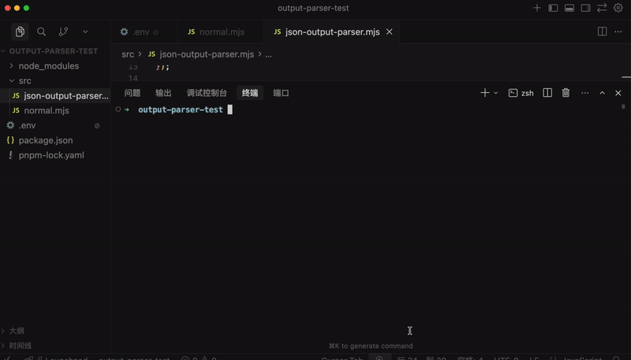
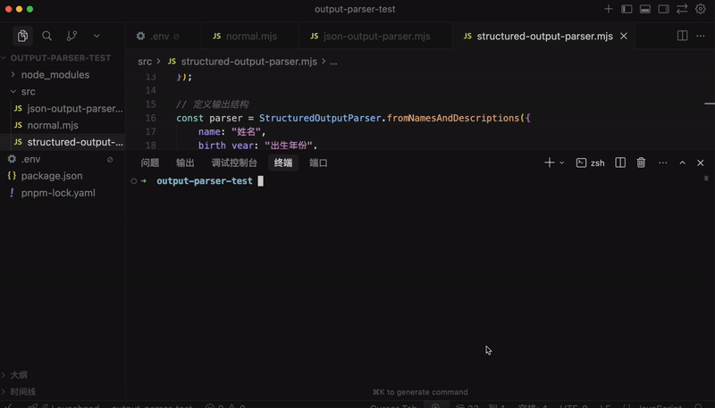
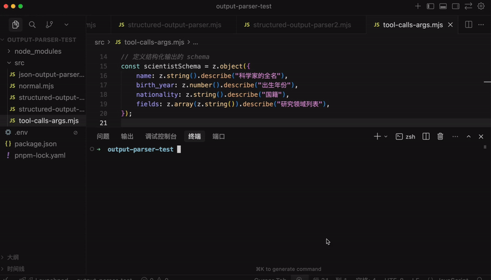
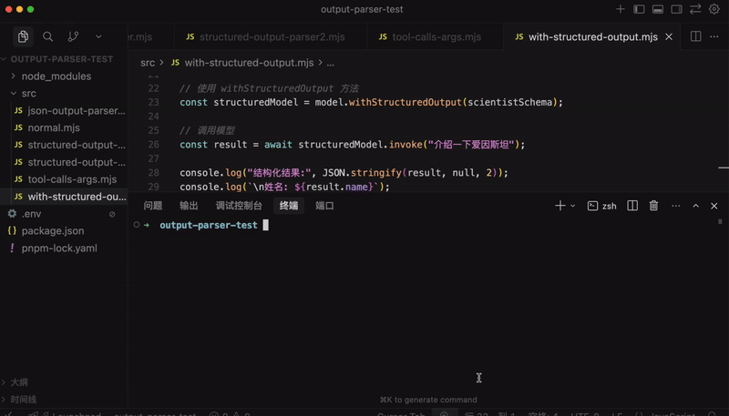
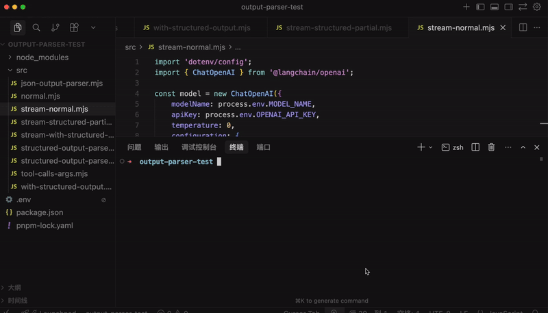
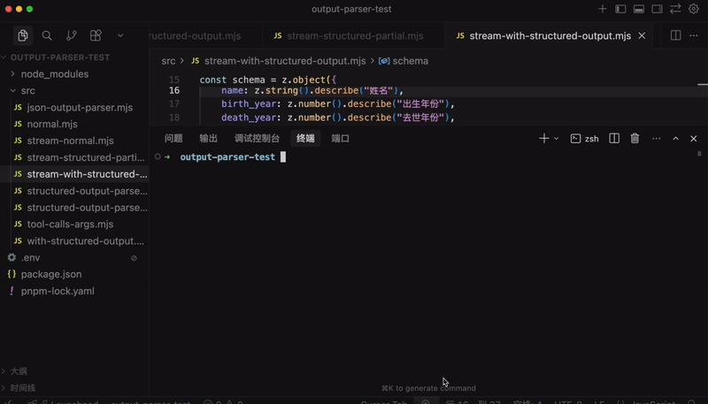
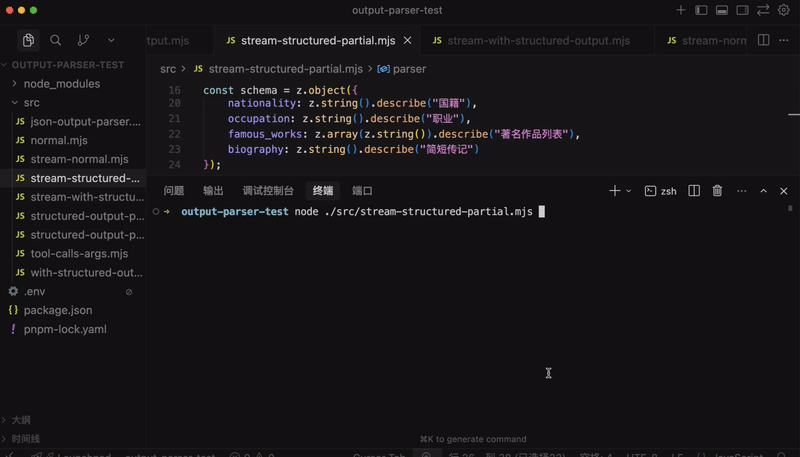
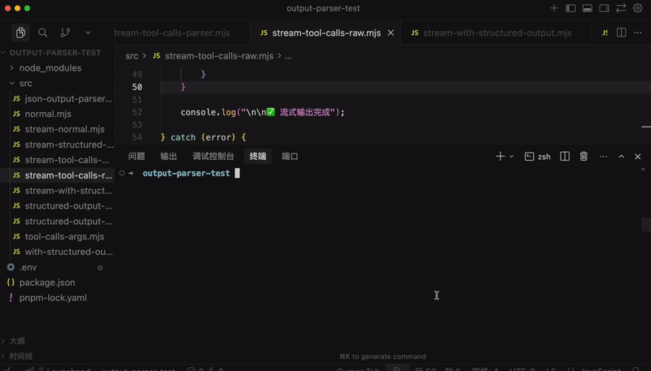

# 结构化大模型输出：output parser 还是 tool？

我们已经调用大模型完成过很多功能了，但输出一直没做控制，都是自然语言的形式。

而很多情况下，我们希望大模型按照我们的格式要求，返回一个 json

这就需要用到 output parser 的 api 了。

有同学说，这个不就是在 prompt 里描述下要什么格式，然后按照这种格式解析大模型返回的结果字符串么？

没错，就是这种思路，只不过 output parser 对这个思路做了一下封装。

我们直接写代码来试一下：

```
mkdir output-parser-test
cd output-parser-test 
npm init -y
```


创建项目，安装用到的包：

```
pnpm install @langchain/core @langchain/openai chalk dotenv zod
```

然后创建 .env 配置文件：

```
# OpenAI API 配置
OPENAI_API_KEY=sk-xxx
OPENAI_BASE_URL=https://dashscope.aliyuncs.com/compatible-mode/v1
MODEL_NAME=qwen-plus
EMBEDDINGS_MODEL_NAME=text-embedding-v3
```

写一下测试代码：

src/normal.mjs

```
import 'dotenv/config';
import { ChatOpenAI } from'@langchain/openai';

// 初始化模型
const model = new ChatOpenAI({
    modelName: process.env.MODEL_NAME,
    apiKey: process.env.OPENAI_API_KEY,
    temperature: 0,
    configuration: {
        baseURL: process.env.OPENAI_BASE_URL,
    },
});

// 简单的问题，要求 JSON 格式返回
const question = "请介绍一下爱因斯坦的信息。请以 JSON 格式返回，包含以下字段：name（姓名）、birth_year（出生年份）、nationality（国籍）、major_achievements（主要成就，数组）、famous_theory（著名理论）。";

try {
    console.log("🤔 正在调用大模型...\n");

    const response = await model.invoke(question);

    console.log("✅ 收到响应:\n");
    console.log(response.content);

    // 解析 JSON
    const jsonResult = JSON.parse(response.content);
    console.log("\n📋 解析后的 JSON 对象:");
    console.log(jsonResult);

} catch (error) {
    console.error("❌ 错误:", error.message);
}
```

我们让大模型用 JSON 格式返回爱因斯坦的信息。

然后把返回的 json 解析成对象

跑一下：


返回的内容带了额外的 markdown 语法，解析失败了。

这是我们经常遇到的一个问题。

我们用 OutputParser 试一下：

创建 src/json-output-parser.mjs

```
import 'dotenv/config';
import { ChatOpenAI } from'@langchain/openai';
import { JsonOutputParser } from'@langchain/core/output_parsers';

// 初始化模型
const model = new ChatOpenAI({
    modelName: process.env.MODEL_NAME,
    apiKey: process.env.OPENAI_API_KEY,
    temperature: 0,
    configuration: {
        baseURL: process.env.OPENAI_BASE_URL,
    },
});

const parser = new JsonOutputParser();

const question = `请介绍一下爱因斯坦的信息。请以 JSON 格式返回，包含以下字段：name（姓名）、birth_year（出生年份）、nationality（国籍）、major_achievements（主要成就，数组）、famous_theory（著名理论）。

${parser.getFormatInstructions()}`;

console.log('question:',question)
try {
    console.log("🤔 正在调用大模型（使用 JsonOutputParser）...\n");

    const response = await model.invoke(question);

    console.log("📤 模型原始响应:\n");
    console.log(response.content);

    const result = await parser.parse(response.content);

    console.log("✅ JsonOutputParser 自动解析的结果:\n");
    console.log(result);
    console.log(`姓名: ${result.name}`);
    console.log(`出生年份: ${result.birth_year}`);
    console.log(`国籍: ${result.nationality}`);
    console.log(`著名理论: ${result.famous_theory}`);
    console.log(`主要成就:`, result.major_achievements);

} catch (error) {
    console.error("❌ 错误:", error.message);
}
```

用了 JsonOutputParser，顾名思义，它就是用来解析 json 结果的。

就像前面说的，在 prompt 里放一段格式的提示词

然后对返回的结果按照格式来 parse

分别对应 parser.getFormatInstructions 和 parser.parse 方法


我们跑一下：

**🎬 [视频 1](http://mpvideo.qpic.cn/0bc3qmas2aabm4ao33lzmruvda6dfwbqclia.f10002.mp4?dis_k=61380fb6fe2a01bef5620153912f655d&dis_t=1781680457&play_scene=10110&auth_info=DJSO/ZokJdLPqY9sHa2X5a9HfEhARjFiHTJkNBo4LBsxTBlwOxUbFnJrDidqBBk5BStxaFRM&auth_key=050a4e732a2c41b1539af8d2b987f55e)**



可以看到，虽然大模型返回的还是带了 markdown 语法，但是 JsonOutputParser 能够解析其中的 json。

因为它做了这种常见情况的处理。


有的同学说，getFormatInstructions 好像没内容啊。

确实，JsonOutputParser 比较简单，不需要提示词。

我们换一个 output parser

创建 src/structured-output-parser.mjs

```
import 'dotenv/config';
import { ChatOpenAI } from'@langchain/openai';
import { StructuredOutputParser } from'@langchain/core/output_parsers';

// 初始化模型
const model = new ChatOpenAI({
    modelName: process.env.MODEL_NAME,
    apiKey: process.env.OPENAI_API_KEY,
    temperature: 0,
    configuration: {
        baseURL: process.env.OPENAI_BASE_URL,
    },
});

// 定义输出结构
const parser = StructuredOutputParser.fromNamesAndDescriptions({
    name: "姓名",
    birth_year: "出生年份",
    nationality: "国籍",
    major_achievements: "主要成就，用逗号分隔的字符串",
    famous_theory: "著名理论"
});

const question = `请介绍一下爱因斯坦的信息。

${parser.getFormatInstructions()}`;

console.log('question:', question)

try {
    console.log("🤔 正在调用大模型（使用 StructuredOutputParser）...\n");

    const response = await model.invoke(question);

    console.log("📤 模型原始响应:\n");
    console.log(response.content);

    const result = await parser.parse(response.content);

    console.log("\n✅ StructuredOutputParser 自动解析的结果:\n");
    console.log(result);
    console.log(`姓名: ${result.name}`);
    console.log(`出生年份: ${result.birth_year}`);
    console.log(`国籍: ${result.nationality}`);
    console.log(`著名理论: ${result.famous_theory}`);
    console.log(`主要成就: ${result.major_achievements}`);

} catch (error) {
    console.error("❌ 错误:", error.message);
}
```

这里我们用了 StructuredOutputParser，它可以指定具体的 json 结构

我们用 fromNamesAndDescriptions 指定了字段和描述

跑一下：

**🎬 [视频 2](http://mpvideo.qpic.cn/0b2efmabwaaaa4anuz3yp5uvak6ddmvqagya.f10002.mp4?dis_k=ab5586351fd174b13109c37db010b43c&dis_t=1781680457&play_scene=10110&auth_info=D5uVmrYgcYfLr4Q/H6/Avq5EKhxBQDY1TjRpPEppL0wyGkl3PhVPQ3ZtBXRoBk5iBCgnPFVK&auth_key=b5667a62a2e8e6669989d47a0c9bbf8a)**



解析出的对象依然是正确的。


但现在多了一大段提示词：


这就是 output parser 的原理：

在 prompt 里加入格式描述，根据这个格式来解析响应。

当然，就像我们之前用 zod 来描述 tool 的参数格式一样：


StructuredOutputParser 也可以用 zod 来描述复杂的对象格式。

创建 src/structured-output-parser2.mjs

```
import 'dotenv/config';
import { ChatOpenAI } from'@langchain/openai';
import { StructuredOutputParser } from'@langchain/core/output_parsers';
import { z } from'zod';

// 初始化模型
const model = new ChatOpenAI({
    modelName: process.env.MODEL_NAME,
    apiKey: process.env.OPENAI_API_KEY,
    temperature: 0,
    configuration: {
        baseURL: process.env.OPENAI_BASE_URL,
    },
});

// 使用 zod 定义复杂的输出结构
const scientistSchema = z.object({
    name: z.string().describe("科学家的全名"),
    birth_year: z.number().describe("出生年份"),
    death_year: z.number().optional().describe("去世年份，如果还在世则不填"),
    nationality: z.string().describe("国籍"),
    fields: z.array(z.string()).describe("研究领域列表"),
    awards: z.array(
        z.object({
            name: z.string().describe("奖项名称"),
            year: z.number().describe("获奖年份"),
            reason: z.string().optional().describe("获奖原因")
        })
    ).describe("获得的重要奖项列表"),
    major_achievements: z.array(z.string()).describe("主要成就列表"),
    famous_theories: z.array(
        z.object({
            name: z.string().describe("理论名称"),
            year: z.number().optional().describe("提出年份"),
            description: z.string().describe("理论简要描述")
        })
    ).describe("著名理论列表"),
    education: z.object({
        university: z.string().describe("主要毕业院校"),
        degree: z.string().describe("学位"),
        graduation_year: z.number().optional().describe("毕业年份")
    }).optional().describe("教育背景"),
    biography: z.string().describe("简短传记，100字以内")
});

// 从 zod schema 创建 parser
const parser = StructuredOutputParser.fromZodSchema(scientistSchema);

const question = `请介绍一下居里夫人（Marie Curie）的详细信息，包括她的教育背景、研究领域、获得的奖项、主要成就和著名理论。

${parser.getFormatInstructions()}`;

console.log('📋 生成的提示词:\n');
console.log(question);

try {
    console.log("🤔 正在调用大模型（使用 Zod Schema）...\n");

    const response = await model.invoke(question);

    console.log("📤 模型原始响应:\n");
    console.log(response.content);

    const result = await parser.parse(response.content);

    console.log("✅ StructuredOutputParser 自动解析并验证的结果:\n");
    console.log(JSON.stringify(result, null, 2));

    console.log("📊 格式化展示:\n");
    console.log(`👤 姓名: ${result.name}`);
    console.log(`📅 出生年份: ${result.birth_year}`);
    if (result.death_year) {
        console.log(`⚰️  去世年份: ${result.death_year}`);
    }
    console.log(`🌍 国籍: ${result.nationality}`);
    console.log(`🔬 研究领域: ${result.fields.join(', ')}`);

    console.log(`\n🎓 教育背景:`);
    if (result.education) {
        console.log(`   院校: ${result.education.university}`);
        console.log(`   学位: ${result.education.degree}`);
        if (result.education.graduation_year) {
            console.log(`   毕业年份: ${result.education.graduation_year}`);
        }
    }

    console.log(`\n🏆 获得的奖项 (${result.awards.length}个):`);
    result.awards.forEach((award, index) => {
        console.log(`   ${index + 1}. ${award.name} (${award.year})`);
        if (award.reason) {
            console.log(`      原因: ${award.reason}`);
        }
    });

    console.log(`\n💡 著名理论 (${result.famous_theories.length}个):`);
    result.famous_theories.forEach((theory, index) => {
        console.log(`   ${index + 1}. ${theory.name}${theory.year ? ` (${theory.year})` : ''}`);
        console.log(`      ${theory.description}`);
    });

    console.log(`\n🌟 主要成就 (${result.major_achievements.length}个):`);
    result.major_achievements.forEach((achievement, index) => {
        console.log(`   ${index + 1}. ${achievement}`);
    });

    console.log(`\n📖 传记:`);
    console.log(`   ${result.biography}`);

} catch (error) {
    console.error("❌ 错误:", error.message);
    if (error.name === 'ZodError') {
        console.error("验证错误详情:", error.errors);
    }
}
```

我们用 zod 描述了一个复杂的对象结构，然后用 StructuredOutputParser 生成提示词，以及 parse

跑一下：

**🎬 [视频 3](http://mpvideo.qpic.cn/0bc3aiabsaaacuanqg3ynruvaawddebaagia.f10002.mp4?dis_k=2fea44a1aebc8ddcce0224ac79ec58f2&dis_t=1781680457&play_scene=10110&auth_info=DPvGlMsmI9efr49uGPnH66cQeUtNFWdmSmQ9MEg7KxwxHBt4bhMdEyJtDiVvUEk3DXx0a1kf&auth_key=292914963768cd4d45b61700e8ae41a7)**


可以看到，StructuredOutputParser 根据格式生成了一大段提示词，并且解析也是正确的。

有同学说，tool 可以指定参数的对象格式，能不能直接用 tool 来获取结构化的结果呢？

当然可以的。

试一下：

创建 src/tool-call-args.mjs

```
import 'dotenv/config';
import { ChatOpenAI } from'@langchain/openai';
import { z } from'zod';

const model = new ChatOpenAI({
    modelName: process.env.MODEL_NAME,
    apiKey: process.env.OPENAI_API_KEY,
    temperature: 0,
    configuration: {
        baseURL: process.env.OPENAI_BASE_URL,
    },
});

// 定义结构化输出的 schema
const scientistSchema = z.object({
    name: z.string().describe("科学家的全名"),
    birth_year: z.number().describe("出生年份"),
    nationality: z.string().describe("国籍"),
    fields: z.array(z.string()).describe("研究领域列表"),
});

const modelWithTool = model.bindTools([
    {
        name: "extract_scientist_info",
        description: "提取和结构化科学家的详细信息",
        schema: scientistSchema
    }
]);

// 调用模型
const response = await modelWithTool.invoke("介绍一下爱因斯坦");

console.log('response.tool_calls:',response.tool_calls)
// 获取结构化结果
const result = response.tool_calls[0].args;

console.log("结构化结果:", JSON.stringify(result, null, 2));
console.log(`\n姓名: ${result.name}`);
console.log(`出生年份: ${result.birth_year}`);
console.log(`国籍: ${result.nationality}`);
console.log(`研究领域: ${result.fields.join(', ')}`);
```

这里没定义 tool 的实现逻辑，因为我们只是告诉大模型有这个 tool、参数是什么格式，不需要执行


跑一下：

**🎬 [视频 4](http://mpvideo.qpic.cn/0bc334aecaaa3aaiartydfuvbx6dihpqaqia.f10002.mp4?dis_k=bc17a9ebc55e42c9a2a219367526a8a2&dis_t=1781680457&play_scene=10110&auth_info=XKjshIknedXI/o9tFauS66tHLB9NEmc2TzBrZUU/eB5hSx10OBRHEXU8DiZiAhw3ASshP1kY&auth_key=12560c861c66302ab1bbd068f3d753ec)**



可以看到，通过返回的 tool_calls 信息，也能拿到结构化的数据。

而且，这种方式比 output parser 更好。

因为模型训练的时候就保证了生成 tool calls 的参数一定是符合格式要求的，如果不符合，会重新生成。

那岂不是没必要用 output parser 了？

确实，如果只是要求结构化返回数据，用 tool 就行了。

所以，现在获取结构化数据一般会用 withStructuredOutput 这个 api

它会判断模型是否支持 tool calls，支持的话就用 tool 的方式获取结构化数据，否则用 output parser 的方式，不用我们自己去处理。

创建 with-structured-output.mjs

```
import 'dotenv/config';
import { ChatOpenAI } from'@langchain/openai';
import { z } from'zod';

const model = new ChatOpenAI({
    modelName: process.env.MODEL_NAME,
    apiKey: process.env.OPENAI_API_KEY,
    temperature: 0,
    configuration: {
        baseURL: process.env.OPENAI_BASE_URL,
    },
});

// 定义结构化输出的 schema
const scientistSchema = z.object({
    name: z.string().describe("科学家的全名"),
    birth_year: z.number().describe("出生年份"),
    nationality: z.string().describe("国籍"),
    fields: z.array(z.string()).describe("研究领域列表"),
});

// 使用 withStructuredOutput 方法
const structuredModel = model.withStructuredOutput(scientistSchema);

// 调用模型
const result = await structuredModel.invoke("介绍一下爱因斯坦");

console.log("结构化结果:", JSON.stringify(result, null, 2));
console.log(`\n姓名: ${result.name}`);
console.log(`出生年份: ${result.birth_year}`);
console.log(`国籍: ${result.nationality}`);
console.log(`研究领域: ${result.fields.join(', ')}`);
```

所以说，现在获取结构化数据更简单了。

**🎬 [视频 5](http://mpvideo.qpic.cn/0b2efqaaoaaaquampa3yqzuvalgda4waabya.f10002.mp4?dis_k=94429004719d58475799bfdc0150e368&dis_t=1781680457&play_scene=10110&auth_info=WI2xvfR1d4HNpoQ+SvzH7K9AKhtGRW1tGDVuPUxqLkplRxx1MkNJRXBkBXU9VUkwBSwnO1JP&auth_key=3b97b48e62f5e5f6f6706fc194f914bf)**



那岂不是说 output parser 一般用不到了？

也不是，如果流式打印返回数据的场景，还是需要 output parser 的。

而且还有一些非 json 格式的，比如 XML、YAML 等格式的内容，也要用 output parser。

我们先试一下流式：

创建 src/stream-normal.mjs

```
import 'dotenv/config';
import { ChatOpenAI } from'@langchain/openai';

const model = new ChatOpenAI({
    modelName: process.env.MODEL_NAME,
    apiKey: process.env.OPENAI_API_KEY,
    temperature: 0,
    configuration: {
        baseURL: process.env.OPENAI_BASE_URL,
    },
});

const prompt = `详细介绍莫扎特的信息。`;

console.log("🌊 普通流式输出演示（无结构化）\n");

try {
    const stream = await model.stream(prompt);

    let fullContent = '';
    let chunkCount = 0;

    console.log("📡 接收流式数据:\n");

    forawait (const chunk of stream) {
        chunkCount++;
        const content = chunk.content;
        fullContent += content;

        process.stdout.write(content); // 实时显示流式文本
    }

    console.log(`\n\n✅ 共接收 ${chunkCount} 个数据块\n`);
    console.log(`📝 完整内容长度: ${fullContent.length} 字符`);

} catch (error) {
    console.error("\n❌ 错误:", error.message);
}
```

把 invoke 换成 stream 方法就可以了，用 for await 打印异步返回的 chunk

跑一下：

**🎬 [视频 6](http://mpvideo.qpic.cn/0bc35qaamaaakyamnetyqnuvb3gda3waabqa.f10002.mp4?dis_k=3c4c80fedd14d2650f6eaac0f0b45406&dis_t=1781680457&play_scene=10110&auth_info=JPH4+DV2gcr5izlN+cfs+EV4SkBHZWIfYmhnRGp8GDAaSXRuRUhFdzsKcjpQSTBSKXVqVE0=&auth_key=646baf201954e6ab10f045bf9f31b8f2)**



我们先用 withStructuredOutput 做一下流式的结构化输出：

src/stream-with-structured-output.mjs

```
import 'dotenv/config';
import { ChatOpenAI } from'@langchain/openai';
import { z } from'zod';

const model = new ChatOpenAI({
    modelName: process.env.MODEL_NAME,
    apiKey: process.env.OPENAI_API_KEY,
    temperature: 0,
    configuration: {
        baseURL: process.env.OPENAI_BASE_URL,
    },
});

// 使用 zod 定义结构化输出格式
const schema = z.object({
    name: z.string().describe("姓名"),
    birth_year: z.number().describe("出生年份"),
    death_year: z.number().describe("去世年份"),
    nationality: z.string().describe("国籍"),
    occupation: z.string().describe("职业"),
    famous_works: z.array(z.string()).describe("著名作品列表"),
    biography: z.string().describe("简短传记")
});

const structuredModel = model.withStructuredOutput(schema);

const prompt = `详细介绍莫扎特的信息。`;

console.log("🌊 流式结构化输出演示（withStructuredOutput）\n");

try {
    const stream = await structuredModel.stream(prompt);

    let chunkCount = 0;
    let result = null;

    console.log("📡 接收流式数据:\n");

    forawait (const chunk of stream) {
        chunkCount++;
        result = chunk;

        console.log(`[Chunk ${chunkCount}]`);
        console.log(JSON.stringify(chunk, null, 2));
    }

    console.log(`\n✅ 共接收 ${chunkCount} 个数据块\n`);

    if (result) {
        console.log("📊 最终结构化结果:\n");
        console.log(JSON.stringify(result, null, 2));

        console.log("\n📝 格式化输出:");
        console.log(`姓名: ${result.name}`);
        console.log(`出生年份: ${result.birth_year}`);
        console.log(`去世年份: ${result.death_year}`);
        console.log(`国籍: ${result.nationality}`);
        console.log(`职业: ${result.occupation}`);
        console.log(`著名作品: ${result.famous_works.join(', ')}`);
        console.log(`传记: ${result.biography}`);
    }

} catch (error) {
    console.error("\n❌ 错误:", error.message);
}
```

跑一下：

**🎬 [视频 7](http://mpvideo.qpic.cn/0bc3byacaaaajuaocklykjuvadwdeahaaiaa.f10002.mp4?dis_k=4c75a611a304c4330ce63378870a7b48&dis_t=1781680457&play_scene=10110&auth_info=WuvDi9R1c4SZ+otvH6+c5KlFe0kXR21gTzZpZUprKxxnTkwjPkRNQCQ4CiRoBhI4Ayl2aQNN&auth_key=19b30d6bf58ba3f63dfed9c4b78a8844)**



可以看到，虽然我们是用的 stream 的流式方式打印的

但是用了 withStructuredOutput 之后，它会在 json 生成完通过校验后再返回（底层是 tool calls）。

所以只有一个 chunk 包含完整 json

这样明显不是真的流式啊。

我们换 output parser 试试：

src/stream-structured-partial.mjs

```
import 'dotenv/config';
import { ChatOpenAI } from'@langchain/openai';
import { StructuredOutputParser } from'@langchain/core/output_parsers';
import { z } from'zod';

const model = new ChatOpenAI({
    modelName: process.env.MODEL_NAME,
    apiKey: process.env.OPENAI_API_KEY,
    temperature: 0,
    configuration: {
        baseURL: process.env.OPENAI_BASE_URL,
    },
});

// 使用 zod 定义结构化输出格式
const schema = z.object({
    name: z.string().describe("姓名"),
    birth_year: z.number().describe("出生年份"),
    death_year: z.number().describe("去世年份"),
    nationality: z.string().describe("国籍"),
    occupation: z.string().describe("职业"),
    famous_works: z.array(z.string()).describe("著名作品列表"),
    biography: z.string().describe("简短传记")
});

const parser = StructuredOutputParser.fromZodSchema(schema);

const prompt = `详细介绍莫扎特的信息。\n\n${parser.getFormatInstructions()}`;

console.log("🌊 流式结构化输出演示\n");

try {
    const stream = await model.stream(prompt);

    let fullContent = '';
    let chunkCount = 0;

    console.log("📡 接收流式数据:\n");

    forawait (const chunk of stream) {
        chunkCount++;
        const content = chunk.content;
        fullContent += content;

        process.stdout.write(content); // 实时显示流式文本
    }

    console.log(`\n\n✅ 共接收 ${chunkCount} 个数据块\n`);

    // 解析完整内容为结构化数据
    const result = await parser.parse(fullContent);

    console.log("📊 解析后的结构化结果:\n");
    console.log(JSON.stringify(result, null, 2));

    console.log("\n📝 格式化输出:");
    console.log(`姓名: ${result.name}`);
    console.log(`出生年份: ${result.birth_year}`);
    console.log(`去世年份: ${result.death_year}`);
    console.log(`国籍: ${result.nationality}`);
    console.log(`职业: ${result.occupation}`);
    console.log(`著名作品: ${result.famous_works.join(', ')}`);
    console.log(`传记: ${result.biography}`);

} catch (error) {
    console.error("\n❌ 错误:", error.message);
}
```

我们用 StructuredOutputParser 解析结果，过程做了流式打印。

跑一下：

**🎬 [视频 8](http://mpvideo.qpic.cn/0bc36uabmaaamiannk3ymfuvb5odc32qafqa.f10002.mp4?dis_k=50a7cc970c0ae51d5988caddbd7b8bb0&dis_t=1781680457&play_scene=10110&auth_info=Cobmo4N3JIHDp4U/TfzAvvpCeEYXEWVhHGBrZx9jLU03ThklP0YaRX5lBHQ6VU5iUC51ZgMb&auth_key=37c5ac92e2a5ca538742a09d6541c498)**



可以看到，现在是边生成边打印，最后再 parse。

所以流式的情况下，用 output parser 还是更适合的。

那如果我们就是想用 tool calls 来做结构化输出，但还是想要流式的打印，怎么办呢？

其实流式输出的情况下，如果你用了 tool call，是这样返回的：


tool_call_chunks 里保存了 tool 参数的部分内容，我们可以用这个来实现流式打印效果

试一下：

src/stream-tool-calls-raw.mjs

```
import 'dotenv/config';
import { ChatOpenAI } from'@langchain/openai';
import { z } from'zod';

const model = new ChatOpenAI({
    modelName: process.env.MODEL_NAME,
    apiKey: process.env.OPENAI_API_KEY,
    temperature: 0,
    configuration: {
        baseURL: process.env.OPENAI_BASE_URL,
    },
});

// 定义结构化输出的 schema
const scientistSchema = z.object({
    name: z.string().describe("科学家的全名"),
    birth_year: z.number().describe("出生年份"),
    death_year: z.number().optional().describe("去世年份，如果还在世则不填"),
    nationality: z.string().describe("国籍"),
    fields: z.array(z.string()).describe("研究领域列表"),
    achievements: z.array(z.string()).describe("主要成就"),
    biography: z.string().describe("简短传记")
});

// 绑定工具到模型
const modelWithTool = model.bindTools([
    {
        name: "extract_scientist_info",
        description: "提取和结构化科学家的详细信息",
        schema: scientistSchema
    }
]);

console.log("🌊 流式 Tool Calls 演示 - 直接打印原始 tool_calls_chunk\n");

try {
    // 开启流式输出
    const stream = await modelWithTool.stream("详细介绍牛顿的生平和成就");

    console.log("📡 实时输出流式 tool_calls_chunk:\n");

    let chunkIndex = 0;

    forawait (const chunk of stream) {
        chunkIndex++;
        // 直接打印每个 chunk 的 tool_calls 信息
        if (chunk.tool_call_chunks && chunk.tool_call_chunks.length > 0) {
            process.stdout.write(chunk.tool_call_chunks[0].args);
        }
    }

    console.log("\n\n✅ 流式输出完成");

} catch (error) {
    console.error("\n❌ 错误:", error.message);
    console.error(error);
}
```

打印 tool_call_chunks 片段，就可以实现流式打印效果：

**🎬 [视频 9](http://mpvideo.qpic.cn/0bc3iia7waabsiadwltztfuvcqwd7nbad6ya.f10002.mp4?dis_k=670b660dfd9614e4802d08a0a7f9fd7e&dis_t=1781680457&play_scene=10110&auth_info=DYzU1t0mdIzKrdlsFPmUvakTIxgRRDBiGzE+MkpqfhswR05xPhJKSHdvWCdjUBphA38uOAVO&auth_key=ea4788854dbfa08e21a5dc6df95e0771)**



基于这个可以实现流式打印效果，但是看下 chunk 内容：


这时候是不能调用 tool 的，因为参数还不完整，没有 tool_calls 信息。

如果我想参数不完整的时候，也能拿到 tool_call 参数的 json 呢？

这种就可以用 JsonOutputToolsParser 了

它的作用就是解析 tool_call_chunks 中的内容，拼接成符合 json 格式规范的对象，就算 chunk 还没传输完的时候，也能拿到 json 对象

试一下：

src/stream-tool-calls-parser.mjs

```
import 'dotenv/config';
import { ChatOpenAI } from'@langchain/openai';
import { JsonOutputToolsParser } from'@langchain/core/output_parsers/openai_tools';
import { z } from'zod';

const model = new ChatOpenAI({
    modelName: process.env.MODEL_NAME,
    apiKey: process.env.OPENAI_API_KEY,
    temperature: 0,
    configuration: {
        baseURL: process.env.OPENAI_BASE_URL,
    },
});

// 定义结构化输出的 schema
const scientistSchema = z.object({
    name: z.string().describe("科学家的全名"),
    birth_year: z.number().describe("出生年份"),
    death_year: z.number().optional().describe("去世年份，如果还在世则不填"),
    nationality: z.string().describe("国籍"),
    fields: z.array(z.string()).describe("研究领域列表"),
    achievements: z.array(z.string()).describe("主要成就"),
    biography: z.string().describe("简短传记")
});

// 绑定工具到模型
const modelWithTool = model.bindTools([
    {
        name: "extract_scientist_info",
        description: "提取和结构化科学家的详细信息",
        schema: scientistSchema
    }
]);

// 1. 绑定工具并挂载解析器
const parser = new JsonOutputToolsParser();
const chain = modelWithTool.pipe(parser);

try {
    // 2. 开启流
    const stream = await chain.stream("详细介绍牛顿的生平和成就");

    let lastContent = ""; // 记录已打印的完整内容
    let finalResult = null; // 存储最终的完整结果

    console.log("📡 实时输出流式内容:\n");

    forawait (const chunk of stream) {
        if (chunk.length > 0) {
            const toolCall = chunk[0];

            // 获取当前工具调用的完整参数内容
            // const currentContent = JSON.stringify(toolCall.args || {}, null, 2);

            // if (currentContent.length > lastContent.length) {
            //     const newText = currentContent.slice(lastContent.length);
            //     process.stdout.write(newText); // 实时输出到控制台
            //     lastContent = currentContent; // 更新已读进度
            // }

            console.log(toolCall.args);
        }
    }

    console.log("\n\n✅ 流式输出完成");

} catch (error) {
    console.error("\n❌ 错误:", error.message);
    console.error(error);
}
```

JsonOutputToolsParser 会试试解析 tool_call_chunks 生成完整的 tool_calls 信息

我们跑下试试：

**🎬 [视频 10](http://mpvideo.qpic.cn/0bc3ieawsaabwiaktcdztbuvcqodnfaqc2ia.f10002.mp4?dis_k=d21fee90eaa1811c15aa3e0fba574fd6&dis_t=1781680457&play_scene=10110&auth_info=CPqd5OR1I4XP/txvSajCvv9ALUoTF2MwHjA6YRljKhg1H0l4O0YdQXI8XSQ+AUxiVSwgagcd&auth_key=b9de0e5d102678479addfc51dd4637d3)**


可以看到，就算是流式返回的 tool_call_chunks 还不完整，也会拼成正确格式的 tool_calls


这样你可以实时调用工具，传入部分参数了。

此外，我们前面说 withStructuredOutput 不适合的场景有两个：

- 流式打印内容，这种还是需要 Output Parser
- XML、YAML 等非 json 格式，也需要 Output Parser

我们来试一下 XML 的 output parser

创建 src/xml-output-parser.mjs

```
import 'dotenv/config';
import { ChatOpenAI } from'@langchain/openai';
import { XMLOutputParser } from'@langchain/core/output_parsers';

// 初始化模型
const model = new ChatOpenAI({
    modelName: process.env.MODEL_NAME,
    apiKey: process.env.OPENAI_API_KEY,
    temperature: 0,
    configuration: {
        baseURL: process.env.OPENAI_BASE_URL,
    },
});

const parser = new XMLOutputParser();

const question = `请提取以下文本中的人物信息：阿尔伯特·爱因斯坦出生于 1879 年，是一位伟大的物理学家。

${parser.getFormatInstructions()}`;

console.log('question:', question);

try {
    console.log("🤔 正在调用大模型（使用 XMLOutputParser）...\n");

    const response = await model.invoke(question);

    console.log("📤 模型原始响应:\n");
    console.log(response.content);

    const result = await parser.parse(response.content);

    console.log("\n✅ XMLOutputParser 自动解析的结果:\n");
    console.log(result);

} catch (error) {
    console.error("❌ 错误:", error.message);
}
```

跑一下：


可以看到提示词里加入了一些格式信息，返回的也是 xml 格式，并且正确 parse 了出来。

这种也用不了 withStructuredOutput（也就是 tool call）来做结构化，还是得用 output parser。

> 代码上传了课程仓库： https://github.com/QuarkGluonPlasma/ai-agent-course-code

## 总结

我们经常需要对大模型输出做一些结构化的限制，这时候就需要 output parser 的 api

它的原理就是在提示词里加入格式信息，然后对结果做一下 parse

比如 JsonOutputParser、StructuredOutputParser、XMLOutputParser 等

当然，用 tool call 的方式也完全可以实现结构化限制，而且可靠性更高，是模型训练的时候就保证的

所以，如果是做结构化，直接用 withStructuredOutput 这个 api 就行，它底层就是根据模型来决定是用 tool call 还是 output parser。

但它有两个不适合的场景：

- 流式打印，这种需要用 output parser
- xml 等非 json 格式，也需要 output parser

此外，如果流式打印 tool 参数的过程中，想实时拿到 tool_calls 的 json 对象来调用 tool，可以用 JsonOutputToolsParser 这个 output parser

综上，如果你需要做大模型的输出做结构化，就可以考虑 withStructuredOutput 和 output parser 这两者二选一了。
