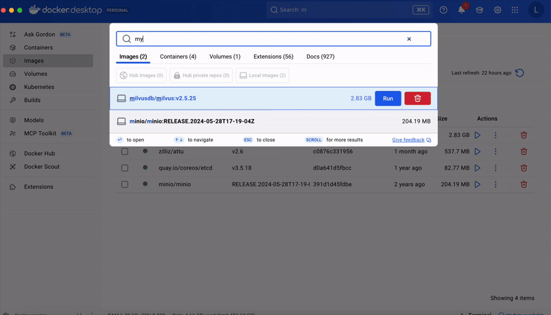
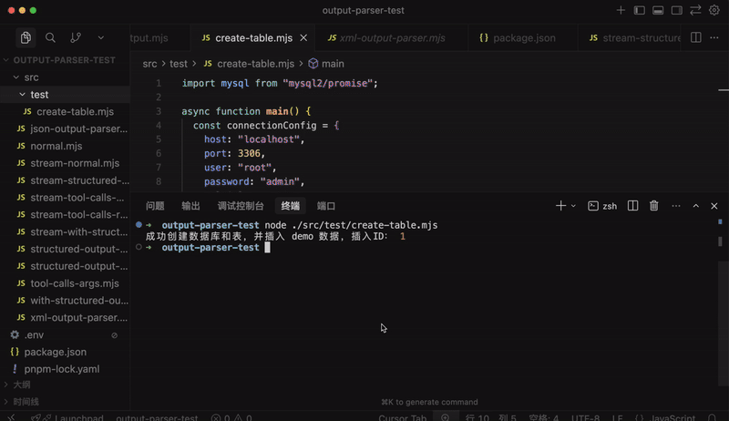
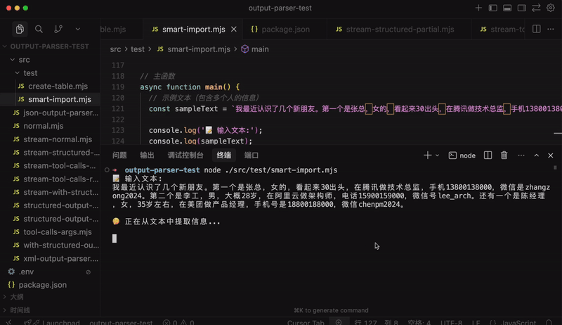
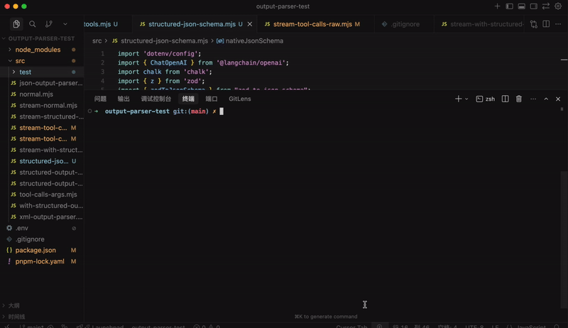
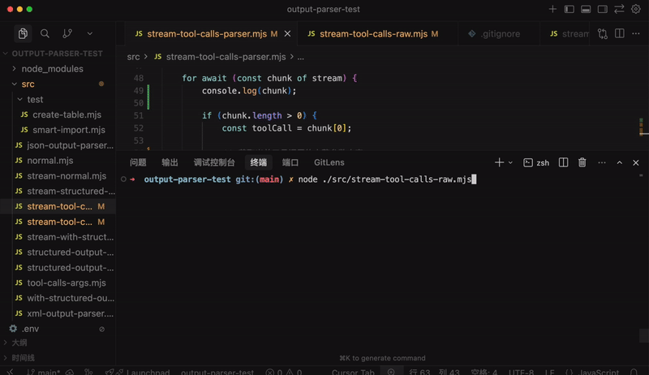

# Output Parser 实战：智能录入 + 流式版 mini cursor

前面学了大模型的输出控制：

用 model.withStructuredOutput 来控制输出的结构，它底层会根据模型来决定用 tool 或者 output parser，确保输出一定是符合格式要求的。


一般用 withStructuredOutput 就可以了，但当流式返回内容的时候，如果要实现打字机效果，就要直接用 output parser 了，比如 tool 参数的流式打印。

**🎬 [视频 1](http://mpvideo.qpic.cn/0bc3ieawsaabwiaktcdztbuvcqodnfaqc2ia.f10002.mp4?dis_k=9d182d4b30436941380d23a4f56a86cf&dis_t=1781680482&play_scene=10110&auth_info=fJays61RaILVg8QHR62du8Qjd0BtQmlnHGZKUiFtUAVBeWthXGZWRmhBRUwwBBNnbk96YHlI&auth_key=f99218602b5b50a1dd9b77bc6c7a3c79)**


这是我们上节学的，这节我们来练习一下，做两个实战。

首先是 withStructuredOutput，这个确实很常用：

比如当你需要录入信息的时候，之前怎么做呢？

一般是在表单里填入信息，点击保存。

如果是批量录入，可以上传 excel 来解析录入。


这需要你把数据按结构整理好，代码里解析出来保存到数据库。

但在 AI 时代，一般都是智能录入的：


你只需要给一段文本，让 AI 分析并提取其中的数据，按照结构整理好，然后插入数据库。

这是 AI 应用常见功能。

这个功能就需要用 withStructuredOutput 实现大模型的结构化输出控制。

我们先安装下 mysql 数据库，用 docker

**🎬 [视频 2](http://mpvideo.qpic.cn/0bc3ciaakaaa4uan2u4bafuvaewdaujaabia.f10002.mp4?dis_k=4d312cd2934e8b3fa651f98c97ce2c48&dis_t=1781680482&play_scene=10110&auth_info=fsfJyP8HYoHV1cpcQPrPtcF2I0o0FTZlSWJAB3YzXQVDcGtmDDZcRWgXSxc3U0FpaxouaiAf&auth_key=b8813c37cdf979dd04a27e7f208dde63)**



需要指定 MYSQL_ROOT_PASSWORD 这个环境变量，它是 root 用户的密码。

然后下载一个 GUI 工具连上它，这里我们用 mysql 官方的 Mysql Workbench

https://dev.mysql.com/downloads/workbench/

点击下载按钮：


下载后安装：


然后打开连上刚才的 mysql 服务：

**🎬 [视频 3](http://mpvideo.qpic.cn/0bc3iaaaiaaa7man5gmbabuvaqgdaraaabaa.f10002.mp4?dis_k=83d12b74ac6d70c1695ab2f8c5cbbef7&dis_t=1781680482&play_scene=10110&auth_info=Ka+/jdsHOtHX1MUOEK2YusEmJ0FqTmxnSWUQASQ8UVIUcGtnXzAEFWoWREVnBBZma0oqYX5E&auth_key=00d472210fb1c1a4942f00ce4f7b8cd1)**


我们写代码创建一下数据库和表：

在 output-parser-test 那个项目里写：

创建 src/test/create-table.mjs

```
import mysql from"mysql2/promise";

asyncfunction main() {
const connectionConfig = {
    host: "localhost",
    port: 3306,
    user: "root",
    password: "admin",
    multipleStatements: true,
  };

const connection = await mysql.createConnection(connectionConfig);

try {
    // 创建 database
    await connection.query(`CREATE DATABASE IF NOT EXISTS hello CHARACTER SET utf8mb4 COLLATE utf8mb4_unicode_ci;`);
    await connection.query(`USE hello;`);

    // 创建好友表
    await connection.query(`
      CREATE TABLE IF NOT EXISTS friends (
        id INT AUTO_INCREMENT PRIMARY KEY,
        name VARCHAR(50) NOT NULL,
        gender VARCHAR(10),                -- 性别
        birth_date DATE,                   -- 出生日期
        company VARCHAR(100),              -- 公司
        title VARCHAR(100),                -- 职位
        phone VARCHAR(20),                 -- 当前手机号
        wechat VARCHAR(50)                 -- 微信号
      ) ENGINE=InnoDB DEFAULT CHARSET=utf8mb4;
    `);

    // 插入 demo 数据
    const insertSql = `
      INSERT INTO friends (
        name,
        gender,
        birth_date,
        company,
        title,
        phone,
        wechat
      ) VALUES (?, ?, ?, ?, ?, ?, ?);
    `;

    const values = [
      "王经理", // name
      "男", // gender
      "1990-01-01", // birth_date
      "字节跳动", // company
      "产品经理/产品总监", // title
      "18612345678", // phone
      "wangjingli2024", // wechat
    ];

    const [result] = await connection.execute(insertSql, values);
    console.log("成功创建数据库和表，并插入 demo 数据，插入ID：", result.insertId);
  } catch (err) {
    console.error("执行出错：", err);
  } finally {
    await connection.end();
  }
}

main().catch((err) => {
console.error("脚本运行失败：", err);
});
```

用 mysql2 的驱动包来连接数据库。

安装下：

```
pnpm install mysql2
```

这里创建了 database，创建了一个好友表，然后插入了一条数据。

跑一下：

**🎬 [视频 4](http://mpvideo.qpic.cn/0bc3labc2aac7iaplg4dqjuvewgdfvmaelia.f10002.mp4?dis_k=e20295698474fcd9436f6ab28a32dc1c&dis_t=1781680482&play_scene=10110&auth_info=fbzHv64JY4bWhJRdF6WasMIhcxJuRDczGTUWB3NoDFNAc2AwXj1dQmtGFRZgDBRsaE1+MnpO&auth_key=f2310e50c2d7e7b9ad2cdc5ae29133c2)**



然后我们就可以来实现智能录入了。

创建 src/test/smart-import.mjs

```
import 'dotenv/config';
import { ChatOpenAI } from'@langchain/openai';
import { z } from'zod';
import mysql from'mysql2/promise';

// 初始化模型
const model = new ChatOpenAI({
modelName: process.env.MODEL_NAME,
apiKey: process.env.OPENAI_API_KEY,
temperature: 0,
configuration: {
    baseURL: process.env.OPENAI_BASE_URL,
  },
});

// 定义单个好友信息的 zod schema，匹配 friends 表结构
const friendSchema = z.object({
name: z.string().describe('姓名'),
gender: z.string().describe('性别（男/女）'),
birth_date: z.string().describe('出生日期，格式：YYYY-MM-DD，如果无法确定具体日期，根据年龄估算'),
company: z.string().nullable().describe('公司名称，如果没有则返回 null'),
title: z.string().nullable().describe('职位/头衔，如果没有则返回 null'),
phone: z.string().nullable().describe('手机号，如果没有则返回 null'),
wechat: z.string().nullable().describe('微信号，如果没有则返回 null'),
});

// 定义批量好友信息的 schema（数组）
const friendsArraySchema = z.array(friendSchema).describe('好友信息数组');

// 使用 withStructuredOutput 方法
const structuredModel = model.withStructuredOutput(friendsArraySchema);

// 数据库连接配置
const connectionConfig = {
host: 'localhost',
port: 3306,
user: 'root',
password: 'admin',
multipleStatements: true,
};

asyncfunction extractAndInsert(text) {
const connection = await mysql.createConnection(connectionConfig);

try {
    // 切换到 hello 数据库
    await connection.query(`USE hello;`);

    // 使用 AI 提取结构化信息
    console.log('🤔 正在从文本中提取信息...\n');
    const prompt = `请从以下文本中提取所有好友信息，文本中可能包含一个或多个人的信息。请将每个人的信息分别提取出来，返回一个数组。

${text}

要求：
1. 如果文本中包含多个人，请为每个人创建一个对象
2. 每个对象包含以下字段：
   - 姓名：提取文本中的人名
   - 性别：提取性别信息（男/女）
   - 出生日期：如果能找到具体日期最好，否则根据年龄描述估算（格式：YYYY-MM-DD）
   - 公司：提取公司名称
   - 职位：提取职位/头衔信息
   - 手机号：提取手机号码
   - 微信号：提取微信号
3. 如果某个字段在文本中找不到，请返回 null
4. 返回格式必须是一个数组，即使只有一个人也要放在数组中`;

    const results = await structuredModel.invoke(prompt);

    console.log(`✅ 提取到 ${results.length} 条结构化信息:`);
    console.log(JSON.stringify(results, null, 2));
    console.log('');

    if (results.length === 0) {
      console.log('⚠️  没有提取到任何信息');
      return { count: 0, insertIds: [] };
    }

    // 批量插入数据库
    const insertSql = `
      INSERT INTO friends (
        name,
        gender,
        birth_date,
        company,
        title,
        phone,
        wechat
      ) VALUES ?;
    `;

    const values = results.map((result) => [
      result.name,
      result.gender,
      result.birth_date || null,
      result.company,
      result.title,
      result.phone,
      result.wechat,
    ]);

    const [insertResult] = await connection.query(insertSql, [values]);
    console.log(`✅ 成功批量插入 ${insertResult.affectedRows} 条数据`);
    console.log(`   插入的ID范围：${insertResult.insertId} - ${insertResult.insertId + insertResult.affectedRows - 1}`);

    return {
      count: insertResult.affectedRows,
      insertIds: Array.from({ length: insertResult.affectedRows }, (_, i) => insertResult.insertId + i),
    };
  } catch (err) {
    console.error('❌ 执行出错：', err);
    throw err;
  } finally {
    await connection.end();
  }
}

// 主函数
asyncfunction main() {
// 示例文本（包含多个人的信息）
const sampleText = `我最近认识了几个新朋友。第一个是张总，女的，看起来30出头，在腾讯做技术总监，手机13800138000，微信是zhangzong2024。第二个是李工，男，大概28岁，在阿里云做架构师，电话15900159000，微信号lee_arch。还有一个是陈经理，女，35岁左右，在美团做产品经理，手机号是18800188000，微信chenpm2024。`;

console.log('📝 输入文本:');
console.log(sampleText);
console.log('');

try {
    const result = await extractAndInsert(sampleText);
    console.log(`\n🎉 处理完成！成功插入 ${result.count} 条记录`);
    console.log(`   插入的ID：${result.insertIds.join(', ')}`);
  } catch (error) {
    console.error('❌ 处理失败：', error.message);
    process.exit(1);
  }
}

main();
```

给一段无规则文本，用大模型提取结构化的信息。

结构用 withStructuredOutput 指定，要求提取一个数组，数组里是好友对象的信息。

然后我们把数组里的结构化数据批量插入数据库表。

跑一下：

**🎬 [视频 5](http://mpvideo.qpic.cn/0bc3ueabaaaa2iamrvmb5vuvbiodccqqaeaa.f10002.mp4?dis_k=65652bd65f4a89ff3e225a05f003029a&dis_t=1781680482&play_scene=10110&auth_info=e+W3pOkBbtTV0coHFfqd5sZ1cBI8Q2liGjRCVntqX1RGdGtnDDJQEGgTS0xiUxM6bBl9MihJ&auth_key=feac4bc5e51352229bd6554f9c78bbbb)**




这样，我们就实现了智能录入的功能，它需要大模型的结构化输出控制，用了 withStructuredOutput。

还有一点要补充：前面讲 withStructuredOutput 底层是 tool、output parser，其实还有一种特性 JSON Schema

创建 src/structured-json-schema.mjs

```
import 'dotenv/config';
import { ChatOpenAI } from'@langchain/openai';
import chalk from'chalk';
import { z } from'zod';
import { zodToJsonSchema } from"zod-to-json-schema";
import { HumanMessage, SystemMessage } from'@langchain/core/messages';

const scientistSchema = z.object({
    name: z.string().describe("科学家的全名"),
    birth_year: z.number().describe("出生年份"),
    field: z.string().describe("主要研究领域"),
    achievements: z.array(z.string()).describe("主要成就列表")
}).strict();

// 将 Zod 转换为原生的 JSON Schema 格式
const nativeJsonSchema = zodToJsonSchema(scientistSchema);

const model = new ChatOpenAI({
    modelName: "qwen-max",
    temperature: 0,
    apiKey: process.env.OPENAI_API_KEY,
    configuration: {
        baseURL: process.env.OPENAI_BASE_URL,
    },
    modelKwargs: { // 通过 modelKwargs 传入原生参数
        response_format: {
            type: "json_schema",
            json_schema: {
                name: "scientist_info",
                strict: true,
                schema: nativeJsonSchema // 这里的 nativeJsonSchema 就是转换后的对象
            }
        }
    }
});

asyncfunction testNativeJsonSchema() {
    console.log(chalk.bgMagenta("🧪 测试原生 JSON Schema 模式...\n"));

    const res = await model.invoke([
        new SystemMessage("你是一个信息提取助手，请直接返回 JSON 数据。"),
        new HumanMessage("介绍一下杨振宁")
    ]);

    console.log(chalk.green("\n✅ 收到响应 (纯净 JSON):"));
    console.log(res.content); 

    const data = JSON.parse(res.content);
    console.log(chalk.cyan("\n📋 解析后的对象:"));
    console.log(data);
}

testNativeJsonSchema().catch(console.error);
```

指定大模型的输出格式为 json_schema 指定格式，它就会按照这个格式输出。

安装依赖：

```
pnpm install zod-to-json-schema
```

跑一下：

**🎬 [视频 6](http://mpvideo.qpic.cn/0bc32eabwaaaqiandtec45uvbuoddpiqagya.f10002.mp4?dis_k=7857cd5134087e8b1edfe3f10c5c06e2&dis_t=1781680482&play_scene=10110&auth_info=eLPUn+4BaIbRiMVbS/6f5pAhIEBqRz8xH2RCUic5XllFdjphXTVWQmxKRBA8VxE6Ok0tYH5N&auth_key=cad0abe605de2de089a0fe5e11ecb285)**



json schema 就和 tool 的 args 一样，都是大模型层面支持的，会保证按照这个格式来返回，如果格式不对，会在模型层面重新生成正确的返回。

也就是说，withStructuredOutput 底层是 tool、json schema、output parser 这三者。

当然，平时开发用 withStructuredOutput 就可以了，这个 api 会根据模型自动选择对应的实现。

我们再做一个流式输出实战。

还记得之前做的 mini-cursor 么？

**🎬 [视频 7](http://mpvideo.qpic.cn/0bc3buackaaa4eamqsciy5uvadodeugqajia.f10002.mp4?dis_k=75a69519e0523bc7d3c725db9b7a107e&dis_t=1781680482&play_scene=10110&auth_info=LKqR9/QIPoLUgsFcEKvKsJdwd0ZoFDYwHWZDVHVuXlQRd2AwWT0ARmlAQBdnAkRsPRx6Znwe&auth_key=c2f522a5b257e6bef8d40817ebd63ead)**


当时等了好久，大概一分钟才显示写入成功。

其实这时候一直在生成代码内容，只不过我们没做流式打印，只能干等。

我们学完流式 + output parser 之后，就可以优化了。

先想想之前不用流式是什么流程：

我们传入 SystemMessage 和 HumanMessage，调用大模型之后，返回 AIMessage


把这个 AIMessage 也加入 memory

之后根据 AIMessage 中的 tool_calls 信息调用 tool，执行结果封装成 ToolMessage 放入 memory


直到不再返回带 tool_calls 信息的 AIMessage，就代表循环结束。

那如果改成流式返回的话，难点在哪呢？

难点在于返回的 AIMessage 是 chunk。


我们要把 AIMessageChunk 拼接成完整的 AIMessage 才能放入 Memory 再次调用大模型。

这个用它的 contact 方法即可。


流式返回一个个 AIMessageChunk，调用 concat 方法合并一下，流式结束就拿到了完整的 AIMessage，把它放入 memory 即可。

那现在返回的是 tool_call_chunks 怎么办呢？

前面我们用 JsonOutputToolsParser 把它转成了 tool_calls

改一下上节代码，打印下看看：


**🎬 [视频 8](http://mpvideo.qpic.cn/0bc3l4amaaaaouabrumbqjuvax6dybpqbqaa.f10002.mp4?dis_k=24019bc5662f494fe72dbd4b80f165c6&dis_t=1781680482&play_scene=10110&auth_info=feHBx5EFbYTT1sYHR/rLtMYjJxc4FDdiTDZEUSE9W1VAcGBnCzFTQG4UR0wwU0VobE8qNywe&auth_key=f4caa44c3935157005022269bf68652c)**



原始 stream 里的 tool_call_chunks 是片段信息：


并不是一个合法 json

而用了 JsonOutputToolsParser 之后：


拿到的就是积累的片段拼起来的 json 了

所以我们不用自己解析这些片段，直接用 JsonOutputToolsParser 解析之后取某个属性就行。

**这就是流式的两个难点：**

- 返回的是 AIMessageChunk，需要 concat 拼接成完整的 AIMessage
- AIMessageChunk 里的是 tool_call_chunks，只包含部分参数，需要用 JsonOutputToolsParser 来解析成 json


这么一看确实比非流式的逻辑复杂了，因为有个拼接（concat）和解析（parse）的过程

按照这个思路来实现下新版 mini cursor

创建 src/test/mini-cursor.mjs

```
import 'dotenv/config';
import { ChatOpenAI } from'@langchain/openai';
import { HumanMessage, SystemMessage, ToolMessage } from'@langchain/core/messages';
import { InMemoryChatMessageHistory } from'@langchain/core/chat_history';
import { JsonOutputToolsParser } from'@langchain/core/output_parsers/openai_tools';
import { executeCommandTool, listDirectoryTool, readFileTool, writeFileTool } from'./all-tools.mjs';
import chalk from'chalk';

const model = new ChatOpenAI({ 
    modelName: "qwen-plus",
    apiKey: process.env.OPENAI_API_KEY,
    temperature: 0,
    configuration: {
        baseURL: process.env.OPENAI_BASE_URL,
    },
});

const tools = [
    readFileTool,
    writeFileTool,
    executeCommandTool,
    listDirectoryTool,
];

// 绑定工具到模型
const modelWithTools = model.bindTools(tools);

// Agent 执行函数
asyncfunction runAgentWithTools(query, maxIterations = 30) {
    const history = new InMemoryChatMessageHistory();

    await history.addMessage(new SystemMessage(`你是一个项目管理助手，使用工具完成任务。

当前工作目录: ${process.cwd()}

工具：
1. read_file: 读取文件
2. write_file: 写入文件
3. execute_command: 执行命令（支持 workingDirectory 参数）
4. list_directory: 列出目录

重要规则 - execute_command：
- workingDirectory 参数会自动切换到指定目录
- 当使用 workingDirectory 时，绝对不要在 command 中使用 cd
- 错误示例: { command: "cd react-todo-app && pnpm install", workingDirectory: "react-todo-app" }
- 正确示例: { command: "pnpm install", workingDirectory: "react-todo-app" }

重要规则 - write_file：
- 当写入 React 组件文件（如 App.tsx）时，如果存在对应的 CSS 文件（如 App.css），在其他 import 语句后加上这个 css 的导入
`));

    await history.addMessage(new HumanMessage(query));

    for (let i = 0; i < maxIterations; i++) {
        console.log(chalk.bgGreen(`⏳ 正在等待 AI 思考...`));

        // 获取当前消息历史
        const messages = await history.getMessages();

        const rawStream = await modelWithTools.stream(messages);

        // 准备一个空的容器来拼接完整的 AIMessage
        let fullAIMessage = null;

        // 准备一个 tool_call_chunks 的 JSON 增量解析器
        const toolParser = new JsonOutputToolsParser();

        // 记录每个工具调用已打印的长度（用 id 或 filePath 作为 key）
        const printedLengths = newMap();

        console.log(chalk.bgBlue(`\n🚀 Agent 开始思考并生成流...\n`));

        forawait (const chunk of rawStream) {
            // 这里的 chunk 是 AIMessageChunk，把它拼接起来
            fullAIMessage = fullAIMessage ? fullAIMessage.concat(chunk) : chunk;

            let parsedTools = null;
            try {
                parsedTools = await toolParser.parseResult([{ message: fullAIMessage }]);
            } catch (e) {
                // 解析失败说明 JSON 还不完整，忽略错误继续累积
            }

            if (parsedTools && parsedTools.length > 0) {
                for (const toolCall of parsedTools) {
                    if (toolCall.type === 'write_file' && toolCall.args?.content) {
                        const toolCallId = toolCall.id || toolCall.args.filePath || 'default';
                        const currentContent = String(toolCall.args.content);
                        const previousLength = printedLengths.get(toolCallId);

                        if (previousLength === undefined) {
                            printedLengths.set(toolCallId, 0);
                            console.log(
                                chalk.bgBlue(
                                    `\n[工具调用] write_file("${toolCall.args.filePath}") - 开始写入（流式预览）\n`,
                                ),
                            );
                        }

                        if (currentContent.length > previousLength) {
                            const newContent = currentContent.slice(previousLength);
                            process.stdout.write(newContent);
                            printedLengths.set(toolCallId, currentContent.length);
                        }
                    }
                }
            } else {
                // 当前还没有解析出工具调用时，如果有文本内容就直接输出
                if (chunk.content) {
                    process.stdout.write(
                        typeof chunk.content === 'string'
                            ? chunk.content
                            : JSON.stringify(chunk.content),
                    );
                }
            }
        }

        // 此时 fullAIMessage 已经完美还原，直接存入 history
        await history.addMessage(fullAIMessage);
        console.log(chalk.green('\n✅ 消息已完整存入历史'));

        // 检查是否有工具调用
        if (!fullAIMessage.tool_calls || fullAIMessage.tool_calls.length === 0) {
            console.log(`\n✨ AI 最终回复:\n${fullAIMessage.content}\n`);
            return fullAIMessage.content;
        }

        // 执行工具调用
        for (const toolCall of fullAIMessage.tool_calls) {
            const foundTool = tools.find((t) => t.name === toolCall.name);
            if (foundTool) {
                const toolResult = await foundTool.invoke(toolCall.args);
                await history.addMessage(
                    new ToolMessage({
                        content: toolResult,
                        tool_call_id: toolCall.id,
                    }),
                );
            }
        }
    }

    const finalMessages = await history.getMessages();
    return finalMessages[finalMessages.length - 1].content;
}

const case1 = `创建一个功能丰富的 React TodoList 应用：

1. 创建项目：echo -e "n\nn" | pnpm create vite react-todo-app --template react-ts
2. 修改 src/App.tsx，实现完整功能的 TodoList：
 - 添加、删除、编辑、标记完成
 - 分类筛选（全部/进行中/已完成）
 - 统计信息显示
 - localStorage 数据持久化
3. 添加复杂样式：
 - 渐变背景（蓝到紫）
 - 卡片阴影、圆角
 - 悬停效果
4. 添加动画：
 - 添加/删除时的过渡动画
 - 使用 CSS transitions
5. 列出目录确认

注意：使用 pnpm，功能要完整，样式要美观，要有动画效果

去掉 main.tsx 里的 index.css 导入

之后在 react-todo-app 项目中：
1. 使用 pnpm install 安装依赖
2. 使用 pnpm run dev 启动服务器
`;

try {
    await runAgentWithTools(case1);
} catch (error) {
    console.error(`\n❌ 错误: ${error.message}\n`);
}
```

其实你理解了刚才的两个点：

拼接 AIMessageChunk 成完整 AIMessage

用 JsonOutputToolsParser 来解析 tool_call_chunks

就很容易理解上面的代码

我们用 InMemoryChatMessageHistory 来管理 memory，不是直接用 messages 数组了：


然后先看 AIMessageChunk 的拼接：


用 concat 来拼接。

当 chunk 遍历完，自然也就拼好了，这时候就放入 memory：


另外就是 tool_call_chunks，这个用 JsonOutputToolsParser 来解析：


调用它的 parseResult 方法，传入我们 concat 好的部分 AIMessage

我们加了一个 Map 来记录已经打印过的长度，下次 slice 一下，继续打印后面的。


第一次打印下工具调用的日志，在 Map 里记录下长度为 0

后续每次打印截取掉这个长度之后的 args 信息。

这样就能实现增量打印的效果。

用到的 all_tools.mjs 从之前 tool-test 里复制。

然后还要安装下依赖包：

```
pnpm install chalk
```

我们来跑一下：

**🎬 [视频 9](http://mpvideo.qpic.cn/0bc3xuboiaacamadg3mdxbuvfpod4s6qfzaa.f10002.mp4?dis_k=36c837f9dc17e7e9dd2ba3b8c0c49f80&dis_t=1781680482&play_scene=10110&auth_info=LoHKqtsKP9HQh5cJFqXK58YlJEBuTmxiSTNLAno7WlcTeWoyDj0BFW1FFkJhDEQ7bEkpYHpE&auth_key=ade4af587d51ad0492636c224bd5b0bd)**


可以看到，现在的 mini cursor 就能流式打印生成的代码了。

流式打印生成的代码，等完整之后再一次写入即可。

写入的内容从拼接完整的 AIMessage 取 tool_calls 的参数信息。


前面用 JsonOutputToolsParser 解析的 tool_call_chunks 拼起来的 tool_calls 的 args 只是流式打印，调用工具的时候还是直接从 AIMessage 取完整的。

虽然只是加了一个流式，但是代码改动还挺多的

之前是完整的 AIMessage 和 tool_calls


现在需要自己对 AIMessageChunk 做 concat，以及用 JsonOutputToolsParser 解析 tool_call_chunks：


> 代码上传了课程仓库： https://github.com/QuarkGluonPlasma/ai-agent-course-code

## 总结

这节我们做了大模型输出控制的两个小实战：

智能录入：这个是常见需求，调用大模型对一段文本做解析，返回结构化的数据，一般用 model.withStructuredOutput，之后存入数据库即可

流式版 mini cursor：这个主要是要流式打印 tool 的参数，需要做好 AIMessageChunk 的 concat，以及用 JsonOutputToolsParser 做 tool_call_chunks 的解析，之后增量打印

此外，我们还补充学习了 withStructuredOutput 底层的另一个 JSON Schema 机制，当然，平时做结构化直接用 withStructuredOutput 就行，底层会自动根据模型来选择 tool、json schema 或者 output parser

常见的输出控制需求就这两种：结构化输出、流式输出 + tool 参数解析。
