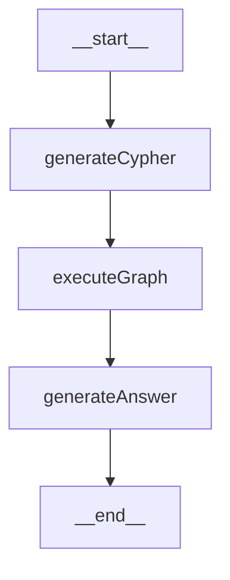

# GraphRAG 实战教学：LLM + Neo4j 知识图谱问答

> 对应代码：`src/02_graphrag.mjs`
> 前置知识：`cypher.md`（奶茶知识图谱数据）、`cypher-syntax-tutorial.md`（Cypher 语法）

## 一、什么是 GraphRAG？

传统 RAG（向量检索）：把文档切块 → 向量化 → 按语义相似度召回文本块。
**GraphRAG**（图检索）：把知识存成**实体 + 关系**的图谱 → 用图查询语言（Cypher）精确检索 → 把结构化结果交给 LLM 生成答案。

两者的核心区别：

| | 向量 RAG | GraphRAG |
|---|---|---|
| 数据形态 | 非结构化文本块 | 节点 + 关系（结构化） |
| 检索方式 | 语义相似度（模糊） | 图查询（精确、可多跳） |
| 擅长问题 | "介绍一下珍珠奶茶" | "珍珠奶茶的配料用了什么工艺？"（多跳推理） |
| 幻觉风险 | 召回不准时易编造 | 查询结果即事实，可控性强 |

本示例实现的是 GraphRAG 中最经典的 **Text2Cypher** 模式，整个流程只有三步：

```
用户问题 → [LLM 生成 Cypher] → [执行图查询] → [LLM 组织答案] → 回答
```

## 二、依赖与初始化

```js
import 'dotenv/config'                                            // 读取 .env 环境变量
import { Neo4jGraph } from '@langchain/community/graphs/neo4j_graph'  // Neo4j 封装
import { ChatOpenAI } from '@langchain/openai'                    // OpenAI 兼容的 LLM 客户端
import { StateGraph, END, START } from '@langchain/langgraph'     // 图编排引擎
import { HumanMessage } from '@langchain/core/messages'           // 消息类型
```

### 1. 连接 Neo4j

```js
const graph = new Neo4jGraph({
  url: 'bolt://localhost:7687',   // Bolt 协议端口（不是 7474 的 Web 端口！）
  username: 'neo4j',
  password: '12345678',
})
```

- `Neo4jGraph` 是 LangChain 对 neo4j 驱动的封装，提供 `graph.query(cypher)` 直接执行语句
- 注意代码连接走 **7687（Bolt）**，浏览器管理界面才是 7474

### 2. 初始化大模型

```js
const llm = new ChatOpenAI({
  model: process.env.MODEL_NAME,
  temperature: 0,                 // 生成 Cypher 需要确定性，温度设为 0
  configuration: { baseURL: process.env.OPENAI_BASE_URL }  // 支持任意 OpenAI 兼容接口
})
```

💡 `temperature: 0` 很关键：Text2Cypher 是"代码生成"任务，要的是稳定精确，不是创造性。

## 三、LangGraph 状态定义

LangGraph 的核心概念是**状态机**：所有节点共享一个 State，每个节点读取 State、返回"部分更新"，引擎负责合并。

```js
const state = {
  messages: {
    value: (left, right) =>
      left.concat(Array.isArray(right) ? right : [right]),  // reducer：追加合并
    default: () => [],
  },
  cypher: null,    // 步骤1 产出：LLM 生成的 Cypher 语句
  context: null,   // 步骤2 产出：图查询结果（检索到的知识）
  answer: null,    // 步骤3 产出：最终回答
}
```

两种字段更新策略：

- **messages**：定义了 `value` reducer → 新消息**追加**到数组（对话历史不断累积）
- **cypher / context / answer**：没有 reducer → 新值**直接覆盖**旧值

辅助函数 `userQuery` 从消息数组中取最后一条的内容，即当前用户问题：

```js
function userQuery(state) {
  const last = state.messages[state.messages.length - 1]
  return last.content
}
```

## 四、三个核心节点

### 节点1：generateCypher —— 自然语言转 Cypher（Text2Cypher）

```js
async function generateCypher(state) {
  const prompt = `
    你是一个专业的 Neo4j Cypher 生成器。
    严格按照下面的结构生成正确语句，只返回纯 Cypher 代码...

    节点：
    - Product: 奶茶产品
    - Ingredient: 配料
    ...

    关系方向（必须严格遵守）：
    - (Product)-[:属于]->(Type)
    - (Product)-[:包含]->(Ingredient)
    - (Product)-[:适合]->(People)
    - (Ingredient)-[:使用]->(Method)

    用户问题：${userQuery(state)}
  `
  const res = await llm.invoke([new HumanMessage(prompt)])
  return { cypher: res.content }   // 只更新 state.cypher
}
```

Prompt 设计的三个要点（Text2Cypher 的成败全在这里）：

1. **把图谱 Schema 写进 Prompt** —— LLM 不知道你的图长什么样，必须告诉它有哪些标签、哪些关系类型
2. **强调关系方向不能反** —— `(Product)-[:包含]->(Ingredient)` 写反了就查不到任何结果，这是 Text2Cypher 最常见的错误
3. **约束输出格式** —— "只返回纯 Cypher，不要解释、不要 markdown"，否则 LLM 返回 ` ```cypher ... ``` ` 代码块会导致执行报错

### 节点2：executeGraphQuery —— 执行图查询（检索）

```js
async function executeGraphQuery(state) {
  try {
    const res = await graph.query(state.cypher)      // 执行上一步生成的 Cypher
    return { context: JSON.stringify(res) }          // 查询结果序列化后作为"检索上下文"
  } catch (e) {
    return { context: '未查询到相关知识' }             // LLM 生成的语句可能有语法错误，必须兜底
  }
}
```

- 这一步对应传统 RAG 中的 **Retrieval（检索）**，只不过检索器从"向量数据库"换成了"图数据库"
- `try/catch` 是必需的：LLM 生成的 Cypher 不保证 100% 可执行，失败时给一个降级文案，让流程继续走下去而不是崩溃

### 节点3：generateAnswer —— 基于检索结果生成答案

```js
async function generateAnswer(state) {
  const prompt = `
    你是奶茶专家，根据下方「检索结果」回答用户问题；
    检索结果为空或不足时简要说明无法从图谱得到答案，不要编造。
    回答要求：
    - 直接列出事实，不要推断图谱里未出现的配料（如水、冰、添加剂等）。

    检索结果：${state.context}
    用户问题：${userQuery(state)}
  `
  const res = await llm.invoke([new HumanMessage(prompt)])
  return { answer: res.content }
}
```

对应 RAG 中的 **Generation（生成）**。Prompt 里两条抗幻觉约束值得学习：

- "检索结果为空时说明无法回答，**不要编造**" —— 防止 LLM 在没有依据时瞎答
- "不要推断图谱里未出现的配料" —— 防止 LLM 用自己的常识"补充"答案（比如自作主张加上"水、冰块"）

## 五、用 LangGraph 编排工作流

```js
const workflow = new StateGraph({ channels: state })
  .addNode('generateCypher', generateCypher)
  .addNode('executeGraph', executeGraphQuery)
  .addNode('generateAnswer', generateAnswer)
  .addEdge(START, 'generateCypher')
  .addEdge('generateCypher', 'executeGraph')
  .addEdge('executeGraph', 'generateAnswer')
  .addEdge('generateAnswer', END)

const app = workflow.compile()
```

- `addNode(名字, 函数)`：注册节点，每个节点就是一个 `state => 部分更新` 的（异步）函数
- `addEdge(A, B)`：A 执行完后走 B，本例是最简单的**线性流水线**
- `compile()`：编译成可执行应用，之后用 `app.invoke(初始状态)` 运行

工作流图（`printWorkflowMermaid` 打印出的就是它）：



`printWorkflowMermaid` 利用 LangGraph 内置能力把工作流导出成 Mermaid 图，方便调试和写文档：

```js
const drawable = await app.getGraphAsync()
const mermaid = drawable.drawMermaid({ withStyles: true })
```

## 六、运行与输出

```js
async function runGraphRAG(question) {
  const res = await app.invoke({
    messages: [new HumanMessage(question)],   // 初始状态：只放入用户问题
  })
  // res 是最终状态，包含全部中间产物，方便观察每一步
  console.log('生成 Cypher：', res.cypher)
  console.log('检索结果：', res.context)
  console.log('最终回答：', res.answer)
}
```

入口处用 `Promise.all` **并发**跑三个问题（三条流水线互不干扰，各自持有独立 State）：

```js
await Promise.all([
  runGraphRAG('我们这款珍珠奶茶有哪些配料？'),
  runGraphRAG('台式奶茶的饮品都有哪些配料？'),   // 两跳：Type ← Product → Ingredient
  runGraphRAG('珍珠奶茶适合哪些人群饮用？'),
])
```

以第一个问题为例，完整数据流：

```
"珍珠奶茶有哪些配料？"
   │
   ▼ generateCypher（LLM + Schema Prompt）
MATCH (p:Product {name: "珍珠奶茶"})-[:包含]->(i:Ingredient) RETURN i.name
   │
   ▼ executeGraph（Neo4j 执行）
[{"i.name":"珍珠"},{"i.name":"果糖"},{"i.name":"红茶"},{"i.name":"牛奶"}]
   │
   ▼ generateAnswer（LLM 组织语言）
"珍珠奶茶包含以下配料：珍珠、果糖、红茶、牛奶。"
```

## 七、运行前准备

1. 启动 Neo4j：`docker-compose up -d`（本目录下）
2. 导入数据：执行 `cypher.md` 中的建节点、建关系语句
3. 配置 `.env`：

```env
MODEL_NAME=你的模型名
OPENAI_API_KEY=你的Key
OPENAI_BASE_URL=你的兼容接口地址
```

4. 运行：`node src/02_graphrag.mjs`

## 八、总结与延伸思考

**本例的架构精髓**：

1. **Text2Cypher = Schema in Prompt** —— 把图谱结构描述清楚，LLM 才能生成正确查询
2. **检索与生成分离** —— 检索节点只负责拿事实，生成节点只负责组织语言，各自的 Prompt 职责单一
3. **状态机编排** —— 中间产物（cypher/context/answer）全部落在 State 里，可观测、可调试
4. **容错兜底** —— LLM 生成的代码不可信，执行必须 try/catch

**生产环境还需要考虑的问题**：

- Cypher 执行失败时可以**回传错误信息让 LLM 重新生成**（加一条 executeGraph → generateCypher 的条件边，形成自我修复循环）
- Schema 较大时，可用 `graph.getSchema()` 动态获取图谱结构注入 Prompt，而不是手写
- 防注入：LLM 生成的 Cypher 应做白名单校验（禁止 DELETE/DETACH/SET 等写操作）
- 复杂问题可结合向量检索做混合召回（向量定位实体 → 图谱多跳扩展）
